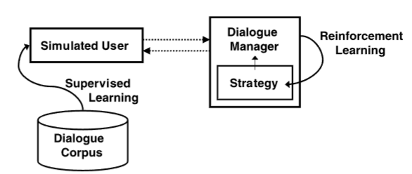

# DMW-KER-2006-A-Survey-of-Statistical-User-Simulation-Techniques-for-RL-Dialogue-Management.md
*论文下载地址（可选）：[https://doi.org/10.1017/S0269888906000944]*
*代码是否开源：否*
*分享人：马明晖*

## 一句话总结内容
> 本文是对话管理强化学习中**用户模拟器**的经典综述，系统梳理统计型用户建模方法，对比各类仿真技术、评估范式与核心挑战，奠定对话策略学习的仿真基础。

## 一句话总结创新贡献
> 首次系统性综述基于统计学习的用户仿真技术，建立“监督训练用户模型→强化学习对话策略”的标准范式，提出直接/间接双重评估体系，指明概念漂移、目标一致性、个体差异三大核心问题。

## 举一个例子说明这篇文章的创新点
> 传统对话策略靠人工规则或小样本调试；本文范式先用真实对话语料训练一个概率用户模拟器（如N-Gram、贝叶斯网络），再让对话管理器与模拟器无限次交互试错，自动学到最优确认、引导、纠错策略。

## 框架图
`
> 
> **框架工作流描述**：1. 从人机对话语料监督训练统计用户模型；2. 对话建模为MDP/POMDP；3. 对话管理器与模拟用户交互；4. 用RL（Q-learning等）优化长期奖励；5. 评估策略有效性与泛化性。

## 本文挑战及已有工作不足
1. 真实用户交互成本极高，无法覆盖全部状态空间。
2. 固定语料无法探索未知策略，难以学到最优解。
3. 早期用户模拟器无目标一致性，容易自相矛盾。
4. 模型难以捕捉用户目标变化（概念漂移）。
5. 缺少统一评估：仿真像不像 vs 策略好不好。

## 印象最深刻的点
> 仿真的核心不是“复刻语料”，而是**生成可信分布与合理行为**，让对话策略能在安全环境中自主探索、泛化到真实用户。

## 对我们的启发
1. 用户仿真是对话强化学习的必备基础设施。
2. 好模拟器需要目标一致性、行为多样性、长期合理性。
3. 评估必须双轨：预测精度 + 策略效用。
4. 结合内容建模与协同建模，才能模拟真实个体差异。

## Idea是否好想
> Idea是领域奠基性综述，范式清晰、影响深远，是对话管理RL必读经典。

## 是否有开创性
> 是开创性综述；确立统计用户仿真+RL对话策略的标准路线，影响至今。

## 是否属于热点
> 属于长期经典根基：任务型对话、对话管理、强化学习、用户建模、仿真学习。

## 其他需要补充的点（可选）
> 主流仿真方法：N-Gram、图模型、贝叶斯网络、特征线性模型、HMM。
> 核心评估：困惑度、精确率/召回率、语料统计分布、策略交叉测试。
> 关键问题：概念漂移、目标一致性、合作性建模、噪声与错误鲁棒性。

## 与其他论文的关联（可选）
> 基于MDP对话管理、Q-learning、统计语言模型、用户建模；是后续所有用户模拟器（ agenda-based、NN-based、LLM-based）的理论源头。

## 还有哪些不足的地方（未来工作）
1. 更精准的用户目标与情绪动态建模。
2. 在线适应与概念漂移自适应仿真。
3. 结合内容+协同建模，模拟个体差异。
4. 更轻量、高泛化的端到端用户模拟器。
5. 跨领域迁移与小样本学习仿真。