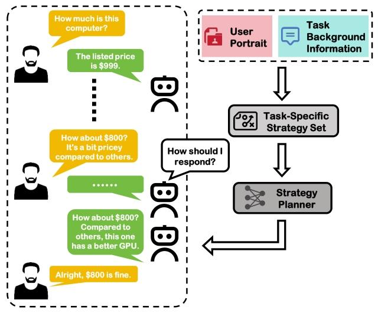

# DWM-ACL-2025-ASTRO: Automatic Strategy Optimization For Non-Cooperative Dialogues

*论文下载地址：https://aclanthology.org/2025.findings-acl.22.pdf*

*代码地址：https://github.com/SCUNLP/ASTRO*

*代码是否开源：是*

*分享人：马明晖*

---

## 一句话总结内容
本文提出 ASTRO 全自动非合作对话策略优化框架，通过 LLM 自动生成任务专属策略集，并使用解耦策略规划器 + 自博弈强化学习，全程无需人工参与，显著提升谈判与说服效果。

## 一句话总结创新贡献
实现从**策略集自动生成**到**策略规划器全自动训练**的端到端流程，提出解耦策略规划器（Decoupled Strategy Planner），在无人工干预下超越 PPDPP、TRIP 等手动设计策略方法。

## 举一个例子说明这篇文章的创新点
传统方案需要专家人工定义10–20条固定策略，再训练模型选择；
ASTRO 只需输入任务背景（如“劝捐”“砍价”），**自动生成定制策略**，再用双BERT解耦结构打分选最优，全程零人工、更贴合场景、成功率更高。

## 框架图

**框架工作流描述**
1. 环境初始化：用户输入任务背景，自动生成多样用户画像与对话场景；
2. 策略集自动生成：LLM 根据场景与用户画像产出定制化策略集合；
3. 解耦策略规划器：分别编码对话历史与策略，打分选出最优策略；
4. 两阶段训练：先自博弈数据SFT初始化，再用强化学习持续优化；
5. 推理执行：规划器输出最优策略，指导LLM生成最终回复。

## 本文挑战及已有工作不足
1. 策略集依赖专家手工编写，成本高、场景难迁移；
2. 策略规划器需要大量标注与训练，人工介入重；
3. 传统模型将历史与策略拼接编码，信息耦合、选择不准；
4. 训练流程复杂，无法快速适配新非合作场景。

## 印象最深刻的点
1. **全程全自动**：从策略生成到训练上线，无需人工规则与标注；
2. 解耦结构大幅提升**策略利用率与多样性**，避免固定套路；
3. 在GPT-3.5/GPT-4底座上均**超过所有基线**，平均SR提升11.93%。

## 对我们的启发
1. 非合作对话（说服/谈判）的核心是**策略自动生成与选择**；
2. 解耦架构比拼接更适合策略规划任务；
3. 自博弈+RLAIF可实现完全自动化的Agent优化；
4. 策略必须**场景定制**，通用策略集效果有限。

## Idea是否好想
Idea**非常清晰、工程友好、可直接落地**：
自动生成策略 + 解耦打分 + 自博弈训练，流程标准化，可快速扩展到销售、辩论、维权等场景。

## 是否有开创性
是**非合作对话自动化训练的开创性工作**：
首次实现策略生成—规划—训练全链路无人工介入，重新定义低成本落地范式。

## 是否属于热点
属于**顶会核心热点**：
非合作对话、谈判说服、自博弈进化、策略规划、模块化Agent均为热门方向。

## 其他需要补充的点
1. 支持两类典型任务：公益说服 P4G、价格谈判 CB；
2. 解耦规划器 = BERT_history + BERT_strategy + Transformer 打分；
3. 奖励模型基于用户接受度，使用 GPT-4o-mini 充当情绪分析器；
4. 策略多样性显著高于 PPDPP、TRIP。

## 与其他论文的关联
1. 承接 PPDPP 插件式策略规划思路；
2. 对比 TRIP、ProCoT、Standard 等基线；
3. 延续自博弈、RLAIF、非合作对话优化方向。

## 不足与未来工作
1. 极端小众场景下 LLM 自动生成策略质量不稳定；
2. 用户模拟器仍存在态度突变问题；
3. 可扩展多轮、多模态、多方博弈场景；
4. 可引入心智建模（ToM）进一步提升策略精准度；
5. 可增加伦理约束防止恶意策略滥用。