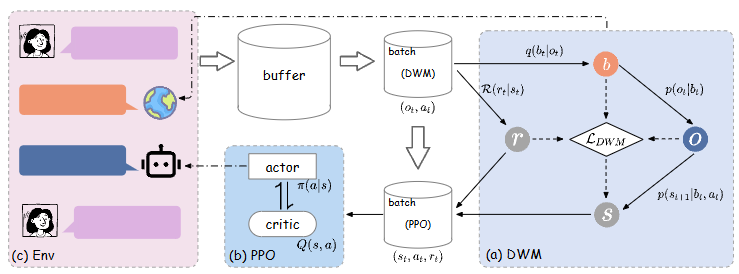

# DWM-ARXIV-2025-Dream to Chat: Model-based Reinforcement Learning on Dialogues with User Belief Modeling
*论文下载地址（可选）：https://arxiv.org/abs/2508.16876*

*代码是否开源：否*

*分享人：马明晖*

## 一句话总结内容
> 提出融合用户信念建模的对话世界模型DreamCUB，基于模型化强化学习与POMDP框架，实现对话情绪、意图认知与高质量共情对话生成。

## 一句话总结创新贡献
> 首次将用户信念（情绪、情感、意图）融入对话世界模型，结合基于模型的强化学习与信息瓶颈优化，显著提升对话系统情绪理解、策略生成与跨域泛化能力。

## 框架图

`

> **框架工作流描述**：1. 信念推理模块从对话观测中提取用户信念；2. 对话世界模型融合信念迁移、下一用户问句预测与奖励建模；3. 基于DWM‑RL算法分三阶段训练：动态学习优化世界模型、行为学习用PPO更新策略与评判网络、环境交互收集经验数据；4. 策略网络结合历史与信念输出对话策略与回复，实现端到端共情对话。

## 本文挑战及已有工作不足
1. 传统RLHF/PPO采样效率低、方差大、计算开销高。
2. 现有对话世界模型仅建模可观测语句，忽略用户不可观测的心理状态。
3. 共情对话多基于给定情绪生成回复，缺乏对用户情绪与意图的深度理解。
4. 多数方法在跨域共情对话上泛化能力弱。

## 印象最深刻的点
将世界模型从视觉/机器人领域迁移到开放域对话，显式建模用户隐式信念，并把POMDP、信息瓶颈与LLM后训练结合，在情绪分类与对话生成上全面超越基线。

## 对我们的启发
1. 对话系统可引入用户隐状态建模提升理解与共情能力。
2. 基于模型的强化学习能有效缓解大模型RL采样低效问题。
3. 世界模型+策略分离设计比单模型共享参数效果更优。
4. 跨域泛化可通过通用域对话训练+世界模型规划实现。

## Idea是否好想
Idea清晰直观：**世界模型+用户信念+MBRL**，模块拆解明确，理论依托POMDP与信息瓶颈，工程上基于LLM后训练实现，可复现性强、落地路径清晰。

## 是否有开创性
是开创性工作：首次把**用户信念建模**融入**对话世界模型**，并建立完整的MBRL对话训练框架，为开放域/共情对话提供新范式。

## 是否属于热点
属于当前热点：大模型对话对齐、RL/RLHF、共情对话、用户建模、世界模型均为NLP与多模态顶会主流方向。

## 其他需要补充的点（可选）
1. 基座模型：Llama3.1‑8B‑Instruct，训练框架OpenRLHF。
2. 核心优化目标：ELBO（变分信息瓶颈）。
3. 验证数据集：DailyDialog、ESconv、EmpatheticDialogues、Amazon、IMDB等。
4. 消融实验证明：用户信念、世界模型、RL、策略‑模型分离均为必要组件。

## 与其他论文的关联（可选）
1. 继承World Models（Ha & Schmidhuber, 2018）、Dreamer/Dream to Drive思想。
2. 对比RLHF/PPO、DPO、GRPO、CoT、FSM、RAG等基线。
3. 延续Deep Dyna‑Q、MCA等对话MBRL工作，但新增用户信念建模。

## 未来工作
1. 信念维度太窄只做了情绪、情感、意图，没覆盖用户偏好、记忆、人格、动机，真实场景不够用。
2. 模型规模有限只用了 Llama3.1-8B，没验证更大模型（70B+）或国产基座，扩展性证据不足。
3. 想象力规划验证弱“梦境规划” 是核心卖点，但没有可视化、没有轨迹分析、没有消融对比，说服力一般。