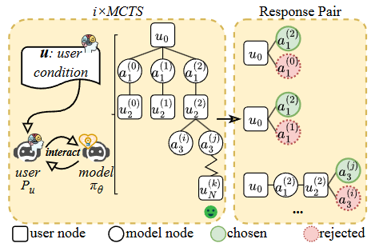

# Engagement-ARXIV-2025-Enhancing-User-Engagement-in-Socially-Driven-Dialogue-through-Interactive-LLM-Alignments.md
*论文下载地址（可选）：[https://arxiv.org/abs/2506.21497](https://arxiv.org/abs/2506.21497)*

*代码是否开源：否*

*分享人：马明晖*

## 一句话总结内容
> 本文针对社交驱动型对话（情感支持、公益劝说），提出利用对话未来发展信号与用户交互反馈，通过i×MCTS探索对话轨迹并结合DPO对齐大模型，直接提升交互式LLM的用户参与度。

## 一句话总结创新贡献
> 首次将面向交互的蒙特卡洛树搜索i×MCTS与直接偏好优化DPO结合，以对话结束后的用户真实反应为直接奖励信号，摆脱传统知识/对话行为依赖，精准提升社交对话场景下的用户参与度。

## 举一个例子说明这篇文章的创新点
> 传统情感支持对话只关注“说安慰话、提建议”，无法判断这句话是否真的让用户愿意继续倾诉；本文方法先用用户模拟器和i×MCTS“预演”多轮对话，看哪句回复能让用户最终完全表达负面情绪，再把“有效回复”和“无效回复”做成偏好数据用DPO训练模型，让模型学会真正能拉近距离、促使用户深度参与的表达。

## 框架图
`

> **框架工作流描述**：1. 构建用户模拟器（求助者/被劝说者），基于SFT训练以模拟真实用户交互行为；2. 用i×MCTS在模型与模拟器的对话中做选择-扩展-rollout-反向传播，探索高/低参与度对话轨迹；3. 按用户最终参与状态（情绪释放/捐款金额）构建偏好数据对；4. 混合i×MCTS提取对与原训练集对，通过DPO对齐优化交互式LLM；5. 在情感支持与公益劝说场景做自动评估与人工评估。

## 本文挑战及已有工作不足
1. 传统方法依赖外部知识或对话行为规划，与用户参与度关联微弱、效果不稳定。
2. 多数工作只关注单轮回复质量，忽略对话长期发展对参与度的影响。
3. 缺少直接、可量化的用户参与度信号，难以精准优化模型对齐方向。
4. 社交对话交互性强，传统MCTS难以直接适配多角色交替对话场景。

## 印象最深刻的点
> 不依赖复杂奖励模型，直接用对话结束后的用户真实结果（是否完全倾诉、捐款多少）作为参与度指标，简单高效且可解释性强。

## 对我们的启发
1. 提升对话类LLM应聚焦“长期交互结果”，而非仅优化单轮回复流畅度。
2. 可结合树搜索+偏好优化，让模型从“未来反馈”中自我迭代。
3. 社交对话的参与度需用场景化直接信号衡量，而非通用语义指标。

## Idea是否好想
> Idea清晰直观：用未来反馈指导当前优化，结合成熟的MCTS与DPO，模块可复用、思路易迁移，工程落地难度适中。

## 是否有开创性
> 是开创性工作；首次在社交对话中把交互型MCTS与DPO结合，以用户终态反馈为核心奖励，开辟了“面向长期参与度的对话模型对齐”新范式。

## 是否属于热点
> 属于当前热点：对话AI对齐、大模型偏好优化、情感/劝说对话、人机交互参与度均为顶会热门方向。

## 其他需要补充的点（可选）
> 支持两种典型社交对话：情感支持对话（用户情绪释放率）、公益劝说对话（用户捐款金额），验证方法通用性。

## 与其他论文的关联（可选）
> 基于DPO（2024）做偏好对齐，沿用MCTS增强LLM推理思路，区别于仅用MCTS做对话策略规划，直接对齐模型本身；在情感支持、劝说对话上优于基于知识/策略的BoN与SFT基线。

## 还有哪些不足的地方（未来工作）
1. 当前仅优化通用参与度，未实现个性化参与度适配。
2. 用户模拟器仍存在行为偏差，与真人交互存在差距。
3. 未探索多模态、更长轮次对话的参与度优化。
4. 可扩展到更多社交对话场景，如心理咨询、销售对话。
