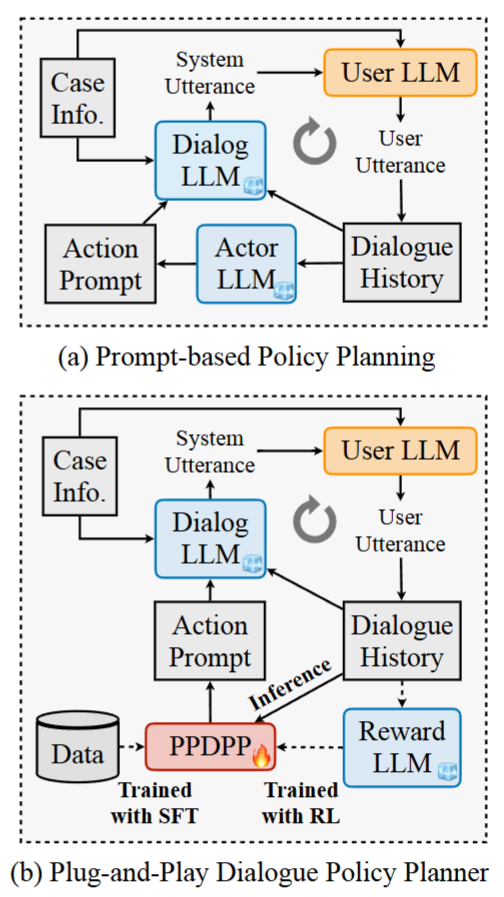

# DWM-ICLR-2024-Plug-and-Play Policy Planner for LLM-Powered Dialogue Agents

*论文下载地址：https://arxiv.org/pdf/2311.00262.pdf*

*代码地址：https://github.com/dengyang17/PPDPP*

*代码是否开源：是*

*分享人：马明晖*

---

## 一句话总结内容
本文提出**PPDPP**即插即用策略规划器，通过轻量可训练插件为大模型对话智能体提供显式策略规划，结合SFT与RLAIF实现跨场景、低成本的主动对话能力升级。

## 一句话总结创新贡献
首创**插件式对话策略规划范式**，用小模型作为可插拔策略头，以自博弈交互+AI反馈强化学习优化，在不改动主LLM前提下显著提升谈判、情感支持、教学三类主动对话效果。

## 举一个例子说明这篇文章的创新点
传统方案要么冻结LLM用提示词规划（能力受限），要么全量微调（昂贵不可迁移）；
PPDPP只训练一个**轻量插件**负责“下一步该用什么策略”，主LLM只负责生成自然回复。换场景只需换插件，无需重训LLM，低成本、可迁移、效果更强。

## 框架图

**框架工作流描述**
1. 插件初始化：在人类标注对话数据上做SFT，学习基础对话策略；
2. 自博弈交互：用LLM分别扮演智能体与用户，按目标任务展开多轮交互；
3. 策略决策：每轮由PPDPP插件输出下一步对话策略（如提问、还价、安慰）；
4. 奖励打分：第三方LLM作为Reward Model给出目标导向奖励；
5. 强化学习：用策略梯度更新PPDPP插件，提升长期目标达成率；
6. 推理部署：插件直接接入任意LLM，指导生成高策略性回复。

## 本文挑战及已有工作不足
1. 冻结LLM的提示式规划：受限于模型本身能力，无法持续优化；
2. 全量微调LLM：成本极高、场景专一、难以迁移；
3. 迭代优化方案：每新案例都要重跑仿真，推理低效；
4. 评估只看单轮回复质量，缺少**长期目标完成度**评价。

## 印象最深刻的点
1. 仅训练**轻量插件**就能在三大任务全面超越SOTA、逼近甚至超越GPT-3.5；
2. 真正实现**即插即用**，换场景只需替换插件，LLM保持不动；
3. 提出**交互式评估协议**，用成功率与平均轮次衡量长期规划能力。

## 对我们的启发
1. 大模型不必全量微调，**专用插件**是高效增强路线；
2. 主动对话的核心是**策略规划**，而非单纯生成流畅回复；
3. 自博弈+AI反馈（RLAIF）可在无人类数据下持续迭代；
4. 对话系统必须评估**目标达成率**，而非仅词汇匹配度。

## Idea是否好想
Idea**非常直观、工程性极强、可快速落地**：
把“策略大脑”拆成独立插件，LLM只负责“说话”，结构清晰、易复现、可跨场景复用。

## 是否有开创性
是**主动对话系统的开创性工作**：
首次提出并验证“插件式策略规划”架构，重新定义LLM对话系统的模块化升级范式。

## 是否属于热点
属于**顶会顶级热点**：
LLM模块化设计、插件机制、对话策略、强化学习对齐、主动对话均为核心方向。

## 其他需要补充的点
1. 支持三类任务：价格谈判、情感支持、教学对话；
2. 采用RoBERTa-large作为策略插件，轻量高效；
3. 提出**目标导向奖励**，更关注长期收益而非单轮好坏；
4. 推理仅增加极低计算量，兼容API模型与开源模型。

## 与其他论文的关联
1. 承接Proactive、ProCoT等提示式策略规划工作；
2. 对比ICL-AIF、Ask-an-Expert等迭代优化方案；
3. 属于RLAIF、插件增强LLM、模块化智能体体系工作。

## 不足与未来工作
1. 依赖人工定义策略集合，未实现开放式策略；
2. 自博弈数据多样性与真实性仍有提升空间；
3. 可扩展多模态、长对话、多智能体场景；
4. 可进一步轻量化插件，做到实时推理；
5. 可加入伦理约束，防止策略滥用。