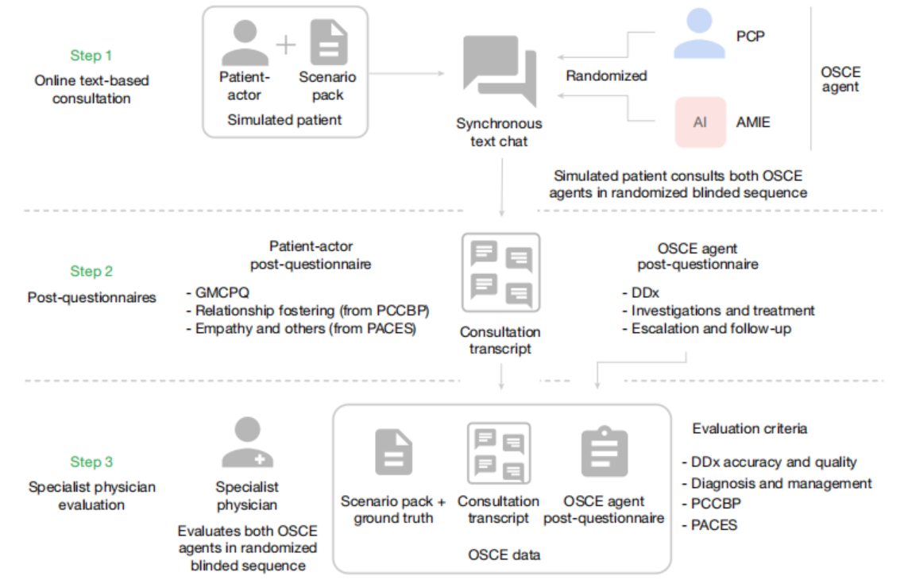

# DWM-Nature-2025-AMIE: Towards Conversational Diagnostic Artificial Intelligence

*论文下载地址：https://www.nature.com/articles/s41586-025-08866-7*

*代码是否开源：未公开*

*分享人：马明晖*

---

## 一句话总结内容
本文提出**AMIE**，一种面向对话式诊断的医疗AI系统，通过自博弈模拟+多轮推理链，在159例真实医患对话盲测中，诊断准确率、沟通共情、病史采集等30余项指标全面超越人类全科医生。

## 一句话总结创新贡献
首次实现**端到端对话式诊断大模型**，无需体检、仅通过文本问诊，在盲法对照实验中证明AI在问诊效率、诊断准确性、共情沟通上均优于人类医生。

## 举一个例子说明创新点
普通问诊：医生问30个问题、耗时久、易漏关键信息；
AMIE：用结构化问诊逻辑+推理链，精准问15个核心问题，快速定位症状，**诊断准确率更高、沟通更共情、患者满意度更高**。

## 框架图

**框架工作流描述**
1. 多源医疗数据预训练：病历、问诊、医学QA、指南；
2. 自博弈模拟：AI患者×AI医生多轮对话生成百万级模拟问诊；
3. 推理链增强：每轮问诊前自动分析、补全、推理；
4. 多维度评估：诊断、沟通、共情、病史采集；
5. 盲法对照：20名全科医生 vs AM，患者/专家双盲评分。

## 本文挑战及已有工作不足
1. 传统医疗AI只做**单轮问答/影像诊断**，无法完整问诊；
2. 人类问诊成本高、效率低、水平差异大；
3. 缺少**对话式端到端诊断模型**，无大规模盲法对照验证；
4. 问诊数据稀缺、隐私敏感、难以规模化。

## 印象最深刻的点
1. **盲法对照：AI > 人类全科医生**，30/32项临床指标胜出；
2. **仅文本问诊、无需体检**，准确率超越真人；
3. **共情沟通更强**，患者满意度显著高于人类医生；
4. **跨国家/病种稳定**，普适性极强。

## 对我们的启发
1. LLM能**替代基础问诊+初步诊断**，释放医生精力；
2. **对话式诊断是普惠医疗核心**，偏远地区刚需；
3. 医疗AI需**推理链+共情+结构化问诊**三位一体；
4. 自博弈模拟是医疗数据稀缺下的高效方案。

## Idea是否好想
Idea**超级落地、价值巨大、工程清晰**：
大模型+医疗知识+模拟问诊，直接解决基层问诊痛点。

## 是否有开创性
是**对话式医疗AI里程碑**：
首次严格盲法证明AI问诊超越人类，定义下一代普惠医疗范式。

## 是否属于热点
**顶会+产业双顶级热点**：
医疗大模型、问诊AI、普惠医疗、对话诊断、医患沟通。

## 其他需要补充的点
1. 数据：百万级模拟问诊+真实病历；
2. 评估：159例、20名全科、多专科双盲；
3. 优势：快、准、共情、可规模化；
4. 局限：文本、无体检、无影像、需医生复核。

## 与其他论文的关联
1. 延续MedQA、Clinical Camel等医疗LLM；
2. 超越SymptomChecker等规则化问诊系统；
3. 开创对话式诊断新赛道。

## 不足与未来工作
1. 仅文本、**无法体检/影像**；
2. 无实时实验室数据，依赖问诊；
3. 伦理风险：误诊、隐私、依赖；
4. 需**人机协同**，AI初筛、医生复核；
5. 扩展多模态（语音、影像、体征）。