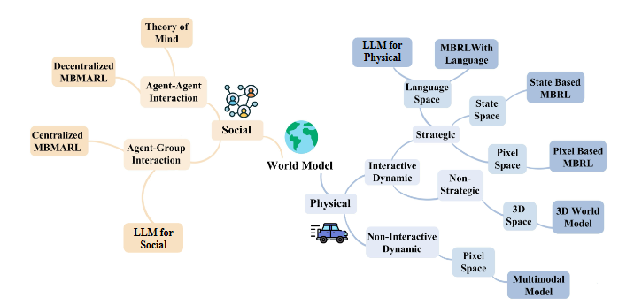

# DWM-NeurIPS-2025-World-Models-Should-Prioritize-the-Unification-of-Physical-and-Social-Dynamics.md
*论文下载地址（可选）：[https://arxiv.org/]*
*代码是否开源：否*
*分享人：马明晖*

## 一句话总结内容
> 本文指出当前世界模型普遍割裂物理动力学与社会动力学建模，提出必须将二者双向统一融合，并给出ACE指导原则与一体化框架，指明世界模型下一代核心发展方向。

## 一句话总结创新贡献
> 首次系统性提出世界模型必须统一物理与社会动力学，明确二者双向纠缠关系，提出ACE三大原则并构建一体化物理-社会世界模型框架，给出完整研究路线与评估范式。

## 举一个例子说明这篇文章的创新点
> 传统交通世界模型只算车辆运动物理规律，无法理解司机焦虑、遵守规则等社会因素；本文框架会同时建模物理状态（车速、位置）与社会状态（情绪、意图、规范），让模型能预测“司机紧张→车速不稳→路况变化”这种双向因果，而不是只算纯物理轨迹。

## 框架图
`
> 
> **框架工作流描述**：1. 世界状态由物理状态与社会状态联合构成；2. 物理状态按物理规律演化，社会状态按或然因果演化；3. 遵循ACE原则进行多粒度抽象、捕捉或然因果、建模纠缠共演化；4. 输出一体化状态转移，支撑智慧交通、人机协作、政策模拟等上层应用。

## 本文挑战及已有工作不足
1. 物理世界模型擅长客观规律，但严重缺失社会主体、意图、情感与互动建模。
2. 社会世界模型多在抽象环境，缺乏真实物理场景约束与感知 grounding。
3. 物理与社会建模完全割裂，无法建模双向因果与纠缠演化。
4. 缺少统一表示、统一学习、统一评估的一体化世界模型范式。
5. 社会动力学具有主观性、异质性、或然因果，难以标准化建模。

## 印象最深刻的点
> 明确指出现有世界模型的本质缺陷：只懂物理不懂社会、只懂社会脱离物理，无法模拟真实人类世界；并首次给出清晰的一体化理论与路线图。

## 对我们的启发
1. 下一代通用世界模型必须是物理+社会双驱动，缺一不可。
2. 社会动力学不是规则，而是或然因果、上下文依赖、共演化系统。
3. 建模人机协作、智慧城市、机器人服务必须融合物理-社会纠缠关系。
4. 可建立分层抽象与统一表示，实现物理与社会模块的端到端融合。

## Idea是否好想
> Idea极具洞察力与高度，是顶层范式级创新，不是小改进；逻辑自洽、跨学科支撑充分，工程上可模块化落地，方向明确且引领性强。

## 是否有开创性
> 是开创性范式工作；首次定义“物理-社会统一世界模型”这一新领域，提出理论原则、框架、评估与路线图，为通用世界模型奠定基础。

## 是否属于热点
> 属于顶级热点；世界模型、具身智能、多智能体、人机交互、通用AI均为当前核心方向，本文是方向级引领工作。

## 其他需要补充的点（可选）
> 提出三级评估协议：感知保真度→解耦动力学→纠缠动力学；覆盖从底层感知到高层因果推理。
> 覆盖两大场景：情感陪护机器人、城市交通，验证统一建模必要性。

## 与其他论文的关联（可选）
> 基于LeCun世界模型、JEPA、DreamerV3等物理世界模型，结合ToM、生成式智能体、多智能体强化学习等社会建模，将二者首次统一在同一框架下。

## 还有哪些不足的地方（未来工作）
1. 缺少大规模物理-社会对齐数据集与仿真平台。
2. 统一架构、训练目标、推理算法仍需具体实现与验证。
3. 跨文化、长时序、大规模涌现行为建模难度极高。
4. 伦理、公平性、可解释性在统一模型中更复杂。
5. 可扩展到具身机器人、自动驾驶、虚拟社会、政策推演等真实场景。