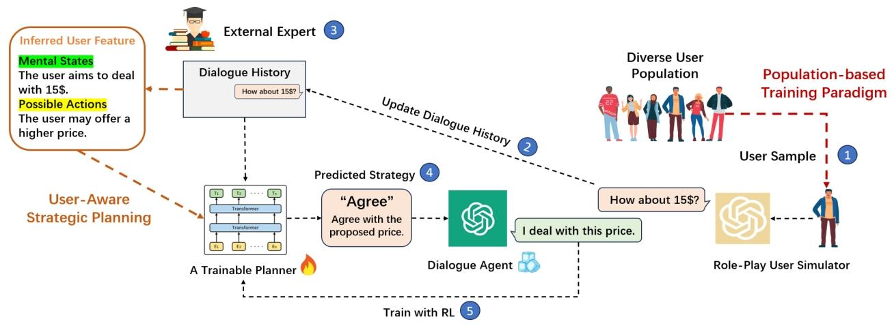

# DWM-arXiv-2024-Strength Lies in Differences! Improving Strategy Planning for Non-collaborative Dialogues via Diversified User Simulation

*论文下载地址：https://arxiv.org/pdf/2403.06769v3.pdf*

*代码地址：未提供*

*代码是否开源：否*

*分享人：马明晖*

---

## 一句话总结内容
本文提出基于多样化用户仿真的非合作对话策略规划方法，通过用户感知的策略规划与种群化训练范式，让模型在谈判、说服等任务中自适应不同人格用户，显著提升泛化性与成功率。

## 一句话总结创新贡献
首次将**用户心智推理（ToM）+ 多样化用户种群训练**结合，解决传统模型只能适配单一用户、无法泛化到多样人群的核心问题，在全部用户人格上稳定超越PPDPP等SOTA模型。

## 举一个例子说明这篇文章的创新点
传统模型（如PPDPP）对所有人用同一套说服方式；
本模型会先识别用户人格：
- 对开放型：用情感、新奇故事打动；
- 对神经质：用个人经历、共情安抚；
- 对分析型：用数据、透明性、可信度说服。
真正做到“因人而异”的策略规划。

## 框架图

**框架工作流描述**
1. 用户心智状态推理：基于对话历史预测用户目标与行为；
2. 用户感知策略规划：将对话历史 + 心智特征输入策略器；
3. 种群化训练：与40个不同人格用户模拟器交互学习；
4. 强化学习优化：以任务成功、效率、收益为奖励信号；
5. 输出定制化策略与回复。

## 本文挑战及已有工作不足
1. 现有模型不建模用户，仅依赖对话历史；
2. 单一用户模拟器训练导致泛化能力极差；
3. 策略固定僵化，对不同人格效果波动巨大；
4. 真实场景鲁棒性不足。

## 印象最深刻的点
1. 在**全部20类人格用户**上均稳定超越基线；
2. 同类人格策略相似、不同人格策略差异明显，实现真正个性化；
3. 说服成功率相对提升**超70%**。

## 对我们的启发
1. 非合作对话必须**因人而异、千人千策**；
2. 多样化用户训练是泛化的关键；
3. 心智推理（ToM）显著提升策略精准度；
4. 鲁棒Agent需要适应多样用户，而非单一模拟器。

## Idea是否好想
Idea 非常直观、高可复用、工程易落地，适用于谈判、销售、反诈、心理咨询等场景。

## 是否有开创性
是**非合作对话个性化策略规划的开创性工作**，首次定义“多样化用户自适应”新范式。

## 是否属于热点
属于顶会顶级热点：非合作对话、说服/谈判、心智理论、个性化Agent、多智能体交互。

## 其他需要补充的点
1. 任务：价格谈判、公益说服；
2. 用户仿真：大五人格 × 决策风格；
3. 模型结构：BERT策略规划器 + ToM推理；
4. 训练：SFT初始化 + RL种群优化。

## 与其他论文的关联
1. 基于PPDPP插件式策略规划改进；
2. 对比ProCoT、ICL-AIF、GDP-MCTS、PPDPP；
3. 融合心智理论与种群强化学习。

## 不足与未来工作
1. 依赖人工定义策略集合；
2. 真实人类对话验证规模有限；
3. 可扩展多模态、多方对话；
4. 需增加伦理与安全约束。