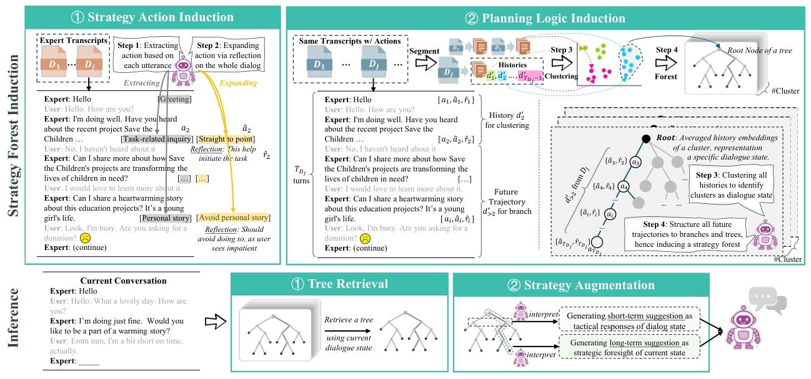

# DWM-arXiv-2026-METRO: Towards Strategy Induction from Expert Dialogue Transcripts for Non-collaborative Dialogues

*论文下载地址：https://arxiv.org/pdf/2604.11427v3.pdf*

*代码地址：https://github.com/Humphrey-0125/METRO*

*代码是否开源：是*

*分享人：马明晖*

---

## 一句话总结内容
本文提出 **METRO** 框架，无需人工定义策略，直接从专家对话转录本中自动归纳策略动作与规划逻辑，构建**策略森林（Strategy Forest）** 分层结构，同时支持短期战术响应与长期战略前瞻，显著提升非合作对话效果。

## 一句话总结创新贡献
首次实现**从原始对话转录本中全自动归纳分层策略**，将专家经验转化为可检索、可复用的策略森林，彻底替代人工策略编码，在说服与谈判任务平均提升 **9%~10%**，并具备强大跨任务迁移能力。

## 举一个例子说明这篇文章的创新点
传统方案需要专家手工写10~20条固定策略（如情感诉诸、可信度诉诸）；
METRO 直接读取大量人类专家对话，自动总结出：
- 短期策略：当前状态下立刻该说什么
- 长期策略：整段对话应该按什么路径推进
形成像思维导图一样的“策略森林”，模型直接查表使用，更灵活、更像人类专家。

## 框架图

**框架工作流描述**
1. 策略动作归纳：从专家对话中提取基础策略，并通过反思扩展更通用策略；
2. 规划逻辑归纳：将对话历史聚类为状态，把多轮策略轨迹构建成树；
3. 策略森林构建：同一对话状态下的所有策略树组成森林，保留高价值分支；
4. 推理阶段：根据当前对话状态检索最匹配的树，给出短期+长期建议；
5. 生成回复：结合战术与前瞻逻辑，输出专家级对话。

## 本文挑战及已有工作不足
1. 传统非合作对话依赖**人工定义策略**，成本高、难以扩展；
2. 现有归纳方法只提取单点策略，**不建模多轮规划逻辑**；
3. 策略以扁平列表存在，**没有长期全局视角**；
4. 跨任务迁移能力弱，换场景就要重新设计策略。

## 印象最深刻的点
1. 完全**去掉人工策略设计**，纯从数据中自动学习专家策略；
2. 策略森林同时掌握**短期战术 + 长期前瞻**，远超扁平策略；
3. 跨任务迁移效果极强，从谈判迁移到说服依然保持SOTA；
4. 推理极快，只需一次相似度检索，无MCTS巨大开销。

## 对我们的启发
1. 非合作对话的未来是**从专家范例中自动学策略**，而非手工设计；
2. 分层结构（森林/树）比扁平策略更适合多轮复杂规划；
3. 短期响应 + 长期路径结合，才能达到人类专家水平；
4. 高质量对话转录本是低成本构建高性能Agent的超级原料。

## Idea是否好想
Idea **非常直观、工业级可落地**：
读专家对话 → 自动总结套路 → 存成策略库 → 实时查表使用，完全复刻人类学习模式。

## 是否有开创性
是 **非合作对话策略归纳领域的开创性工作**：
首次实现“从原始转录本到分层策略”的端到端自动化，重新定义低成本Agent构建路线。

## 是否属于热点
属于 **顶会顶级热点**：
策略归纳、知识萃取、非合作对话、规划学习、大模型Agent均为核心方向。

## 其他需要补充的点
1. 双任务：公益说服（P4G）、价格谈判（CB）；
2. 核心结构：策略森林 = 多个对话状态策略树；
3. 双视角规划：广度（短期动作）、深度（长期轨迹）；
4. 评估指标：成功率SR、平均轮次AT、收益SL%。

## 与其他论文的关联
1. 超越PPDPP、ProCoT、ICL-AIF、GDP-Zero、PRINCIPLES；
2. 延续策略归纳与对话规划方向；
3. 无需训练策略器，纯检索增强，推理轻量。

## 不足与未来工作
1. 依赖高质量专家转录本，低质量数据会影响效果；
2. 暂未支持多模态与超长篇对话；
3. 可结合在线强化学习持续进化策略森林；
4. 可扩展到辩论、反诈、催收、教学等更多非合作场景。