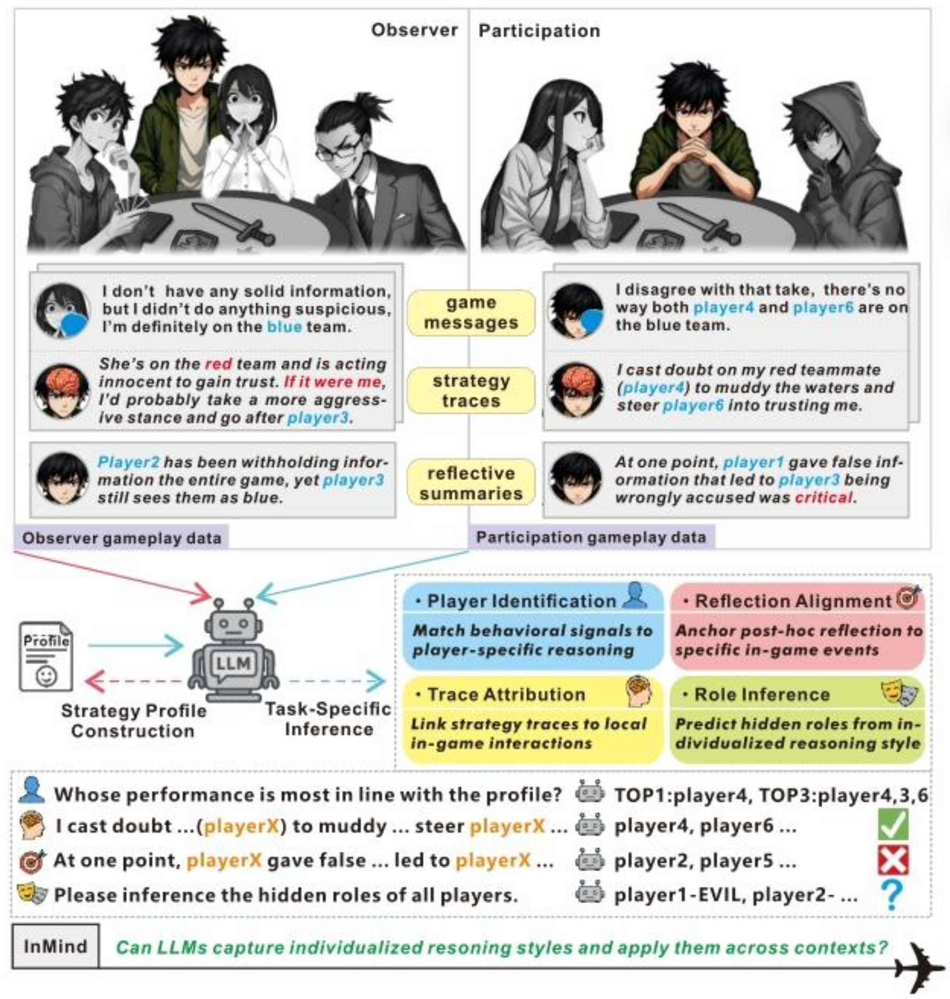

# Data-EMNLP-2025-InMind: Evaluating LLMs in capturing and applying individual human reasoning styles
*论文下载地址：https://aclanthology.org/2025.emnlp.xxx/*

*代码地址：https://github.com/leroy9472/InMind*

*代码是否开源：是*

*分享人：马明晖*

---

## 一句话总结内容
本文提出**InMind**评估框架，基于社交推理游戏Avalon构建带认知标注的对话数据集，从**个体推理风格**角度评测LLM能否捕捉并复用人类的个性化推理逻辑与策略习惯。

## 一句话总结创新贡献
首次从**个体推理风格对齐**视角定义LLM心智理论能力，提出双视角数据采集+双层认知标注+四项细粒度评测任务，揭示当前模型难以真正模仿人类个性化推理的核心缺陷。

## 举一个例子说明这篇文章的创新点
普通ToM评测只问“模型知不知道别人信什么”；
InMind会先观察某玩家的**固定推理习惯**（比如爱从票型反推、喜欢踩末位玩家、习惯性保某人），再看模型在新局里能否**复刻这套风格**，而不是只给出正确答案。

## 框架图

**框架工作流描述**
1. 双模式数据采集：
   - Observer模式：只观察不行动，记录纯推理风格
   - Participant模式：实际参与游戏，产生行为与策略
2. 双层认知标注：每轮实时策略轨迹 + 整局反思总结
3. 构建玩家推理画像：提取逻辑偏好、话术习惯、决策模式
4. 四项评测任务：玩家识别、反思对齐、轨迹归属、角色推理
5. 评估LLM能否复用画像进行自适应推理

## 本文挑战及已有工作不足
1. 传统ToM评测只测**通用社会常识**，不关注**个体差异**；
2. 缺少能捕捉**个性化推理过程**的高质量标注数据；
3. 现有模型依赖词汇与句式表面特征，无法锚定时序与策略；
4. 无法在动态对抗中**持续适配同一玩家的推理风格**。

## 印象最深刻的点
1. 即使GPT-4o也严重依赖**表面词汇模式**，难以理解深层策略；
2. **DeepSeek-R1**在推理风格对齐上显著优于通用模型；
3. 80%以上模型无法完成跨局的**玩家风格识别**，接近随机。

## 对我们的启发
1. 真正的ToM不止“读心”，还要**读个人风格**；
2. 说服、谈判、协作类AI必须**适配对方推理习惯**；
3. 时序策略轨迹+反思总结是建模个体推理的关键；
4. 社交博弈游戏是评估个性化心智的绝佳环境。

## Idea是否好想
Idea**非常直观、心理学基础扎实、可直接扩展**：
从“每个人推理不一样”出发，用双视角+双标注+四任务做评测，可迁移到狼人杀、谈判、辩论、教育对话等。

## 是否有开创性
是**个性化心智理论（ToM）领域的开创性工作**：
首次把“个体推理风格”作为LLM评估核心，开辟ToM从通用到个性化的新方向。

## 是否属于热点
属于**顶会顶级热点**：
LLM心智理论、社交推理、个性化对齐、多智能体博弈、认知标注均为核心方向。

## 其他需要补充的点
1. 数据集：InMind-Avalon，30局完整人类对局，160条策略轨迹，30篇反思；
2. 语言：中文（保留桌游术语与口语特征）；
3. 关键发现：模型擅长**模仿句式**，不擅长**复刻推理逻辑**；
4. 评估覆盖：静态对齐 + 动态自适应。

## 与其他论文的关联
1. 承接ToM、OpenToM、PersuasiveToM等心智理论工作；
2. 基于Avalon、Werewolf等社交推理博弈环境；
3. 对比Social IQa、KoCommonGen等通用社会推理基准。

## 不足与未来工作
1. 仅覆盖Avalon，可扩展到更多社交博弈与真实对话；
2. 标注存在一定主观性，可扩大规模与标注者数量；
3. 只做评测，未提出优化模型的训练方案；
4. 可扩展多模态、跨文化、多轮长期风格对齐；
5. 可用于个性化说服、AI队友、教育辅导等落地场景。