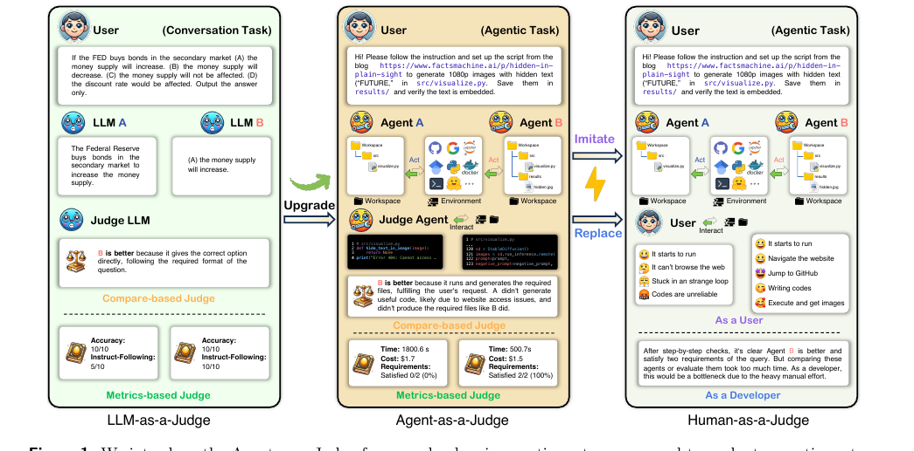

# Data-ICML-2025-Agent-as-a-Judge- Evaluate Agents with Agents
> 说明：本文档内容默认使用中文生成（论文标题与必要专有名词除外）。

*论文下载地址：https://arxiv.org/abs/2410.10934*

*代码是否开源：是 https://github.com/metauto-ai/agent-as-a-judge*

*分享人：马明晖*

## 一句话总结内容
> 提出 Agent-as-a-Judge 框架，用智能体评估智能体，并在代码生成任务中验证其比 LLM-as-a-Judge 更可靠且更接近人工评测。

## 一句话总结创新贡献
> 构建 DevAI 基准并设计 Agent-as-a-Judge 评测框架，在保持较低成本的同时提供过程级反馈，实现对 agentic 系统的自动化高质量评估。

## 举一个例子说明这篇文章的创新点
> 在 DevAI 的“为 src/visualize.py 搭建隐藏文字图片生成脚本并验证结果”任务中，Agent-as-a-Judge 能通过检查代码、文件和轨迹，判断哪个智能体真正完成了 1080p 图片生成、结果保存与文本嵌入验证，而不只依赖最终输出。

## 框架图

**框架工作流描述**：
> 先收集真实 AI 开发任务并整理为带依赖的层级需求；再让多个代码生成智能体执行任务并保存轨迹、代码与文件；随后由 Agent-as-a-Judge 结合图结构、定位、读取、搜索、检索、询问、记忆和规划等模块，基于中间证据逐项判断需求是否满足，最终输出更接近人工的一致性结果。

## 本文挑战及已有工作不足
> 1. 长程开发任务依赖链条多，单一终局指标信息不足
> 2. 传统评测只看最终结果，难以反映智能体的分步执行过程
> 3. 现有基准与真实开发需求仍有差距
> 4. 人工评测成本高、耗时长，不适合规模化

## 印象最深刻的点
> 1. 在部分设置下，其对齐率接近或超过单个人类评审者
> 2. 相较三位人类专家，评测时间和成本分别节省 97.72% 和 97.64%
> 3. DevAI 包含 55 个真实 AI 开发任务、365 个层级需求和 125 个偏好标注
> 4. Agent-as-a-Judge 相比 LLM-as-a-Judge 具有更高的人类一致性

## 对我们的启发
> 1. 借鉴人类评审的分步审查方式，而非只看最终答案
> 2. 利用智能体自身的交互、记忆与规划能力构建评测流程
> 3. LLM-as-a-Judge 启发了将评审过程自动化的思路

## Idea是否好想
> 论文将“智能体评智能体”落地为可执行框架：通过多模块收集证据、定位需求、读取工件并逐项判断，使评测从终局判断升级为过程级、证据驱动的评估。其价值在于兼顾成本与细粒度反馈，尤其适合长链路、高不确定性的 agentic 任务。

## 是否有开创性
> 提出 Agent-as-a-Judge 这一评测范式，并配套 DevAI 基准；在评测维度上引入中间轨迹与层级需求依赖，区别于仅看终局的传统自动评测。

## 是否属于热点
> 智能体评测、自动化基准构建、LLM/Agent 作为裁判、代码生成与软件工程智能体。

## 其他需要补充的点（可选）
> 1. 作者将该方法视为对 LLM-as-a-Judge 的自然扩展
> 2. DevAI 任务来源于真实 AI 应用开发场景

## 与其他论文的关联（可选）
> 1. 与 SWE-Bench、HumanEval、MBPP 等代码评测基准形成对比
> 2. 与 Human-as-a-Judge 相比，重点在于降低人工成本
> 3. 与 LLM-as-a-Judge 直接相关，属于其面向智能体任务的扩展

## 还有哪些不足的地方（未来工作）
> 1. 将框架扩展到更多类型的智能体任务，而不仅限于代码生成
> 2. 进一步提升记忆模块与检索模块在更大规模工作空间中的作用
> 3. 将自动提示优化和工作流设计等更高级的 agentic 优化方法用于 Agent-as-a-Judge
