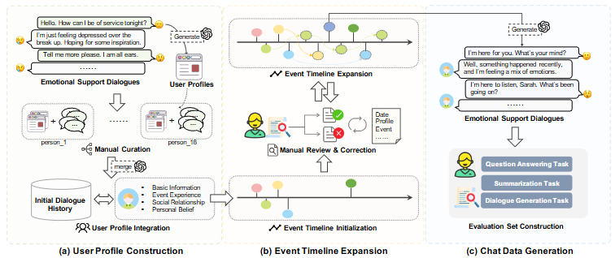

# Data-WWW-2026-ES-MemEval- Benchmarking Conversational Agents on Personalized Long-Term Emotional Support
> 说明：本文档内容默认使用中文生成（论文标题与必要专有名词除外）。

*论文下载地址：https://doi.org/10.1145/3774904.3792143*

*代码是否开源：是 https://github.com/slptongji/ES-MemEval*

*分享人：马明晖*

## 一句话总结内容
> 本文提出ES-MemEval基准和EvoEmo数据集，用于系统评测个性化长期情感支持对话中的长期记忆、用户建模与响应能力。

## 一句话总结创新贡献
> 作者构建了首个面向长期情感支持场景的多会话数据集EvoEmo，并设计覆盖信息抽取、时间推理、冲突检测、拒答和用户建模的ES-MemEval评测基准。

## 举一个例子说明这篇文章的创新点
> 例如，用户早期经历分手，后续又提到妹妹订婚，模型需要结合前情理解其情绪变化并给出个性化支持，而不是只基于当前轮次作出回应。

## 框架图

**框架工作流描述**：
> 首先构建18个虚拟用户及其画像；随后基于初始会话和时间线扩展事件轨迹；再生成多轮情感支持对话并加入辅助标注；最后构建QA、摘要和对话生成三类评测任务。

## 本文挑战及已有工作不足
> 1. RAG可提升事实一致性，但对时间动态和用户状态演化的支持仍不足
> 2. 长上下文模型在超长输入下性能会下降，小模型尤为明显
> 3. 长期情感支持对话中用户信息分散、隐式且持续变化，难以仅靠静态事实回忆应对
> 4. 现有长程对话基准多聚焦显式事实检索，难以全面评测时间推理、冲突检测和用户建模

## 印象最深刻的点
> 1. 提出覆盖五种长期记忆能力的综合评测框架，而非局限于单一检索任务
> 2. 发现会话级检索比轮次级或回合级检索更适合该场景
> 3. 构建了首个面向个性化长期情感支持的多会话数据集EvoEmo
> 4. 系统比较了开源长上下文模型、商业模型及其RAG版本，分析较完整

## 对我们的启发
> 1. 检索增强需要与外部记忆机制结合，才能更好应对超长、多会话场景
> 2. 长期对话评测可从静态事实回忆扩展到动态状态追踪与抽象总结
> 3. 敏感场景中的评测应同时考察记忆准确性、个性化与情感支持质量

## Idea是否好想
> 本文将长期情感支持对话中的记忆问题拆解为五种可评测能力，并通过三类任务将其系统化落地。其价值在于把传统以事实检索为主的长对话评测，推进到对隐式信息整合、跨会话时间推理和个体化状态跟踪的综合考察。数据集构建采用虚拟用户画像、事件时间线与多轮生成相结合的方法，增强了长期演化的可控性与真实性。整体上，这是一项偏基准与数据集导向的工作，突出问题定义、评测设计和经验性分析。

## 是否有开创性
> 新颖性主要体现在四点：一是场景新，聚焦个性化长期情感支持；二是能力覆盖更全，包含信息抽取、时间推理、冲突检测、拒答和用户建模；三是任务设计更丰富，结合QA、摘要和对话生成；四是数据层面引入跨月度演化的多会话轨迹，强调隐式、碎片化披露。

## 是否属于热点
> 长期记忆、用户建模、RAG、长上下文对话、情感支持、个性化对话系统。

## 其他需要补充的点（可选）
> 1. 实验表明RAG能提升事实一致性和个性化，但对时间动态仍不充分
> 2. 论文发表于WWW 2026
> 3. 作者公开了数据集与代码

## 与其他论文的关联（可选）
> 1. 与RAG和长上下文模型评测研究相关，强调检索与外部记忆的结合
> 2. 与ESConv、PsyDial等情感支持对话数据相关，但时间跨度更长、场景更复杂
> 3. 与MemoryBank、PerLTQA、LOCOMO、LongMemEval等长期记忆基准相关，但更关注情感支持与个性化

## 还有哪些不足的地方（未来工作）
> 1. 研究更有效的长上下文压缩与会话级记忆表示方法
> 2. 提升模型对时间动态、因果链条和冲突信息的处理能力
> 3. 发展更稳健的记忆—检索融合机制，以适应长期用户状态演化
> 4. 探索更贴近真实世界的长期情感支持评测与人类反馈结合方式
