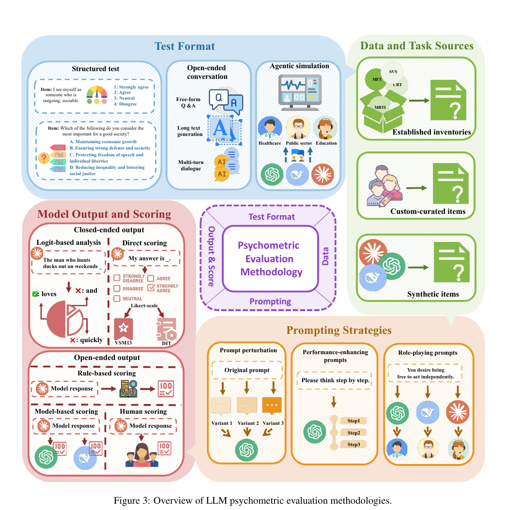

# Data-arXiv-2026-Large language model psychometrics- A systematic review of evaluation, validation, and enhancement
> 说明：本文档内容默认使用中文生成（论文标题与必要专有名词除外）。

*论文下载地址：https://arxiv.org/abs/2505.08245*

*代码是否开源：是 https://github.com/valuebyte-ai/Awesome-LLM-Psychometrics*

*分享人：马明晖*

## 一句话总结内容
> 这是一篇关于大语言模型心理计量学的系统综述，梳理了如何用心理测量学方法评估、验证并增强LLM。

## 一句话总结创新贡献
> 系统总结了LLM心理计量学在构念测量、评估方法、效度验证、模型增强与未来挑战方面的研究框架与经验。

## 举一个例子说明这篇文章的创新点
> 将LLM视为心理测验对象而非评测工具，借助信度、效度、测量不变性和IRT等方法分析其人格、价值观、偏见和认知能力等行为表征。

## 框架图

**框架工作流描述**：
> 先界定待测心理构念，再设计心理计量式测试与提示策略，随后对模型输出进行评分和统计建模，最后从可靠性、效度和标准化角度验证结果，并将结论用于模型增强与对齐。

## 本文挑战及已有工作不足
> 1. LLM输出受随机解码、上下文和提示影响较大，导致稳定性与可重复性不足
> 2. 人类心理构念迁移到LLM时，构念等价性与可解释性仍存在争议
> 3. 静态基准容易失效，且训练数据污染和提示敏感性会影响评测可信度
> 4. 直接沿用人类测验评估模型，可能只能反映统计模仿，而非真实能力

## 印象最深刻的点
> 1. 强调用信度、效度、测量等值性和IRT等方法提升LLM评测的科学性
> 2. 清晰区分了传统AI benchmark与心理计量学在测量哲学和统计方法上的差异
> 3. 总结了人格、价值观、启发式偏差、社会交互、语言心理学和学习能力等多类构念
> 4. 首次系统综述LLM Psychometrics这一交叉领域，覆盖评估、验证与增强三大层面

## 对我们的启发
> 1. 通过因子分析、测量不变性和标准化方法，构建更具解释力的模型能力刻画
> 2. 将心理计量学中的构念定义、信度效度和项目反应理论引入LLM评测
> 3. 借鉴Evidence-Centered Design等规范化测试开发流程

## Idea是否好想
> 本文的核心思想是把LLM输出视为可测量的行为表征，并以心理计量学为理论框架构建评测体系。其价值在于超越单纯的任务准确率排名，转向对潜在构念的科学测量和验证；同时也指出了该路径的关键难点在于构念是否适用于LLM、测试是否稳定、结果是否能够跨提示和跨上下文泛化。

## 是否有开创性
> 创新性主要体现在跨学科重构LLM评测范式：从任务导向转为构念导向，从简单分数转向潜变量建模，从评估结果转向模型增强，并形成了一套系统性的综述框架。

## 是否属于热点
> LLM评测、心理计量学、构念导向基准、信度与效度、项目反应理论、对齐与人类中心AI

## 其他需要补充的点（可选）
> 1. 作者区分了“人类构念”和“LLM构念”，认为二者未必完全同义
> 2. 论文强调LLM并不被视为真正具有主观体验的心理主体，而只是输出呈现出类似心理构念的行为模式

## 与其他论文的关联（可选）
> 1. 与AI公平性、测量不变性和DIF研究具有方法论关联
> 2. 与传统LLM benchmark综述相关，但本文更强调心理计量学方法
> 3. 与人格、价值观、理论心智等单构念评测综述存在交叉

## 还有哪些不足的地方（未来工作）
> 1. 探索从评测到增强的闭环方法，提升安全性、对齐性和认知能力
> 2. 进一步检验心理计量学方法在LLM上的构念效度与测量不变性
> 3. 建立标准化范数与统一评测协议
> 4. 发展适用于LLM的新构念定义，而不仅仅沿用人类心理构念
