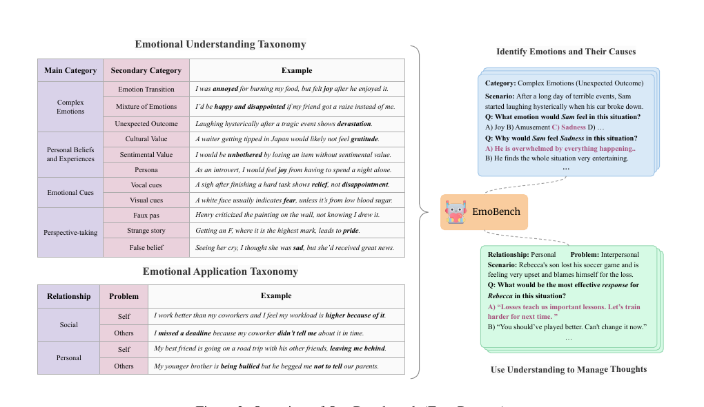

# ED-ACL-2024-EmoBench- Evaluating the Emotional Intelligence of Large Language Models
> 说明：本文档内容默认使用中文生成（论文标题与必要专有名词除外）。

*论文下载地址：https://github.com/Sahandfer/EmoBench*

*代码是否开源：是 https://github.com/Sahandfer/EmoBench*

*分享人：马明晖*

## 一句话总结内容
> 本文提出 EmoBench，一个基于心理学理论构建的中英文情感智能评测基准，用于系统评估大语言模型在情绪理解与情绪应用两方面的能力。

## 一句话总结创新贡献
> 作者设计了400道人工构造的多项选择题，覆盖情绪识别、原因推断、情绪管理与情境应对，并发现现有LLM与人类仍有明显差距。

## 举一个例子说明这篇文章的创新点
> 在“朋友借走外婆留下的衬衫并弄丢”的情境中，模型不能只依据“丢失=难过”的表层模式，而要结合物品的情感价值推断真实情绪及其原因。

## 框架图

**框架工作流描述**：
> 先依据情感智能相关心理学理论搭建情绪理解与情绪应用两大任务框架，再围绕复杂情绪、线索、个人信念、观点采择及关系-问题-应对等类别人工编写情境与选项，随后完成翻译、复审和标注，最终形成中英文双语多项选择评测集，并用零样本与CoT方法评测多个LLM。

## 本文挑战及已有工作不足
> 1. 构造兼顾情感深度、覆盖面和低线索泄漏的人工题目成本较高
> 2. 现有情感智能基准多聚焦情绪识别，较少覆盖情绪调节与情绪应用能力
> 3. 情感智能任务需要推理隐含信息和人物心理状态，难以通过简单模式匹配完成
> 4. 不少已有数据集依赖既有样本，容易带入高频模式、显式线索和标注噪声，影响评测可靠性

## 印象最深刻的点
> 1. 题目均为人工精心构造，而非直接改写已有数据集，有助于减少模式泄漏和显式线索问题
> 2. 数据集包含400题，并提供英文与中文双语版本
> 3. 采用人类标注的加权偏好评分机制处理情绪应用任务，Fleiss' Kappa达到0.852，说明一致性较好
> 4. 基于多项公认心理学理论，给出了较完整的机器情感智能定义，覆盖 Emotional Understanding 与 Emotional Application

## 对我们的启发
> 1. 使用Plutchik情绪轮构建可扩展的情绪标签体系
> 2. 任务设计受到情绪识别、情绪原因识别和情绪管理测试的启发
> 3. 参考了MSCEIT、STEU、STEM等心理学能力测评范式
> 4. 借鉴了Salovey and Mayer、Goleman、Rivers等关于情感智能的经典理论

## Idea是否好想
> 该工作将“情感智能”从单一的情绪识别扩展为更完整的能力集合，并把评测重点从表层模式识别转向隐含信息推理、视角采择与情绪调节决策。其核心价值在于：一方面通过手工构造高难样本提升了评测可信度，另一方面把情绪理解与情绪应用拆成两个维度，更贴近真实人类情感智能的结构，因此适合用于检验LLM是否具备更深层的情感推理与社会认知能力。

## 是否有开创性
> 首次提出同时评估情绪理解与情绪应用的综合性LLM情感智能基准，并用理论驱动的人工构题替代单纯依赖现有情绪数据集的做法。

## 是否属于热点
> 情感智能评测、情绪推理、心理理论相关能力、LLM能力基准、双语人工构造数据集

## 其他需要补充的点（可选）
> 1. CoT对小模型帮助有限，甚至可能带来性能下降
> 2. EU任务中每道题需先判断情绪，再判断原因，因此比单一分类更难
> 3. EA任务采用关系-问题-解决方案三元组建模，覆盖personal/social与self/others组合

## 与其他论文的关联（可选）
> 1. 与Data相关，因为本文核心贡献是构建新的评测基准
> 2. 与ED有关，但本文重点不是生成情感回复，而是评测情感理解与应用能力
> 3. 与ToM相关，因为任务中包含视角采择、隐含心理状态推断和社会情境理解

## 还有哪些不足的地方（未来工作）
> 1. 探索更强的情绪推理与管理能力评测方法
> 2. 进一步扩展关系类别与问题类型的细粒度划分
> 3. 在更大规模、更复杂的情绪应用场景中继续完善评测
> 4. 结合更多语言与文化背景，验证基准的跨语言泛化性
