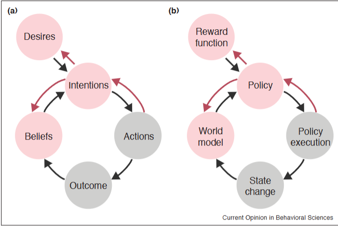

# ED-COBS-2019-Theory-of-Mind-as-Inverse-Reinforcement-Learning.md
*论文下载地址（可选）：[https://arxiv.org/]*
*代码是否开源：否*
*分享人：马明晖*

## 一句话总结内容
> 本文提出人类心智理论（ToM）本质上可建模为逆向强化学习（IRL）：通过观察他人行为，反向推断其隐藏的信念（世界模型）与欲望（奖励函数），并以贝叶斯推理实现心智状态估计。

## 一句话总结创新贡献
> 首次系统性建立心智理论与逆向强化学习的统一计算框架，明确将信念对应世界模型、欲望对应奖励函数、行为推断对应策略逆推，为社会认知提供可解释、可泛化的计算基础。

## 举一个例子说明这篇文章的创新点
> 朋友迟到，传统解释只猜“忘了/迷路了”；IRL-ToM框架会像逆向推理一样：观察行为→假设可能的世界模型（知道哪个店？）→假设可能的奖励函数（想见面？怕麻烦？）→用贝叶斯加权最可能的心智状态→得出“她以为去另一家店”的最优解释，而非简单猜测。

## 框架图
`
> 
> **框架工作流描述**：1. 心智理论分解为信念（世界模型）+欲望（奖励函数）；2. 正向过程：信念+欲望生成策略与行为；3. 逆向过程（IRL）：从观察到的行为，用贝叶斯推理反推信念与欲望；4. 用于预测行为、理解目标、教学、人机协作等。

## 本文挑战及已有工作不足
1. 传统ToM研究缺少统一计算模型，难以量化与建模。
2. IRL 未面向人类认知设计，无法解释人类朴素心理推理。
3. 信念表示过于全局，无法模拟人类只推理关键差异的特点。
4. 欲望表示过于简单，无法表示组合、时序、上下文依赖的目标。
5. 深度IRL数据低效，与人类小样本学习不符。
6. 无法解释个体差异与非理性决策（健忘、冲动、后悔等）。

## 印象最深刻的点
> 用最简单优雅的方式统一社会认知与强化学习：心智 = 世界模型 + 奖励函数，理解他人 = 逆向强化学习，彻底奠定了后续二十年ToM-IRL的基础范式。

## 对我们的启发
1. 所有社会理解、意图识别、共情对话都可统一为IRL问题。
2. 信念=世界模型，欲望=奖励函数，是最稳定的心智表示。
3. 小样本心智推理需要贝叶斯先验与结构归纳偏置。
4. 人机协作、机器人可解释行为、教育教学都可基于此框架设计。
5. 要做类人心智理解，必须建模结构化信念与组合式欲望。

## Idea是否好想
> Idea极简洁、极本质、跨学科洞见强，是认知科学+AI的里程碑式思路，工程与理论双易落地，影响深远。

## 是否有开创性
> 是开创性奠基工作；首次将心智理论正式建模为IRL，定义了整个计算社会认知与机器心智理论的研究范式。

## 是否属于热点
> 属于长期核心热点：心智理论、逆向强化学习、社会认知、人机交互、认知AI、具身智能均围绕此框架展开。

## 其他需要补充的点（可选）
> 提出人类ToM并非完美RL，而是近似的“朴素效用演算”，更轻量、更抽象。
> 指出未来方向：结构化信念、组合式奖励、层级RL、快速神经推断+符号精调。

## 与其他论文的关联（可选）
> 继承朴素效用演算、贝叶斯心智推理、Baker 2009 行动理解工作；是后续所有ToM、IRL、机器心理理论、社交大模型的理论源头。

## 还有哪些不足的地方（未来工作）
1. 信念需结构化表示，而非全状态概率分布。
2. 奖励需支持组合、时序、上下文、逻辑结构。
3. 需结合深度学习实现快速小样本推断。
4. 需加入人类认知局限：记忆、冲动、后悔、个体差异。
5. 扩展到多轮交互、高阶信念、多智能体社交场景。
6. 落地到对话系统、机器人、教育、道德判断等真实任务。