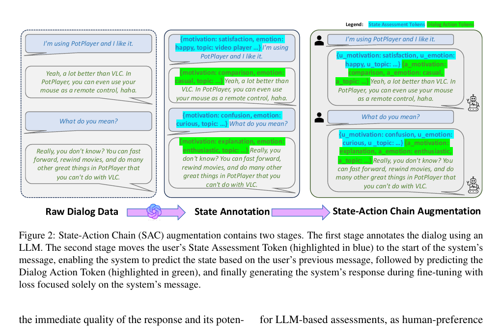

# ED-arXiv-2025-SAGE- Steering and Refining Dialog Generation with State-Action Augmentation
> 说明：本文档内容默认使用中文生成（论文标题与必要专有名词除外）。

*论文下载地址：https://arxiv.org/abs/2503.03040*

*代码是否开源：是 https://github.com/apple/ml-sage-dialog-gen*

*分享人：马明晖*

## 一句话总结内容
> 本文提出SAGE框架，通过引入未来感知的状态-动作链增强情感对话生成，在保持对话自然性的同时实现长程可控生成。

## 一句话总结创新贡献
> 本文的核心贡献是将对话生成拆解为状态评估、动作预测和回复生成三个阶段，并结合自我改进树搜索、偏好学习与推理时状态操控，实现更可控的情感对话模型。

## 举一个例子说明这篇文章的创新点
> 例如，推理时模型先生成类似“{u_motivation: surprise, u_emotion: excited…}{a_motivation: curiosity, a_emotion: playful…}”的状态与动作，再输出回复，因此只需调节少量状态logit即可改变回复风格。

## 框架图

**框架工作流描述**：
> 先用LLM对原始多轮对话进行未来感知标注，补充用户状态评估token和助手动作token；再用SAC增强数据对Mixtral 8x7B进行LoRA微调；随后通过自我对话树搜索生成候选轨迹并用Judge LLM筛选高质量样本，迭代精炼模型；最后再用DPO做偏好优化，并支持推理时按目标状态进行轻量控制。

## 本文挑战及已有工作不足
> 1. 情感对话需要同时兼顾自然性、共情性、策略性与互动性
> 2. 长时程对话中的奖励较稀疏，信用分配困难
> 3. 在巨大的token级动作空间上直接做强化学习成本较高
> 4. 情感型多轮对话缺少明确目标，难以像任务型对话那样直接建模和优化

## 印象最深刻的点
> 1. 在情感对话指标上有明显提升，同时通用基准整体保持相对稳健
> 2. 提出未来感知的State-Action Chain，用完整对话轨迹而非单句孤立标注状态与动作
> 3. 通过树搜索、LLM奖励筛选与再训练形成自我改进管线
> 4. 将高层状态预测与动作预测显式插入生成流程，实现粗粒度可控生成

## 对我们的启发
> 1. 受Decision Transformer启发，将状态-动作轨迹视作序列学习问题
> 2. 受Chain-of-Thought启发，将对话生成分解为高层规划与语言实现两阶段
> 3. 受任务型对话中的DST/Policy/NLG模块化设计启发，并迁移到开放域情感对话

## Idea是否好想
> 这篇工作本质上是在情感对话场景中引入高层中间变量驱动的生成范式：先预测当前对话状态与下一步动作，再生成表面回复。其价值在于把原本隐式、难以优化的对话策略显式化，为搜索、偏好学习和推理时控制提供接口。未来感知标注借助完整上下文消歧情绪、动机与策略，降低了仅看单句带来的标签噪声。整体上，该方法将计划、状态跟踪和生成融合为一个可训练的统一框架。

## 是否有开创性
> 新颖性主要体现在三点：一是将状态和动作作为离散latent变量显式插入对话生成；二是采用未来感知标注学习长程策略；三是把树搜索、自训练和DPO结合到同一条改进链路中，并支持推理时对状态直接操控。

## 是否属于热点
> 情感对话、可控生成、长程规划、自我改进、LLM-based reward modeling、state-level RL

## 其他需要补充的点（可选）
> 1. 模型基座为Mixtral 8x7B，训练中使用LoRA以保持原模型能力
> 2. 数据来自2005到2017年的Reddit对话，并经过多轮过滤得到181,388个训练实例
> 3. 作者报告SAGE DPO相比初始模型在LLM judge下胜率显著提高，但部分通用推理任务有所下降

## 与其他论文的关联（可选）
> 1. Chain-of-Thought
> 2. Decision Transformer
> 3. RLHF

## 还有哪些不足的地方（未来工作）
> 1. 探索更高效的多轮奖励建模与搜索策略
> 2. 缓解情感对话专门化后带来的通用推理能力下降
> 3. 扩展到更复杂的开放域社交互动与个性化控制场景
> 4. 将state-level强化学习真正落地到对话系统中
