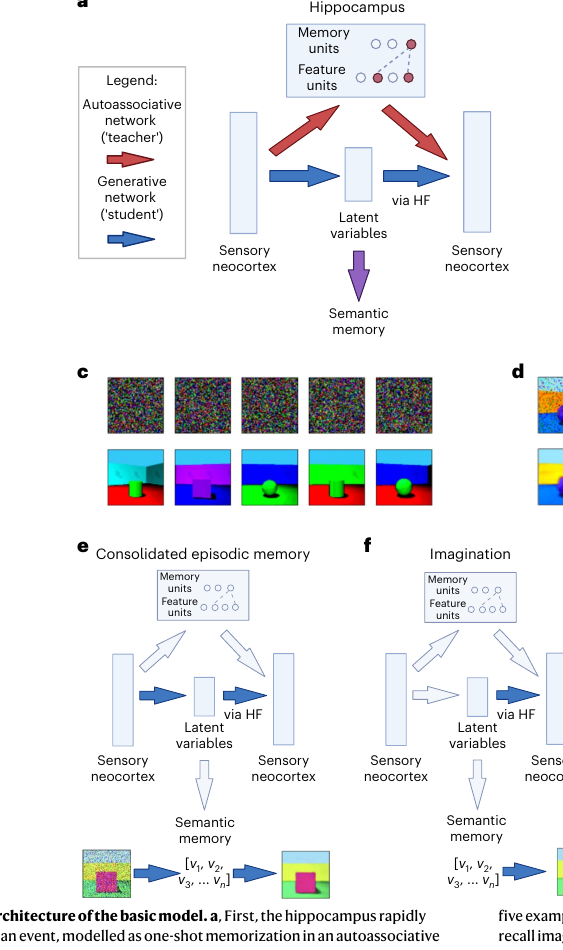

# Memory-Nature Human Behaviour-2024-A generative model of memory construction and consolidation
*论文下载地址：https://doi.org/10.1038/s41562-023-01799-z*

*代码是否开源：未提及*

*分享人：自动生成*

## 一句话总结内容
> 本文构建了一个由海马自联想网络经重放训练皮层生成模型（VAE）的记忆系统，在同一框架下统一解释情景记忆的形成与巩固、语义记忆、想象、关系推理以及图式驱动的记忆扭曲。

## 一句话总结创新贡献
> 核心贡献是将系统巩固形式化为海马“教师”通过重放训练皮层生成“学生”网络的过程，并在同一架构下重现记忆年龄效应、海马损伤、语义化及边界扩展等多种行为和神经现象。

## 举一个例子说明这篇文章的创新点
> 例如，作者用现代Hopfield网络模拟海马一曝即录，再用其重放的Shapes3D和MNIST记忆训练VAE，展示回忆出的手写数字会自动向类别原型收缩，并在“放大/缩小”视角操纵下成功再现实验心理学中观测到的边界扩展与边界收缩效应。

## 框架图

**框架工作流描述**：
> 工作流分为两个层次：在基本模型中，事件首先在海马现代Hopfield网络中以单次呈现的方式快速自联想编码；在休息或巩固阶段，向海马输入噪声触发记忆重放，这些重放模式作为训练数据，通过教师–学生学习训练变分自编码器，使其学会从潜在变量重构感知输入；随着训练推进，某些事件的可预测部分可完全由生成网络重构，相应的海马痕迹便不再必需，从而实现系统巩固与语义化。在扩展模型中，知觉时生成网络对每个元素计算重建误差，将低误差（可由既有图式预测）的成分视为概念特征，仅通过与潜在变量相连的抽象表征表示，而将高误差（新奇、难预测）的成分以高分辨率感官特征写入海马自联想网络；回忆时，部分线索先在海马中完成模式补全，得到概念+感官的混合表征，再由潜在变量经海马–新皮层回投生成图式化场景，并在其中覆写当初存储的个别感官细节。多个生成网络可并行接受同一海马的重放训练，其潜在变量分别位于EC、mPFC和前外侧颞叶，对应不同语义与关系结构，但都需经由海马回投才能生成具象体验。

## 本文挑战及已有工作不足
> 1. 揭示回忆、想象与情景未来思考为何招募高度重叠的神经回路，以及其共享的计算原理
> 2. 阐明情景记忆与语义记忆如何在时间上分离又保持关联，即系统巩固与语义化的具体计算机制
> 3. 在同一模型中同时解释Complementary Learning Systems与多痕迹理论在海马依赖性上看似矛盾的实验结果
> 4. 构建一个能自然产生原型化、边界扩展/收缩等图式驱动记忆扭曲，并可与人类行为数据定量对齐的生成模型

## 印象最深刻的点
> 1. 根据生成网络逐元素重建误差将事件拆分为可预测的概念成分与不可预测的感官成分，仅对后者进行高精度海马编码，在保留关键新奇信息的同时显著提高有效存储容量
> 2. 通过简单的“视角缩放”操作，模型自然产生边界扩展与收缩，并在定量上再现人类实验中“典型视角”附近的偏差曲线，表明图式驱动记忆扭曲可视为生成模型趋向先验分布的重构偏差
> 3. 将系统巩固明确建模为教师–学生学习：海马现代Hopfield网络通过重放样本训练皮层VAE，是对“海马向皮层迁移”经典观点的具体算法实现
> 4. 同一模型在Shapes3D与MNIST上同时展现语义结构学习（潜在空间可线性解码“形状”等属性）、关系推理（向量算术）、想象（潜在空间插值）和类别原型化（类内方差收缩），并通过对潜在变量的线性分类解码具体体现“语义记忆即潜在空间结构”的观点

## 对我们的启发
> 1. 在多系统学习框架中，可将海马–皮层互作视为教师–学生式知识蒸馏：快速系统通过重放样本训练慢速系统捕获稳态统计结构，为设计类CLS架构提供类比
> 2. 工程化记忆系统设计时可借鉴“预测误差门控存储”的思想：让快速记忆模块仅记录生成模型难以预测的部分，在有限容量下优先保留真正新奇、信息量高的细节
> 3. 在认知和神经建模中，可普遍采用VAE或其他生成模型，将“记忆”视为对经验分布的建模，把回忆与想象统一为从潜在空间采样与条件生成的过程
> 4. 模型中的“概念特征+个别感官特征”组合表征提示，在表示学习任务中可显式区分抽象语义维度与高频细节，以在压缩、泛化能力与可逆重构之间取得更佳平衡

## Idea是否好想
> 本文的核心思想是：将人类情景–语义记忆系统视为由一个快速自联想“索引器”（海马）和一个慢速生成模型（新皮层）协同构成的系统。海马通过单次联想绑定来自感官皮层及高阶皮层的多模态特征，并在离线重放时向皮层输出这些活动模式；皮层中的VAE类生成网络反复接收重放样本，学习从潜在变量重构事件的统计规律，逐步接管对可预测成分的生成责任。作者进一步提出按元素级预测误差拆分记忆内容：可被既有图式良好预测的部分只需以抽象潜在变量形式存在，无需在海马中高精度存储；真正新奇、难预测的部分则以高分辨率感官特征写入海马，从而既解释了巩固伴随的语义化与原型化，又解释了部分生动细节长期依赖海马的现象。该模型在行为层面可重现实验中的记忆年龄梯度、海马损伤导致的近期情景缺失但语义相对保留，以及回忆、想象和未来思考共用神经机制等结果；在计算层面则展示了潜在空间自然承载语义分类、关系推理和组合想象等功能。其优势在于用相对简洁的生成模型框架，把CLS、多痕迹理论、图式理论和预测处理等大量分散的认知与神经证据整合为一套可运行的深度学习实现。局限在于：所用MHN与VAE距真实神经回路仍较为抽象，未显式模拟突触可塑性细节和睡眠阶段结构；任务主要局限于合成数据集上的静态视觉场景，尚未覆盖自然语义记忆中语言、因果与时间维度；海马痕迹的遗忘、干扰和严格容量上限也未被系统建模。尽管如此，这项工作为“生成记忆观”提供了有力范例，展示了如何用现代生成模型具体化经典记忆理论，并为后续扩展到更真实、更复杂的认知情境奠定了基础。

## 是否有开创性
> 相较于仅强调学习速率差异的传统CLS框架，本文的创新在于：一是将系统巩固具体化为海马向皮层的教师–学生学习过程，借助现代Hopfield网络与VAE给出可运行算法；二是引入逐元素重建误差，将记忆拆分为由生成图式承担的概念部分和需海马存储的意外细节，从机制上解释语义化与细节流失之间的张力；三是将巩固后的记忆形式明确为生成网络本身，使回忆、想象和未来场景构建都成为同一生成过程的不同调用方式；四是通过对MNIST与Shapes3D的系统模拟，定量展示原型化和边界扩展/收缩等记忆扭曲如何自然从生成模型先验中涌现；五是提出多潜在空间分别对应EC、mPFC、前外侧颞叶等脑区的多生成网络构想，为将深度生成模型与大尺度脑网络结构直接对齐提供了新视角。

## 是否属于热点
> 该工作位于“生成模型统一记忆与想象”这一新兴交叉热点：一方面将深度生成模型（VAE、现代Hopfield网络、潜在空间算术）与经典记忆理论（CLS、多痕迹、图式理论、预测编码）相连接；另一方面与当前关于海马重放、系统巩固、语义化和图式学习的大量实证研究高度契合。它体现了计算认知神经科学的重要趋势：用可训练的深度生成网络解释回忆、想象、未来思考与语义获取等高阶功能，并将预测误差视为选择性编码与巩固的核心信号，从而与更广泛的预测处理和主动推理框架形成呼应。

## 其他需要补充的点（可选）
> 1. 文章强调VAE只是示例性选择，并指出预测编码网络等其他潜在变量生成模型预期会表现出相似行为，为未来采用更生物可行架构预留空间
> 2. 文章区分“基本模型”（仅考虑感官特征）与“扩展模型”（显式引入概念与感官双通道），后者更好贴合海马中概念细胞与情景特异性细胞共存的实验证据
> 3. 作者假设所有从高阶关联皮层潜在空间回投到感官皮层的路径都必须经由海马，以此解释海马损伤时想象与情景再体验受损而语义提取相对保留的现象

## 与其他论文的关联（可选）
> 1. 预测编码与预测处理框架：以预测误差驱动学习与更新先验，本文将事件按重建误差分解为可预测与不可预测成分，是该思想在记忆巩固领域的具体化
> 2. 多痕迹理论（Multiple Trace Theory）：认为生动情景记忆长期依赖海马，本文通过“语义成分迁移至生成网络、细节持续依赖海马”的划分给出了兼容性解释
> 3. Complementary Learning Systems（McClelland等）：同样强调海马快速学习与皮层慢速整合的双系统架构，本文在此基础上引入生成模型视角和教师–学生式实现

## 还有哪些不足的地方（未来工作）
> 1. 在模型中显式加入海马与皮层的容量限制、噪声与遗忘机制，系统考察不同预测误差门控策略对记忆保持曲线和干扰效应的影响
> 2. 将当前基于VAE的生成网络替换或补充为更生物可行的预测编码网络、生成RNN或序列模型，以更好模拟事件序列和时间上下文
> 3. 引入更接近真实睡眠结构的重放与训练调度（如NREM/REM轮替、优先重放新奇或情绪事件），探索不同睡眠阶段在图式抽取与记忆扭曲形成中的差异作用
> 4. 从合成数据扩展到更自然、更高维的多模态刺激（如自然图像、语音、语言叙事、空间轨迹等），并与人类或动物在相同任务上的行为和神经成像数据进行定量拟合
