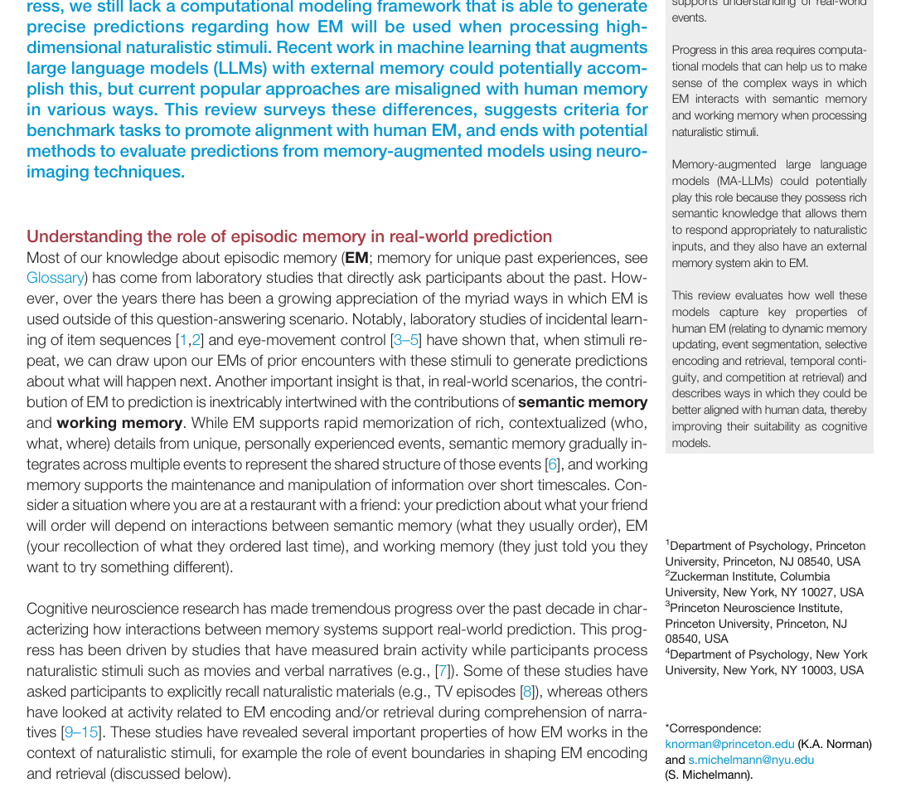

# Memory-Trends in Cognitive Sciences-2025-Towards large language models with human-like episodic memory
*论文下载地址：https://doi.org/10.1016/j.tics.2025.06.016*

*代码是否开源：未提及*

*分享人：自动生成*

## 一句话总结内容
> 文章综述认知神经科学中关于情景记忆的最新进展，系统比较人类情景记忆与记忆增强大语言模型（MA-LLMs）的外部记忆机制，探讨如何让后者在真实世界事件的理解与预测中更接近类人的情景记忆。

## 一句话总结创新贡献
> 文章提出一套将人类情景记忆关键属性（动态更新、事件分段、选择性编码与提取、时间邻近性与竞争性检索）系统映射到MA-LLMs架构设计与评测基准上的框架，为记忆增强LLM的类人化与认知建模应用提供了清晰路线。

## 举一个例子说明这篇文章的创新点
> 作者区分了依赖超长上下文窗口的“在上下文记忆”和独立外部情景记忆系统两类方案，结合互补学习系统理论主张在LLM中显式引入类似海马的一次性记忆模块，并以人类情景记忆的行为与神经特征（如事件边界、检索带宽限制）作为标尺，评估和改进现有RAG、键值存储等MA-LLM架构。

## 框架图

**框架工作流描述**：
> 在研究流程上，文章首先回顾了认知神经科学关于情景记忆在自然电影、叙事等高维自然刺激下支持预测的实证和理论工作，并强调情景记忆与语义记忆、工作记忆之间的互动；随后梳理标准LLM在权重记忆与上下文窗口方面的局限，引出通过外部记忆扩展的大语言模型（如RAG与键值存储模型）；接着以动态更新、事件分段、选择性编码与检索、时间邻近性和竞争性检索为主轴，逐一比较人类情景记忆与现有MA-LLMs的异同，分析EM-LLM、Titans、FLARE等代表性模型在人类数据对齐上的优势与不足；最后，文章讨论主流问答式评测与真实世界记忆使用情境的脱节，提出更贴近连续输入、检索时机决策与不确定性管理的任务设想，并展望利用神经影像将记忆增强模型的内部表征与人脑活动进行对比验证。

## 本文挑战及已有工作不足
> 1. 现有记忆增强方法在编码与检索上多采用固定频率或全局检索策略，既缺乏基于不确定性和任务需求的选择性检索控制，也缺少强竞争与带宽限制机制，容易一次性返回多条相似记忆并引入干扰或错误信息
> 2. 多数MA-LLMs将外部记忆视为“写入即固定”的文本片段集合，缺乏基于再激活的持续调整与遗忘机制，也缺乏由预测误差或潜在因子变化驱动的自动事件分段能力，难以对齐人类在自然情境中的事件边界加工
> 3. 机器学习社区常用的问答式基准假定检索时刻明确且总有单一正确答案，与现实中连续信息流、不确定检索时机及“无相关记忆可用”的情形相去甚远，也尚缺乏将模型检索动态与人脑在自然影片和叙事理解中的神经活动精确比对的成熟方法
> 4. 现有LLM主要依赖权重记忆和有限上下文窗口，难以在不发生灾难性遗忘的前提下实现真正长期的一次性情景记忆存储，而简单延长上下文窗口既计算代价高昂，也难以认知上区分有限容量的工作记忆与大容量情景记忆

## 印象最深刻的点
> 1. 系统梳理了人类情景记忆的核心特性——动态更新、事件边界、选择性编码与检索、时间邻近性和竞争性检索——并提供丰富的行为与神经证据，将其逐项映射到具体MA-LLM设计问题上
> 2. 文章将互补学习系统理论中“海马快速情景记忆–新皮层缓慢语义学习”的分工，与LLM的权重记忆和外部记忆架构进行了细致类比，构建出统一的认知–工程视角
> 3. 作者敏锐地批判了主流问答式基准对检索时机、检索风险和“无答案”情形几乎不设约束，进而提出结合自然电影范式与神经影像数据的新型评估思路，凸显当前研究范式与自然记忆使用情境的落差
> 4. 在综述RAG等“存原文”的外部检索方案的同时，文章深入讨论直接存储Transformer键值向量的模型，指出后者在模拟人类“存内部表征”的记忆形式上更具心理合理性，并用Titans、EM-LLM、FLARE等实例加以说明

## 对我们的启发
> 1. 模型访问外部记忆的时机不宜预设为固定频率，而应由当前预测不确定性、可用上下文信息及潜在检索风险共同决定，从而发展出策略性检索控制模块和竞争性筛选机制
> 2. 可借鉴人类在事件边界处更强编码与检索的现象，让预测误差或潜在因子变化驱动模型的事件自动分段与关键时刻记忆强化
> 3. 在工程实现上，应显式区分“工作记忆式上下文窗口”和“长期外部情景记忆”，避免仅依赖超长上下文来一体化处理所有记忆需求
> 4. 时间邻近性和时间上下文理论启发我们在外部记忆中显式编码时间上下文向量，并结合自然电影等任务中的人脑活动数据来塑造类人化的回忆顺序与索引结构

## Idea是否好想
> 本文的核心思想是将记忆增强大语言模型视作候选的“认知模型”，检验并推动其在结构和行为上向人类情景记忆收敛。作者指出，仅通过扩大会话上下文虽然可以在工程上缓解部分长期依赖问题，但既成本高昂，又难以在功能上区分有限容量的工作记忆和大容量的情景记忆；相反，应在互补学习系统框架下引入独立的一次性外部情景记忆模块，并通过“检索后回写权重”等机制与权重中的语义记忆形成互动。方法论上，文章主张从自然电影、叙事和真实事件理解等自然范式出发考察记忆功能，而非局限于受控实验或静态问答任务；在评估维度上，则强调检索时机选择、错误检索风险管理、事件分段与回忆顺序等更贴近真实认知行为的指标。总体来看，文章并未提出具体新模型，而是搭建了一套连接认知神经科学与机器学习的分析框架，明确了构建“类人记忆大模型”所需面对的关键设计问题与实验范式。

## 是否有开创性
> 相较于以往只是借用神经科学术语来命名或装饰工程模型的做法，本工作真正从行为和神经层面细致梳理了人类情景记忆的若干核心特性，并据此对现有各类MA-LLMs的具体设计逐项“对表”，提出了一套可操作的对齐指标体系。其新颖性体现在两方面：一是利用互补学习系统、事件分段理论和时间上下文模型等成熟认知框架，系统反思长上下文、RAG、键值存储等不同工程方案的优劣与偏差；二是从任务设计角度批判以问答为中心的评测范式，主张构建更接近连续自然输入与不确定性决策的记忆任务，并将神经影像数据作为外部“真值”，检验模型是否以类似人脑的方式使用记忆。总体而言，这种“从认知现象倒推模型结构与基准设计”的思路，在记忆增强LLM研究中具有明显的原创性和方向引导作用。

## 是否属于热点
> 围绕类人情景记忆的记忆增强大语言模型（MA-LLMs）的架构设计与评测——尤其是如何在模型中构建类似海马的外部记忆系统，并使其在自然情境下以接近人类的方式完成事件分段、选择性检索和长期存储——正成为连接认知神经科学与大模型工程的关键研究热点。

## 其他需要补充的点（可选）
> 1. 作者特别强调“检索风险”这一概念，指出在线索不足时强行检索可能让错误记忆主导行为，这一洞见对设计模型的检索策略和评测任务具有重要启发
> 2. 文中讨论的人类记忆可塑性（如竞争驱动的增强与削弱、再巩固过程中的内容更新）为未来在模型中实现可控遗忘与记忆重写提供了丰富的认知依据
> 3. 文章通过介绍Box 1中Transformer自注意力的查询–键–值机制，将短程上下文内的自注意力操作类比为工作记忆处理，而将对远端上下文或外部记忆的同类计算视作情景记忆检索

## 与其他论文的关联（可选）
> 1. 系统引入事件分段、事件边界和时间上下文模型等认知与神经研究成果，用以指导外部记忆的分块策略、时间索引结构及回忆顺序建模
> 2. 工作与互补学习系统（CLS）理论密切相关，将海马的快速情景记忆与新皮层的缓慢语义学习对应到LLM的外部情景记忆与权重学习之上
> 3. 与关于长上下文LLM、自注意力在记忆建模中的作用以及传统开卷问答与检索式问答基准的工作形成对话，比较“一体化长上下文记忆”和“分离式情景记忆模块”两种路径的优劣

## 还有哪些不足的地方（未来工作）
> 1. 在模型中引入基于预测误差或潜在因子变化的事件分段机制，让外部记忆以自适应的“事件块”而非固定长度文本片段为单位进行存储，同时结合显式时间上下文表示，构建多尺度的时间索引结构
> 2. 开发能够根据当前预测不确定性、潜在检索收益与错误检索风险动态决定是否访问外部记忆的策略模块，并在检索阶段加入更强的竞争与带宽限制，使模型更可靠地选择单一或少量关键记忆
> 3. 设计在架构上显式区分工作记忆（上下文窗口）、语义记忆（权重）与情景记忆（外部存储）的新型MA-LLMs，并系统研究三者的交互与通过“记忆重放”将外部情景记忆整合进语义知识的机制
> 4. 构建超越标准问答的评测基准，例如基于长篇电影、连续叙事或交互式环境的任务，并结合fMRI、EEG/MEG等神经影像，将模型的事件边界、检索时刻与表征动态与人脑在自然理解任务中的活动进行对比
