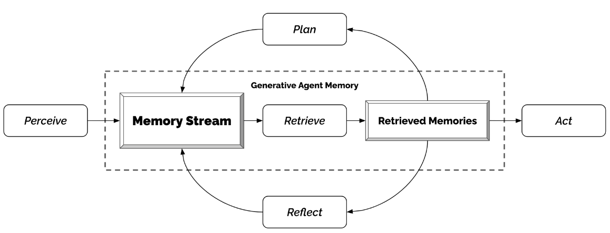

# Memory-UIST-2023-Generative Agents- Interactive Simulacra of Human Behavior
> 说明：本文档内容默认使用中文生成（论文标题与必要专有名词除外）。

*论文下载地址：https://doi.org/10.1145/3586183.3606763*

*代码是否开源：是 https://github.com/joonspk-research/generative_agents*

*分享人：马明晖*

## 一句话总结内容
> 本文提出一种生成式智能体框架，通过自然语言记忆流、反思与规划，让多个智能体在沙盒环境中表现出连贯且逼真的人类行为与社会互动。

## 一句话总结创新贡献
> 作者设计了一个扩展大语言模型的智能体架构，将经历以自然语言长期存储、动态检索并反思归纳，再用于生成日常行为、社交互动和多步规划。

## 举一个例子说明这篇文章的创新点
> 只需给一个智能体设定“想举办情人节派对”的种子意图，系统就能自动推动邀请、传播信息、安排到场并促成派对发生。

## 框架图

**框架工作流描述**：
> 系统先用自然语言记录智能体经历形成记忆流，再按相关性、时效性和重要性检索记忆；随后将多条记忆综合为反思；最后结合当前环境与反思结果生成计划，并递归细化为具体行动，执行后再写回记忆流。

## 本文挑战及已有工作不足
> 1. 如何处理多智能体之间复杂的社会动态与信息扩散
> 2. 如何在长时间、多轮交互中保持智能体行为的一致性
> 3. 如何在上下文窗口有限的情况下管理不断增长的记忆
> 4. 如何让智能体在开放世界中依据既往经历做出合理决策

## 印象最深刻的点
> 1. 通过消融实验说明记忆检索、反思和规划对行为可信度都很关键
> 2. 展示了从单一种子意图出发涌现复杂社会行为的能力
> 3. 提出了由记忆流、反思和规划组成的完整生成式智能体架构
> 4. 支持多智能体在沙盒世界中自然语言交互、形成关系并协同活动

## 对我们的启发
> 1. 可用于测试社会科学理论和人机交互假设
> 2. 可用于构建虚拟世界和游戏中的可信NPC
> 3. 可用于社交原型设计、角色扮演和复杂对话预演

## Idea是否好想
> 该工作把大语言模型从单次生成推进到带长期记忆与自我反思的持续体，关键在于将经验写成可检索的自然语言记忆，并通过反思把局部事件抽象为高层行为倾向，再据此进行规划。其价值不在于单纯提升文本生成质量，而在于让模型具备时间维度上的角色一致性与社会演化能力，更接近面向交互系统的智能体设计范式。

## 是否有开创性
> 将长时记忆检索、反思抽象和规划执行整合到大语言模型驱动的多智能体架构中，并在开放式沙盒环境中验证其可产生个体与群体层面的涌现行为。

## 是否属于热点
> 大语言模型智能体、长期记忆、反思规划、多智能体社会模拟、交互式仿真

## 其他需要补充的点（可选）
> 1. 文中实验环境 Smallville 为手工构建，不是自动生成
> 2. 论文强调该类智能体可能带来拟社会关系、深度伪造与定向说服等伦理风险

## 与其他论文的关联（可选）
> 1. 与基于规则的NPC/行为树方法相关
> 2. 与社会仿真和虚拟社会构建相关
> 3. 与SOAR、ICARUS等认知架构相关

## 还有哪些不足的地方（未来工作）
> 1. 提升语言风格与行为控制的可调性
> 2. 扩展环境与世界状态建模的丰富度
> 3. 进一步降低记忆检索错误和记忆幻觉
> 4. 探索更安全的部署方式以缓解伦理风险
