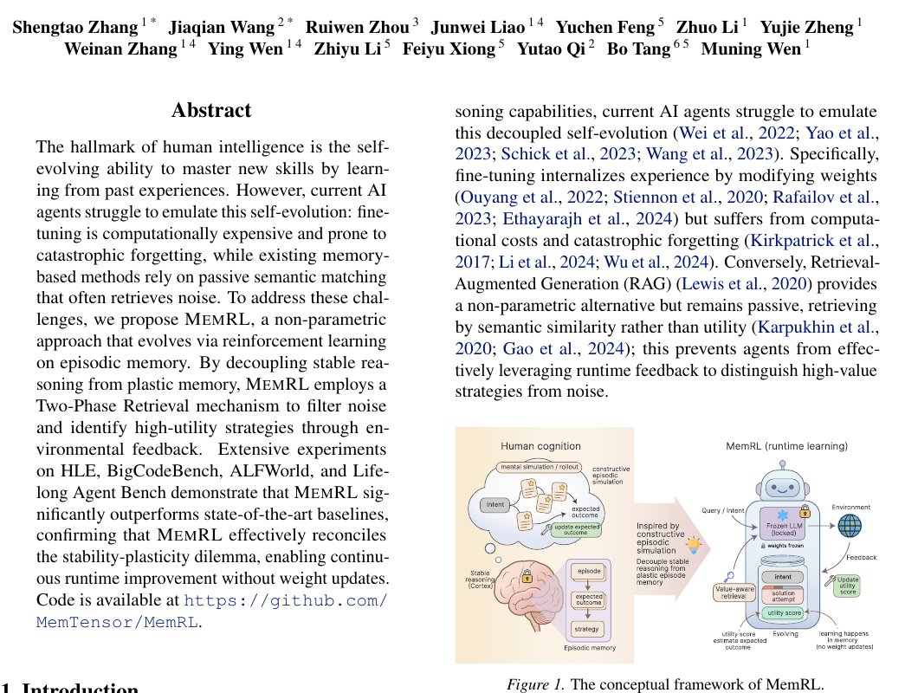

# Memory-arXiv 预印本-2026-MemRL- Self-Evolving Agents via Runtime Reinforcement Learning on Episodic Memory
*论文下载地址：https://arxiv.org/abs/2601.03192*

*代码是否开源：是 https://github.com/MemTensor/MemRL*

*分享人：自动生成*

## 一句话总结内容
> 本文提出 MemRL 框架，在外部情景记忆上执行非参数强化学习，使冻结大模型代理在部署后依赖运行时经验反馈持续自进化而无需更新模型权重。

## 一句话总结创新贡献
> 本文的核心贡献是将记忆检索建模为可学习的决策过程，引入“Intent-Experience-Utility”三元组记忆结构与两阶段检索策略，在理论上缓解稳定性-可塑性困境，并在多项基准上显著优于现有记忆增强与 RAG 方法。

## 举一个例子说明这篇文章的创新点
> 传统 RAG 仅按语义相似度检索，而 MemRL 先用相似度召回候选，再用由环境奖励学习到的 Q 值重排。例如在 ALFWorld 探索任务中，面对多条“去厨房拿钥匙”的相似经验，MemRL 会优先选取过去带来成功（高 Q）的策略轨迹，丢弃虽语义相近但常导致失败的“干扰记忆”，从而在新场景中快速复用高价值操作序列。

## 框架图

**框架工作流描述**：
> 整体工作流为：（1）将当前用户请求或环境状态编码为意图表示 s；（2）将记忆库中的每条记忆存为 (Intent z, Experience e, Utility Q) 三元组；（3）阶段 A：基于嵌入相似度在记忆库中召回 Top-k1 个与 s 语义相近的候选；（4）阶段 B：对候选按归一化相似度与归一化 Q 值加权打分，score=(1-λ)*sim+λ*Q，选出 Top-k2 组成上下文 Mctx；（5）将 Mctx 与当前状态拼接输入冻结的 LLM，得到行动或回答；（6）与环境交互获得奖励 r（成功/失败或得分），对本轮参与生成的记忆按蒙特卡洛规则更新 Q←Q+α(r-Q)；（7）用 LLM 将本次交互轨迹摘要为新的 Experience，与当前 Intent 及初始化 Utility 一起写回记忆库；（8）随交互轮次增加，记忆 Q 估计逐渐收敛，检索策略自适应优化，实现运行时的持续学习。

## 本文挑战及已有工作不足
> 1. 如何在不进行昂贵且易引发灾难性遗忘的参数微调前提下，让大模型代理在部署后持续提升任务表现，构成典型的稳定性-可塑性两难问题
> 2. 跨任务复用经验时，不同任务间语义相似度与可迁移性差异较大，易导致检索经验与当前任务分布不匹配，从而削弱稳定性与收益
> 3. 记忆库持续扩张时，如何通过阈值设定、归一化与检索规模控制噪声累积，避免性能振荡与遗忘，是运行时学习系统的重要工程与理论难点
> 4. 现有 RAG 与记忆增强代理多依赖语义相似度检索，难以区分“语义相似但无用或有害”的记忆，无法有效利用运行时反馈挖掘真正高价值的经验

## 印象最深刻的点
> 1. 将记忆检索明确建模为 M-MDP 框架中的决策动作，并提出“Intent-Experience-Utility”三元组，使传统语义检索升级为基于回报的策略学习，是记忆增强代理中较为系统的 RL 化建模
> 2. 两阶段检索（相似度召回 + 价值感知选择）结构简单却效果显著，能在多数据集上过滤大量“语义相似但无用”的噪声记忆，显著提升成功率与累计成功率
> 3. 在 BigCodeBench、ALFWorld、Lifelong Agent Bench、HLE 等跨代码、导航、工具使用与高难问答的多域基准上均取得稳健提升，且在探索类环境中优势更大，表明该方案具有较强通用性
> 4. 采用完全非参数的强化学习仅更新记忆 Q 值，主干 LLM 全程冻结，既避免在线微调的计算开销，也从根本上规避了灾难性遗忘风险

## 对我们的启发
> 1. Q 值监督不仅可用于检索排序，还可进一步指导反思、解题规划或问题分解策略的选择，构建多层级的价值感知决策体系
> 2. 在多代理或多模型场景下，不同代理的记忆库可通过共享或迁移，将 MemRL 扩展为“群体经验池”的价值驱动管理机制，提升系统级样本利用效率
> 3. MemRL 的思想可与自动合成或压缩记忆（如层级摘要、模板抽象）结合，形成“抽象化-估值-检索”的闭环，使长期记忆既紧凑又高效
> 4. 可将更多类型的外部结构化记忆（如知识图谱节点、工具调用轨迹、程序片段）统一映射为“Intent-Experience-Utility”三元组，在其上执行价值驱动检索，形成通用的“记忆控制层”

## Idea是否好想
> 本文的核心思想是将外部记忆的使用从“静态语义检索”提升为“基于回报的决策问题”。通过 M-MDP 建模，将状态定义为当前用户意图，动作定义为从记忆库中选择哪条经验，价值函数 Q(s,m) 刻画在当前状态下使用某条记忆的期望收益。检索策略 μ(m|s,M) 由 Q 驱动优化，而 LLM 推理策略保持冻结，从而将学习负担从高维参数空间迁移到低维的记忆选择空间。该设计有三点优势：其一，学习信号与环境反馈天然对齐，成功与失败直接反映到记忆的 Q 值上；其二，非参数更新简单高效，适合在线部署；其三，从理论上看，Q 更新的收敛性与 GEM 视角下全局目标的单调改进共同保证了系统稳定。作者同时意识到单纯依赖 Q 容易引入分布漂移和过度利用风险，因此通过相似度与 Q 的加权平衡（λ）、相似度阈值与 z 归一化来兼顾“语义相关性”和“功能效用”。从实验结果看，这种平衡确实是性能提升的关键纽带。整体而言，MemRL 更像是在 RAG 与 RLHF 之间搭起的一座桥梁：它不改变模型参数，而是通过 RL 机制学习如何更好地使用记忆这一“外部参数”，在稳定性与可塑性之间找到较优折中。

## 是否有开创性
> 新颖性主要体现在三个层面：第一，在问题设定上明确提出“Runtime Continuous Learning”，并约束主干模型冻结，将学习聚焦于记忆使用策略，是对传统持续学习与测试时自适应设定的有益变体；第二，在方法上提出“Intent-Experience-Utility”三元组记忆结构与两阶段检索，将记忆检索形式化为价值驱动的决策过程，并通过非参数 RL 更新 Q 值而非模型权重；第三，在理论上从无偏估计、方差界和 GEM 视角分析记忆价值更新与检索策略的协同收敛，相比许多仅给出工程经验的记忆系统，提供了可解释的收敛与稳定性保证。

## 是否属于热点
> 该工作位于当前热门的“Agentic Memory/代理记忆”和“部署后持续学习”交叉点，顺应从参数微调转向经验驱动、非参数增强的趋势；同时将强化学习与 RAG 深度结合，呼应利用环境反馈改进工具使用、规划与决策型 LLM 代理的研究热点。

## 其他需要补充的点（可选）
> 1. 在跨任务与单任务反思的对比中，作者发现在高相似度环境（如 OS-Agent、ALFWorld）中跨任务检索带来显著收益，而在低相似度的 HLE 上效果接近单任务反思，为“任务密度”影响记忆迁移收益提供了直观证据
> 2. 检索阶段采用 z-score 归一化以对齐相似度与 Q 值的尺度，否则任一部分数值范围不匹配都会削弱 λ 权重的调节作用，容易引发不稳定或偏置
> 3. 记忆库中的三元组中，Intent z 通常由当前查询或任务的嵌入表示构成，Experience e 是由 LLM 对解决轨迹生成的摘要，Utility Q 则是基于环境奖励的数值估计，这种结构便于跨任务迁移与压缩

## 与其他论文的关联（可选）
> 1. 与传统 RAG 方法（如原始 RAG、Self-RAG）相比，MemRL 不再将检索视为静态的向量相似度排序，而是通过 Q 值学习记忆的功能效用，从而突破“相似即有用”的假设
> 2. 与 Mem0、MemP 等近期代理记忆系统相比，MemRL 在记忆组织之外显式引入强化学习信号，使记忆选择不再依赖人工启发式或固定规则，而是由环境回报自动调优
> 3. 与持续学习（Continual Learning）和测试时自适应（Test-Time Adaptation）不同，MemRL 不更新模型参数，而是在外部记忆空间进行非参数学习，从而规避传统意义上的灾难性遗忘与在线优化开销

## 还有哪些不足的地方（未来工作）
> 1. 探索多步回报或 n-step/λ-return 等更丰富的更新策略，以缓解长轨迹下单步蒙特卡洛更新的高方差问题，并研究周期性记忆整合或压缩机制以提升长期稳定性
> 2. 在安全与隐私层面，为运行时记忆引入访问控制、敏感信息过滤与遗忘机制，使 MemRL 在处理真实用户数据时更好地满足合规与伦理要求
> 3. 改进记忆级别的信用分配：当一次生成依赖多条记忆时，可借鉴 Shapley 值、counterfactual credit assignment 或多智能体价值分解等方法，更精细地为不同记忆分配奖励
> 4. 系统性研究任务相似度与记忆迁移收益的关系，构建自动化的任务聚类与分层记忆结构，使代理在低相似度场景中也能更好地区分可迁移与不可迁移经验
