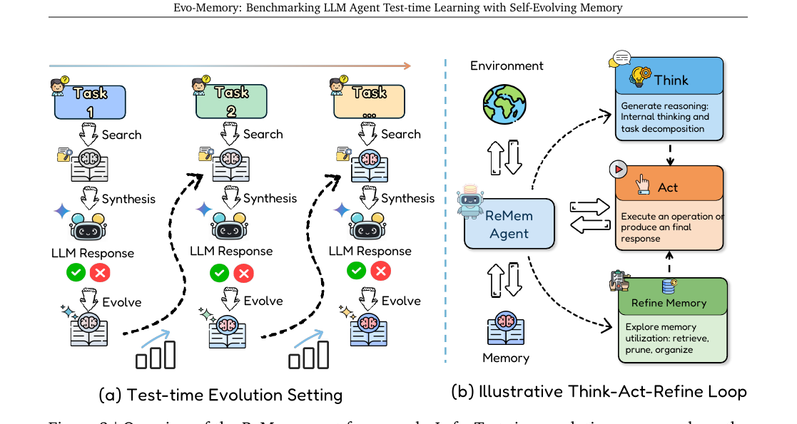

# Memory-arXiv-2025-Evo-Memory- Benchmarking LLM Agent Test-time Learning with Self-Evolving Memory
*论文下载地址：https://arxiv.org/abs/2511.20857*

*代码是否开源：作者表示将发布全部代码和配置以复现实验，但目前具体开源状态未提及*

*分享人：自动生成*

## 一句话总结内容
> 本文提出 Evo-Memory 基准与框架，用于系统评测具备自进化记忆的 LLM 智能体在连续任务流中的测试时学习与经验复用能力。

## 一句话总结创新贡献
> 核心贡献是构建统一的流式基准与评测框架，并提出 ExpRAG 和 ReMem 两种自进化记忆智能体，用于系统分析不同记忆机制在测试时演化中的效果。

## 举一个例子说明这篇文章的创新点
> 例如，ReMem 在传统 ReAct 式“思考–行动”循环中显式加入“Refine Memory”操作，使智能体在解决任务过程中主动检索、重组和剪枝记忆，将成功与失败的轨迹压缩为更可复用的策略，从而在 AlfWorld、ScienceWorld 等多轮环境中显著提升成功率和步骤效率。

## 框架图

**框架工作流描述**：
> 整体工作流基于统一的 search–predict–evolve 循环：在时间步 t，智能体接收输入 x_t，与当前记忆状态 M_t 结合，经检索模块 R 找到相关记忆 R_t，由上下文构造器 C 将输入与检索结果整合为工作上下文 \tilde{C}_t 并交由基础 LLM F 生成输出 y_t；随后利用输入、输出及反馈 f_t 形成新的记忆条目 m_t，通过更新函数 U 得到下一记忆状态 M_{t+1}。在此抽象之上，ExpRAG 将每个任务视为结构化“经验”，通过相似度检索 top-k 经验并直接作为 in-context 示例；而 ReMem 则在每个时间步内部引入多轮决策过程，让智能体在 Think、Act、Refine 三种操作间选择：Think 生成分解与推理轨迹，Act 与环境交互或给出最终答案，Refine 负责检索、剪枝、组织和重写记忆，使记忆结构随任务流持续自适应演化。

## 本文挑战及已有工作不足
> 1. 在现实记忆中充满失败和噪声经验的前提下，如何既设计能衡量最终表现又能刻画记忆质量与自适应性的指标（如序列鲁棒性、步骤效率），并配合有效的剪枝与重组机制以避免检索噪声放大，是一大挑战
> 2. 在统一框架下实现并公平比较十余种异构记忆模块（检索式、工作流式、层次式等），要求抽象出通用的检索、合成和演化接口以屏蔽实现细节差异
> 3. 如何从“静态对话回忆”转向在真实流式环境中评估 LLM 智能体的自进化记忆与经验复用能力，是现有基准普遍缺失且缺乏统一设定的能力维度
> 4. 需要将原本静态、独立的单次任务数据重构为具有前后依赖的“任务流”，使早期任务的经验可被后续任务复用，这在任务设计、标注与组织上都具有较大难度

## 印象最深刻的点
> 1. 在统一协议下实现并评测十余种代表性记忆模块与智能体架构，使不同记忆设计在同一流式测试时学习场景中获得可比结果，并以极简的任务级 ExpRAG 提供了强有力的经验检索基线
> 2. 抽象出记忆增强智能体四元组 (F, U, R, C) 及统一的 search–predict–evolve 循环，将检索增强生成、动态记忆、层次记忆和工作流记忆等方法纳入同一范式，结构清晰且扩展性强
> 3. 提出的 ReMem 通过 Think–Act–Refine 架构将记忆视为可操作的一等实体，实验证明在 AlfWorld、BabyAI、ScienceWorld 等长地平线环境以及小参数 LLM 上带来显著收益，凸显自进化记忆在复杂任务中的价值
> 4. 提出面向自进化记忆的流式基准 Evo-Memory，覆盖单轮推理、数学、编程、工具调用和多环境多轮交互等任务，系统弥补了现有基准聚焦静态回忆的空白

## 对我们的启发
> 1. 将记忆操作显式纳入智能体的决策空间（如 Think / Act / Refine），启发后续工作将“何时存、存什么、如何改写记忆”建模为强化学习或策略优化问题
> 2. 面向“经验复用”而非“事实回忆”的基准设计，为未来研究测试时学习与自主演化智能体提供了更贴近长期应用场景的评测视角
> 3. 任务相似度与记忆收益之间的正相关关系提示在实际系统中需要重视任务聚类与课程式任务排序，以提升经验的可迁移性和长期测试时学习效果
> 4. 简单的任务级经验检索（ExpRAG）即可获得显著提升，说明在工程实践中优先建设结构化经验日志与相似度检索往往能以较低成本换取可观性能收益

## Idea是否好想
> 本文的核心思想是把“记忆”从静态缓存提升为在测试阶段持续更新和优化的自进化组件，并通过统一基准系统性刻画这一能力。作者指出，既有工作多停留在对话级回忆或事实检索，缺乏对“经验复用”的评估——即模型能否从过去的推理与交互轨迹中抽象出可重复利用的策略。为此，Evo-Memory 将多个现有数据集重构为具有依赖关系的任务流，使前后任务之间存在策略复用或信息依赖，并在统一的 search–predict–evolve 循环下运行不同记忆网络。概念上，记忆被形式化为状态 M_t，与检索 R、上下文构造 C 和更新 U 共同定义出通用的记忆增强智能体；在此框架中，ExpRAG 代表极简的任务级检索增强，而 ReMem 则进一步把记忆操作纳入决策空间，通过 Think、Act、Refine 三类动作交替执行任务推理与记忆重组。实验表明，在数学、问答、工具调用等单轮任务上，自进化记忆带来稳健但有限的提升，而在 AlfWorld、BabyAI、PDDL、ScienceWorld 等多轮交互环境中，其作用显著放大，尤其在步骤效率和序列鲁棒性上优势明显。作者还从任务相似度、难度排序与反馈噪声等维度分析影响记忆演化效果的关键因素，论证了“经验结构性”和“记忆选择性”的重要性，使整篇工作既给出抽象理论框架，又提供了可运行的智能体实例和大规模对比实验，对理解和发展测试时学习中的记忆机制具有较高参考价值。

## 是否有开创性
> 相对于 StreamBench、Lifelong-Bench 等主要关注事实保留或环境技能延续的工作，本文的独特之处在于：第一，将评测重点明确放在“经验复用”和“自进化记忆”上，而不仅仅是能否回忆过去内容；第二，提出统一的形式化框架 (F, U, R, C) 与 search–predict–evolve 循环，将多类记忆方案纳入同一评价协议，并系统实现十余种代表性模块；第三，ReMem 在 ReAct 式智能体中加入显式的 Refine Memory 操作，将记忆调整从离线工程逻辑提升为在线决策的一部分，使智能体在交互过程中主动整理、剪枝与重构记忆；第四，从任务相似度、难度序列和失败经验等因素出发给出细致的实证分析，提供影响记忆演化效果的量化证据，构成在“测试时学习 + 记忆机制”交叉方向上较为系统且新颖的探索。

## 是否属于热点
> 该工作处于“Agentic LLM + Test-time Learning + 长期记忆”交叉的热门方向。随着 LLM 从单轮对话走向具备工具使用、环境交互和长期任务管理能力的智能体，如何在部署阶段持续累积并复用经验已成为核心问题之一。Evo-Memory 从基准与框架层面推动了对此问题的系统研究，使不同记忆架构可以在统一条件下比较；ReMem 等方法则体现了“自我反思 + 记忆演化”的趋势，与近期自演化智能体、自反馈规划等方向高度契合。尤其在算力和数据成本高企的背景下，通过智能的记忆设计在测试时挖掘增量价值，被视作提升小模型和领域模型实用性的重要路径，因此这类工作在短期内很可能持续受到关注。

## 其他需要补充的点（可选）
> 1. 结果显示部分工程上复杂的记忆系统在统一流式设置下优势并不明显，提示此前在特定场景获得的收益可能难以直接迁移到更一般的测试时学习环境
> 2. 评测覆盖 Gemini 2.5（Flash、Flash-Lite、Pro）和 Claude（3.5-Haiku、3.7-Sonnet）等多种 LLM 骨干，报告跨模型的一致性趋势并采用回答准确率、成功率、步骤效率、序列鲁棒性等多维指标，提升了结论的稳健性与可解释性
> 3. 论文明确区分“对话回忆（conversational recall）”与“经验复用（experience reuse）”，并用简单的二次方程示例形象说明二者差异，有助于澄清社区对记忆能力的模糊认知

## 与其他论文的关联（可选）
> 1. 在 SelfRAG、MemOS、Mem0、LangMem 等检索增强和记忆操作系统的基础上，本文在统一的 search–predict–evolve 协议下重跑这些方法，展示其在流式任务中的局限，并用更面向任务级经验复用与在线记忆重组的 ExpRAG 与 ReMem 作为对照方案
> 2. 与 StreamBench、Lifelong-Bench 等主要衡量连续任务中事实保留或整体任务表现的工作相比，Evo-Memory 更强调从“记忆结构与演化”角度评估测试时学习能力，并有意排除 MemoryGPT、MemoryBank 等偏重长程对话事实回忆的系统，将研究焦点聚焦于策略和程序性经验的复用
> 3. ReMem 可视为对 ReAct（Reason + Act）范式的扩展：在传统“思考–行动”循环中加入“Refine Memory”动作，使智能体不仅能反思当前任务，还能对自身记忆结构进行反思和更新，与 Dynamic Cheatsheet、Agent Workflow Memory 等动态工作流记忆方法形成互补

## 还有哪些不足的地方（未来工作）
> 1. 探索将记忆操作显式建模为强化学习或元学习问题，让智能体在长时间交互中自动学会更优的存储、检索、压缩和剪枝策略，而不仅依赖手工提示工程
> 2. 在 Evo-Memory 框架下系统引入和比较结构化记忆表示（如图结构、程序库、技能树等），分析其相对简单文本经验记忆在不同任务类型上的优势与局限
> 3. 结合强模型离线生成的大量高质量经验与在线自进化记忆，构建“离线蒸馏 + 在线演化”的混合框架，并在更大规模真实系统中研究日志存储、隐私保护与在线更新等工程问题
> 4. 将 Evo-Memory 扩展到更多真实世界环境，如网页浏览代理、代码库维护和长周期个人助理等，以检验自进化记忆在高噪声、强开放场景下的鲁棒性与实用价值
