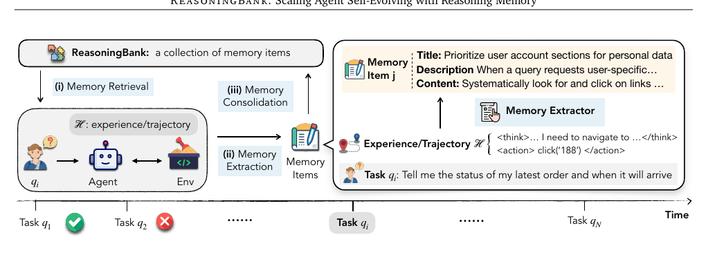

# Memory-arXiv-2025-ReasoningBank-Scaling Agent Self-Evolving with Reasoning Memory
*论文下载地址：https://arxiv.org/abs/2509.25140*

*代码是否开源：未提及*

*分享人：自动生成*

## 一句话总结内容
> 论文提出 ReasoningBank 推理记忆框架及记忆感知的 MaTTS 测试时扩展，使 LLM Agent 在无标注流式任务中从自判的成功与失败轨迹中抽取可迁移推理策略，并在持续使用中实现自我进化。

## 一句话总结创新贡献
> 核心贡献在于将高层推理记忆与测试时扩展紧密耦合：从自评成功/失败的交互轨迹中构建结构化 ReasoningBank，并通过并行与序列 MaTTS 将额外推理计算有效转化为更强记忆和更高任务成功率。

## 举一个例子说明这篇文章的创新点
> 在 WebArena 的购物和账号管理场景中，传统记忆机制通常只简单缓存某次成功导航的完整操作轨迹或工作流，而 ReasoningBank 会从多次成功与失败的尝试中抽象出高层策略记忆项，例如“优先进入用户账户相关板块以获取个性化订单信息”“当需要‘最早订单’时必须使用完整历史视图（如点击‘View All’）而不是仅依赖‘近期订单’模块，并在存在分页或无限滚动时系统性检查所有页面”。随后，当新任务要求查询“最新订单状态及到货时间”时，Agent 会检索到这些记忆项，将其中的原则写入系统提示，主动定位账号/订单区域并审慎处理分页或无限滚动，从而避免先前失败轨迹中的误操作，以更少步骤完成任务。

## 框架图

**框架工作流描述**：
> 整体流程构成一个闭环的测试时学习系统：1）流式任务：测试集中多个任务按顺序到达，Agent 在无 ground truth 下逐个处理，只能利用自身历史交互轨迹及自我评估结果；2）记忆初始化与表示：ReasoningBank 初始为空，记忆项采用统一结构，包括标题（高层策略名）、描述（一句总结）和内容（关键推理步骤、决策依据或操作要点），屏蔽具体 DOM ID、命令等底层细节；3）记忆检索：每当新任务到来，Agent 用任务上下文对 ReasoningBank 做向量检索，取 top‑k 相关记忆项插入 LLM 的 system instruction，引导后续 ReAct 式“思考+行动”；4）任务交互与轨迹生成：Agent 在 WebArena、Mind2Web、SWE-Bench-Verified 等环境中与网页或代码仓库交互，生成包含 think 文本和 action 序列的完整轨迹；5）成败判定与经验标注：任务结束后由 LLM-as-a-judge 基于任务指令与轨迹进行自监督判定，将经验标记为成功或失败，无需外部标注；6）记忆构建：根据成败标签采用不同抽取策略，从成功轨迹中提炼可复用策略，从失败轨迹中总结反例、坑点和防御性原则，并可从单条轨迹中抽取多个记忆项；7）记忆归并：将新记忆项简单追加到 ReasoningBank 中，形成不断扩展的推理策略库，刻意保持检索与整合模块简单，以突出记忆内容本身的作用；8）MaTTS 并行扩展：在并行 MaTTS 中，针对同一任务生成 k 条多样探索轨迹，在记忆指导下进行 self-contrast，对比多条轨迹以总结共性正确策略并过滤伪相关路径，用于构建更可靠记忆；9）MaTTS 序列扩展：在序列 MaTTS 中，Agent 在首次完成任务后对同一轨迹进行多轮 self-refinement，利用中间反思笔记中的推理尝试与改进建议构建记忆，从单次交互中挖掘更丰富信号；10）正反馈闭环：更高质量的 ReasoningBank 反过来在下一轮任务中提升测试时扩展的效率与针对性，使额外计算量转化为更高成功率和更少交互步骤，形成“记忆驱动的经验扩展”这一新型扩展维度。

## 本文挑战及已有工作不足
> 1. 如何将冗长且依赖具体界面或代码细节的原始操作轨迹抽象为少量高层推理策略与通用模式，同时兼顾可迁移性与可解释性，是构建 ReasoningBank 的关键难点
> 2. 在测试时无 ground truth 的流式任务设置下，仅依靠 Agent 自身的交互轨迹与自评结果来判定成功或失败，并从中提炼出稳定、可信的学习信号，本身就具有高度不确定性和噪声
> 3. 随着 ReasoningBank 与由测试时扩展产生的大量多样轨迹不断累积，如何在不过度增加推理开销的前提下，通过有效的检索与聚合机制从中筛选有价值记忆、抑制噪声，是长时间运行 Agent 必须解决的现实难题
> 4. 需要同时充分利用成功与失败经验：既不能因过度依赖成功案例而忽视失败中的预警信息，又要避免从复杂失败原因中提炼出误导性的“不要这样做”规则

## 印象最深刻的点
> 1. 系统显式区分成功与失败轨迹：成功经验贡献“有效策略”，失败经验贡献“反例与防护规则”，实现真正意义上的“从失败中学习”，弥补了许多记忆工作只关注成功样例的不足
> 2. ReasoningBank 不再缓存完整轨迹或工作流，而是采用“标题+描述+内容”的统一结构化记忆单元，专门存储高层推理策略与决策原则，显著提升了记忆的跨任务迁移性和可解释性
> 3. 提出的 MaTTS（Memory-aware Test-Time Scaling）将 test-time scaling 与记忆机制深度结合，通过并行多轨迹 self-contrast 与序列 self-refinement，将额外推理计算沉淀为更高质量的记忆，而非单纯增加采样次数
> 4. 在 WebArena、Mind2Web、SWE-Bench-Verified 等真实复杂环境以及 Gemini-2.5-flash/pro 与 Claude-3.7-sonnet 等不同骨干模型上，实验表明 ReasoningBank 与 MaTTS 能稳定提高任务成功率并减少交互步数，并揭示记忆质量与扩展收益之间的双向正反馈关系

## 对我们的启发
> 1. 将代理经验抽象为结构化的“推理策略记忆项”（而非原始聊天或操作日志）是一种更易维护、便于迁移的知识表示方式，可直接借鉴到其他 Agent 系统的知识库设计与提示工程中，并表明在资源受限场景下，提升记忆内容质量往往比采用复杂检索算法更关键
> 2. 系统化地把失败轨迹纳入记忆，专门提炼“坑点”“反模式”和“防御策略”，对强调安全性、稳健性或错误规避的 Agent 应用具有重要参考价值
> 3. 利用 LLM-as-a-judge 在测试时自动为轨迹打成功/失败标签，并据此采用不同记忆抽取策略，提供了一套在缺少人工标注和环境奖励时构建自监督记忆的通用范式
> 4. 通过 MaTTS 将多轨迹间的 self-contrast 和单轨迹内的 self-refinement 明确用于记忆构建，说明测试时扩展不仅可以用来提升当前答案质量，还能把额外算力转化为可复用的推理知识

## Idea是否好想
> 本文聚焦于 LLM Agent 的长期记忆与自我进化问题，核心观点是：真正有价值的不是某一次具体轨迹，而是轨迹背后可迁移的推理策略和经验教训。为此，作者在记忆层面做了两层抽象：一是从原始操作/思考日志抽象到结构化的策略记忆项，二是同时把成功与失败经验提炼为可以指导未来行为的原则，使记忆摆脱对具体页面结构或代码行的强绑定，从而在跨任务、跨网站乃至跨领域场景下仍具效力。在测试时学习框架中，系统通过 LLM-as-a-judge 自行判定成败，虽然标签可能存在噪声，但借助多次尝试、对比与聚合可以在整体上获得较可靠的学习信号。与基于原始轨迹记忆的 Synapse 和基于工作流记忆的 AWM 相比，ReasoningBank 把重心从“记录做过什么”转向“总结应该怎么想”，本质上完成了从记忆行为到记忆推理的升级。在此基础上叠加 MaTTS，把 test-time scaling 从单纯的算力扩展转变为“经验扩展”：额外推理计算不只产出更多候选答案，还通过 self-contrast 与 self-refinement 沉淀为高层知识，形成记忆与扩展的正反馈回路。当然，当前的检索与整合逻辑仍然刻意保持简单，对大规模记忆的管理、噪声自评的影响以及不同任务间知识冲突等问题尚未系统讨论，但整体上这项工作清晰地展示了一个方向：让 Agent 把测试时的每一次尝试都变成可积累的推理资产。

## 是否有开创性
> 相较于主要缓存原始轨迹或成功工作流的既有 Agent 记忆方法，本文创新点集中在两个方面：第一，提出 ReasoningBank 作为专门存储高层推理策略与决策原则的记忆库，并用统一的结构化模式将成功与失败经验都转化为可检索、可组合的策略单元，系统强调从失败中学习以及可迁移的推理抽象；第二，在 test-time scaling 方向提出记忆感知的 MaTTS，将并行多轨迹的 self-contrast 与单轨迹多轮 self-refinement 显式用作记忆构建信号，使扩展出的额外计算不仅提升当下问题的 Best-of-N 表现，还能持续反哺记忆库，形成“记忆 ↔ 扩展”的闭环协同。此外，作者在多数据集、多模型和多种泛化设置下进行系统实验与消融，清晰展示了 ReasoningBank+MaTTS 相较轨迹记忆（Synapse）和工作流记忆（AWM）的优势，说明“记忆驱动的经验扩展”可以视作 Agent 系统的一条新的扩展维度，而非简单的细节改动。

## 是否属于热点
> 该工作处于多个前沿热点交叉点上：面向 LLM Agent 的长期记忆与知识管理、无监督/自监督的测试时学习（test-time learning）、test-time scaling 在复杂交互任务中的应用、自主进化（self-evolving）智能体系统，以及如何系统性地让 Agent 从自身失败中学习并利用高层推理策略进行跨任务迁移。随着大模型应用从单轮问答走向复杂任务执行和长期部署，如何高效积累和利用经验成为核心问题，使得像 ReasoningBank 这样将记忆与扩展深度耦合的框架具有较高的研究前沿性和应用潜力。

## 其他需要补充的点（可选）
> 1. 实验对比了无记忆 Agent、轨迹记忆 Synapse 和工作流记忆 AWM 等基线，在相同骨干模型与环境下，使用任务成功率、平均交互步数以及 Mind2Web 上的 EA/AF1/SSR 等细粒度指标，系统评估在跨任务、跨网站和跨领域等多种泛化设置中的表现
> 2. 在 MaTTS 分析中，作者比较了无记忆扩展、无聚合的 Vanilla TTS 与完整 MaTTS 随扩展系数变化的成功率曲线，并强调当前仍采用简单的向量检索与追加式存储，以便将性能收益主要归因于记忆内容与扩展协同，而非复杂工程技巧
> 3. Agent 采用 ReAct 风格的“思考+行动”循环：在 Web 任务中行动空间为浏览器点击、输入等操作，在 SWE 任务中为 bash 命令，观测包含网页可访问性树文本和代码片段，环境主要基于 BrowserGym 的 WebArena、Mind2Web 以及 SWE-Bench-Verified

## 与其他论文的关联（可选）
> 1. 与仅从成功案例提炼程序化工作流的 AWM（Wang et al., 2025d）不同，ReasoningBank 同时利用成功和失败经验，并刻意存储可跨网站、跨任务迁移的推理原则，在 Multi 和跨领域等更具挑战性的设置中表现更优
> 2. 与基于原始成功轨迹记忆的 Synapse（Zheng et al., 2024）相比，ReasoningBank 不再存储完整轨迹，而是抽象出高层策略与推理线索，因此在 WebArena、Mind2Web 和 SWE-Bench-Verified 上都取得了更高的成功率与效率
> 3. 在更广泛的记忆与 test-time scaling 文献中，以往工作多关注个性化或长上下文管理，或借助强化学习优化记忆管理，或单纯通过多样采样与多 Agent 协作扩大搜索空间，而本工作则将 self-contrast 和 self-refinement 纳入记忆构建流程，将记忆视为测试时学习的核心驱动

## 还有哪些不足的地方（未来工作）
> 1. 探索利用强化学习或 bandit 方法优化记忆使用策略，让 Agent 学会在不同任务与阶段有选择地读写、更新或遗忘记忆，从而最大化整体收益
> 2. 在记忆检索与整合层面引入更智能的机制，如对记忆项进行聚类与去重、重要性评估和过时策略淘汰，以便在 ReasoningBank 持续扩张时兼顾检索相关性与推理效率
> 3. 系统分析 LLM-as-a-judge 在成败判定中的误差对记忆质量和后续行为的影响，并结合外部弱监督信号、启发式检查或多重冗余判定机制，提高自监督标签的稳健性
> 4. 将 ReasoningBank 拓展到更复杂和多样的环境，如办公自动化流程、数据分析流水线、IDE 编程助手或具身机器人控制，系统评估高层推理记忆在真实应用中的实用价值
