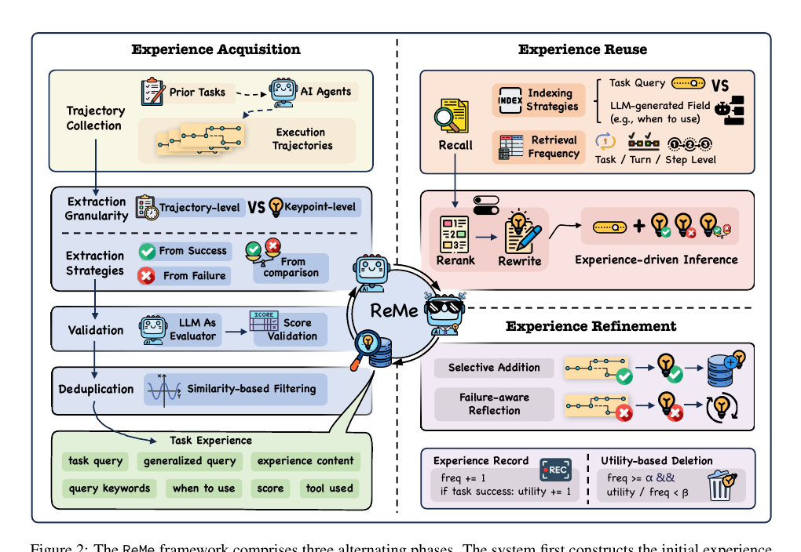

# Memory-arXiv-2025-Remember Me, Refine Me- A Dynamic Procedural Memory Framework for Experience-Driven Agent Evolution
*论文下载地址：https://arxiv.org/abs/2512.10696*

*代码是否开源：是 https://github.com/agentscope-ai/ReMe*

*分享人：自动生成*

## 一句话总结内容
> 提出ReMe框架，将LLM智能体的过程性记忆从被动追加式存储升级为可自动提炼、自适应重用与效用驱动淘汰的动态系统，使智能体能够依托累积经验持续演化，并在工具使用任务中显著提升表现。

## 一句话总结创新贡献
> 核心贡献是围绕记忆全生命周期设计“多视角经验蒸馏 + 场景自适应重用 + 效用驱动精简”的一体化框架，在BFCL-V3和AppWorld上的实验表明高质量过程性记忆可在一定程度上替代模型规模，并发布细粒度记忆数据集reme.library。

## 举一个例子说明这篇文章的创新点
> 例如，在经验获取阶段，ReMe不会将一整条工具调用轨迹原样写入记忆，而是对同一任务的多条成功与失败轨迹做对比分析：从成功中抽取关键步骤与通用策略，从失败中归纳典型误用与触发条件，由总结模型生成包含使用场景、经验内容、关键词集合、置信度和所用工具的结构化条目。随后，这些条目以“使用场景”的语义向量为索引存入经验库，在新任务到来时先按场景相似度检索，再由LLM重排并重写，将多条历史经验整合为贴合当前需求的一段操作指引，从而避免直接拼接原始长对话带来的噪声和迁移失效。

## 框架图

**框架工作流描述**：
> ReMe整体工作流分为三阶段：（1）经验获取：在训练任务上多次高温采样成功与失败轨迹，由总结模型分别进行成功模式识别、失败原因分析和成败对比，抽取关键步骤与教训，生成结构化经验E=⟨使用场景ω，经验内容e，关键词集合κ，置信度c，工具集合τ⟩，再通过LLM-as-judge校验和去重后存入向量化经验池；（2）经验重用：新任务到来时，将任务描述编码后在经验池中按“使用场景”检索top-K相似经验，可选地用LLM进行上下文感知重排，并通过重写模块将多条经验整合为面向当前任务的统一指导提示，与原任务上下文一并送入执行模型以引导工具调用与推理；（3）经验精炼：在线执行时仅对成功轨迹进行总结并选择性加入经验池，同时记录每条经验的被检索次数f和成功贡献次数u，当f达到阈值α且平均效用u/f低于阈值β时自动删除该经验；对于新出现的失败，系统触发至多3轮失败感知自反思，若反思引导的后续尝试获得成功则将改进经验写入记忆，否则丢弃，从而形成随时间自我净化和演化的高质量记忆库。

## 本文挑战及已有工作不足
> 1. 现有大多数智能体记忆系统采用简单的“被动累积”策略，缺乏对经验质量的评估、更新与淘汰机制，记忆池很快被冗余和噪声充斥
> 2. 如何从混杂的成功与失败轨迹中自动提炼出高质量、可解释且结构化的关键经验，对LLM的理解、对比和抽象能力提出了较高要求
> 3. 许多工作以完整轨迹或粗粒度工作流作为经验单元，夹杂大量任务特定细节，使智能体难以抽取可迁移的核心解题逻辑，削弱跨任务泛化
> 4. 在兼顾检索效率和上下文长度约束的前提下，选择合适的索引粒度与检索数量，并避免过多、过粗经验在提示中造成信息干扰，是记忆增强智能体落地的难点

## 印象最深刻的点
> 1. 在经验获取阶段采用“成功模式识别 + 失败原因分析 + 成败对比”的多视角蒸馏，将经验表示为包含使用场景、内容、关键词、置信度和工具集合的结构化五元组，并实验证明关键点级总结相比轨迹级记忆能显著提升任务成功率
> 2. 提出围绕“提炼—重用—精炼”全生命周期设计的过程性记忆框架ReMe，从机制上突破了传统只管存、不管用、更不管删的被动记忆模式
> 3. 实验在BFCL-V3和AppWorld上展示出显著的“memory-scaling效应”：如小规模模型Qwen3-8B结合ReMe即可超越更大规模但无记忆的基线，同时ReMe还能提升跨次运行的稳定性，说明高质量过程性记忆在一定程度上可替代参数规模并增强鲁棒性
> 4. 在经验重用阶段引入“使用场景”作为主要索引键，结合LLM对候选经验的重排与重写，将多条历史经验整合为与当前任务高度贴合的一段操作指导，而非简单拼接示例

## 对我们的启发
> 1. 记忆系统应被视为与推理过程紧密耦合、可自动提炼和更新的“认知基底”，而非简单的外部数据库
> 2. 从失败中学习需要二次验证机制，例如通过反思引导的新尝试来确认结论，避免将单次失败的偶然性噪声固化进记忆库
> 3. 长期在线运行的智能体需要“遗忘”能力，可通过统计经验被检索的频率及其带来的成功贡献来驱动定期淘汰低效甚至有害的旧经验
> 4. 经验单元应尽量细粒度且结构化，例如拆解为“何时使用 + 如何做 + 关键词 + 工具”等要素，有利于泛化、检索和安全控制

## Idea是否好想
> 该工作围绕如何让过程性记忆真正为智能体“赋能”提出了一个工程性很强但具有方法论价值的框架。不同于对现有RAG记忆系统的小改动，ReMe从经验单元设计、获取策略、重用方式和淘汰机制四个维度系统重构了“记忆参与推理”的路径，其核心洞见在于：经验应是细粒度、结构化的关键步骤而非整条轨迹；记忆库必须持续做质量控制与更新，否则必然退化；失败也应纳入学习闭环，但需通过反思和成功验证过滤噪声。实证上，作者不仅与A-Mem、LangMem等代表性系统对比，还围绕粒度、检索键与数量、添加策略、反思机制和删除策略做了较完备的消融，论证相对充分。局限在于框架高度依赖LLM的总结与评判能力，单一LLM-as-judge在大规模或高度异构任务上可能难以捕捉细粒度质量差异，且目前只在工具调用型基准上验证，尚未覆盖更开放环境和多模态任务。总体来看，该方法概念上并非颠覆性，但在“如何管好并用好经验记忆”上给出了可落地且可扩展的系统方案，实践价值和启发意义都较高。

## 是否有开创性
> 相较于已有的记忆增强智能体系统（如存储完整轨迹的Synapse、HiAgent，以及抽取工作流或技能单元的AWM、AgentKB、CER等），ReMe的创新主要体现在三点：第一，将经验单元从粗粒度轨迹或工作流细化为关键点级的结构化五元组，并显式区分“使用场景”和“经验内容”，便于检索、重写与安全控制；第二，在经验生命周期上引入“选择性加入 + 失败感知反思 + 效用驱动删除”的闭环机制，使记忆池随时间自我演化而非单向膨胀；第三，在检索与重用阶段利用LLM进行场景感知的重排和重写，将多条历史经验整合为面向当前任务的一段统一指导提示，并系统实证所谓“memory-scaling效应”，凸显高质量记忆相对于纯参数扩大的独立价值。

## 是否属于热点
> 该工作位于LLM智能体与长期记忆/终身学习的交叉热点：关注如何通过外部过程性记忆让大模型“以经验行事”，在无需频繁更新参数的前提下持续提升任务能力。其议题涵盖记忆表达与结构设计、基于检索的经验重用、在线环境下记忆库的自我净化与演化等，与当前关于agentic workflow、tool-augmented reasoning、无强化学习的持续学习以及memory-augmented LLM等研究方向高度契合。

## 其他需要补充的点（可选）
> 1. 效用驱动删除和失败反思机制采用显式超参数控制（如仅在经验被检索达到一定次数后才评估删除、失败感知反思最多触发3轮），并与A-Mem、LangMem等系统进行对比，配套发布的reme.library数据集和提示模板也便于后续复现与扩展
> 2. 实验在BFCL-V3和AppWorld两个工具增强基准上进行，覆盖Qwen3-8B/14B/32B三种模型规模，并同时报告Avg@4和Pass@4等指标，整体评测设置较为全面
> 3. 在经验采样与检索配置上，作者对每个训练任务进行多次高温轨迹采样（如N=8、temperature=0.9）以获得多样成功与失败路径，并在经验重用阶段默认按K=5检索最相似经验，同时对抽取得到的经验进行相似度去重，仅保留具有代表性的条目

## 与其他论文的关联（可选）
> 1. 与A-Mem等强调智能体自主组织与调用记忆的工作相比，ReMe在“如何存”和“何时取”之外进一步强调“存什么”和“何时删”，通过细粒度经验蒸馏和效用驱动的淘汰机制，使记忆池成为可自我演化的实体
> 2. 与LangMem、AgentKB、AWM、CER等从对话或轨迹中抽取片段式文本、工作流或技能单元的系统不同，ReMe采用结构化经验表示和以使用场景为中心的检索方式，更侧重过程性步骤与策略模式的可迁移性
> 3. 与Synapse、HiAgent等存储完整交互轨迹的代理，以及神经记忆网络或Neural Turing Machine这类隐式向量记忆模型相比，ReMe面向的是可解释的“外部符号化过程性记忆”，并将LLM-as-judge用于经验过滤与验证，呼应了利用LLM自评能力构建自监督信号的研究趋势

## 还有哪些不足的地方（未来工作）
> 1. 引入比单一LLM-as-judge更精细的经验验证机制，例如多裁判投票、基于历史成功率的统计校准，以及结合环境反馈或人类反馈的混合评估，以提升记忆质量判断的可靠性
> 2. 在任务执行过程中探索多轮、按需的动态检索与重写机制，而非仅在任务开始时一次性取出经验，使智能体能够在关键决策点实时获取或更新相关记忆
> 3. 将ReMe扩展到更复杂和开放的场景，如开放Web代理、多应用跨域操作或多模态交互，并探索多智能体之间共享或迁移过程性记忆的机制，以评估其在更广泛环境中的泛化与协同能力
> 4. 研究过程性记忆、语义知识记忆与用户偏好记忆之间的协同与冲突管理，结合效用驱动删除和安全/价值过滤，构建统一而可控的记忆架构来服务多种智能体能力
