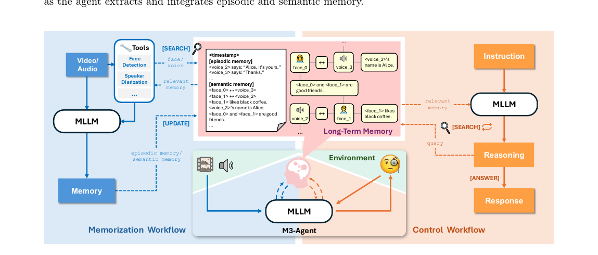

# Memory-arXiv-2025-Seeing, Listening, Remembering, and Reasoning- A Multimodal Agent with Long-Term Memory
*论文下载地址：https://arxiv.org/abs/2508.09736*

*代码是否开源：是，模型、代码和数据已在 GitHub 开源 https://github.com/bytedance-seed/m3-agent*

*分享人：自动生成*

## 一句话总结内容
> 本文提出具备长期记忆能力的多模态智能体 M3-Agent，并在新构建的长视频问答基准 M3-Bench 上系统评估其记忆构建与基于记忆推理的表现。

## 一句话总结创新贡献
> 本文的核心贡献在于提出实体中心的多模态长期记忆与“记忆-控制”双流程架构 M3-Agent，构建覆盖机器人视角与网络长视频的 M3-Bench 基准，并利用强化学习训练控制模块实现多轮记忆检索与推理，从而在多项基准上超越强商用模型组合基线。

## 举一个例子说明这篇文章的创新点
> M3-Agent 将长期记忆显式建模为实体中心的多模态图：在记忆阶段，将连续视频流切分为片段，借助人脸检测、说话人分离等工具提取人脸、语音和文本描述，分别写入图中的图像、音频和文本节点，并通过统一的实体 ID 将同一人物或物体跨片段关联起来；同时为每段视频生成情节记忆（具体事件）与语义记忆（如人物偏好、物体功能、人物关系等抽象知识），为后续检索提供多粒度索引。在控制阶段，智能体接收指令后并不一次性从记忆库拉取大段上下文，而是依据通过强化学习得到的策略，多轮调用 search_node 与 search_clip 等工具迭代检索和更新可见记忆，再由多模态大模型完成推理与响应，在 M3-Bench 和 VideoMME-long 上明显优于采用单轮 RAG 的 Gemini-GPT4o-Hybrid 基线。

## 框架图

**框架工作流描述**：
> M3-Agent 的整体流程由“记忆”和“控制”两个相互配合的子流程组成：在记忆流程中，系统流式接收视频与音频，将其划分为短片段，利用外部工具（如人脸检测、说话人分离）抽取关键多模态信号，并由多模态大模型生成两类记忆：一类是带有精确时间戳、记录具体事件的情节记忆，另一类是人物身份、偏好、关系及物体属性等高层语义记忆；这些记忆被写入实体中心的图数据库，每个节点附带内容、嵌入、权重和时间等元信息，通过权重累积与投票机制缓解冲突，并支持按实体与时间联合检索。在控制流程中，智能体接收自然语言指令后，由多模态大模型构造查询，多轮调用长期记忆提供的 search_node 与 search_clip 接口，按需拉取相关情节和语义记忆，在对话式推理中逐步整合新信息形成答案或行动计划；整个检索与推理策略通过强化学习优化，以提升在复杂长视频问题上的准确率和检索效率。

## 本文挑战及已有工作不足
> 1. 构建贴近真实应用的长视频问答基准代价高昂，需要剧本设计、多演员拍摄机器人视角长视频，以及细粒度时间戳与多类型问题的人工标注
> 2. 需要在在线场景下持续接收理论上无限长的多模态输入流，并将其实时压缩为可管理、可检索的长期记忆，这远超仅处理有限离线长视频的方法能力
> 3. 面对不断扩张的长期记忆库，需要设计高效且鲁棒的检索机制，从海量记忆中精准选出与当前任务最相关的片段，并在多轮推理中正确利用这些信息
> 4. 如何从局部片段中逐步提炼人物身份、物体属性、偏好和关系等高层语义，并在跨模态、跨长时间尺度下保持实体一致性，避免描述漂移与属性冲突，是构建稳定世界模型的核心难点

## 印象最深刻的点
> 1. 控制模块采用强化学习训练的多轮记忆检索与推理策略，相比基于大模型提示的单轮 RAG 和 Gemini-GPT4o-Hybrid 等强商用模型组合，在 M3-Bench 与 VideoMME-long 等基准上取得显著性能提升
> 2. 构建 M3-Bench 长视频问答基准，结合机器人第一视角的真实场景长视频与多类型网络长视频，并系统设计多证据、多跳、跨模态、人物理解和一般知识抽取等问题类型
> 3. 在记忆中显式区分情节记忆与语义记忆，并通过消融实验证明语义记忆对性能至关重要，去除后在 M3-Bench-robot、M3-Bench-web 和 VideoMME-long 上准确率均出现两位数百分比下降
> 4. 提出实体中心的多模态长期记忆图，将人脸、声音和文本知识通过统一实体 ID 连接，使智能体能够围绕人物与关键物体进行关联式记忆与检索，而不再仅依赖时间顺序

## 对我们的启发
> 1. 利用人脸识别、说话人分离等外部专用工具为大模型提供稳定基础表示，表明未来系统架构需要更重视“模型 + 工具 + 记忆”的协同设计
> 2. 在大规模长期记忆场景下，单轮 RAG 难以充分利用信息，将记忆检索纳入决策过程、使用强化学习训练多轮检索—推理策略可能成为记忆增强智能体的主流范式
> 3. 多模态智能体的长期记忆应尽量保留图像、音频等原始模态，并以实体为中心组织，从而在长时交互中稳健追踪人物与物体属性
> 4. 将情节记忆与语义记忆显式分离，为在文本代理、代码助手等系统中同时保留细节与抽象知识、连接高层推理与具体操作提供了可推广的设计思路

## Idea是否好想
> 本文的核心思想，是将多模态智能体的长期记忆从隐式的“上下文扩展”或“特征缓存”，升级为显式存在、结构化可操作的记忆系统。表征层面，系统不再仅依赖语言描述，而是保留图像、音频等原始模态，并通过实体 ID 将人脸、声音与相关文本组织成实体中心的多模态图，从而在长时间尺度上更稳健地跟踪人物和关键物体，减轻纯文本记忆带来的语义漂移和歧义。记忆内容层面，区分情节记忆与语义记忆，一方面精确记录带时间信息的具体事件，另一方面持续抽取偏好、关系、物体功能等稳定世界知识，使智能体既能“回放”过去情节，又能调用抽象经验。使用方式上，控制模块不再一次性读取固定窗口记忆，而是在多模态大模型驱动下，把“查什么、查几轮、如何用”视为决策问题，通过强化学习学得多轮检索与推理策略：根据当前问题逐步构造查询，反复调用检索工具，动态扩展可见记忆并在每轮整合新信息后更新推理状态，这更接近人类回忆过程，也更适合应对跨片段、多证据、多跳推理。实验通过与强商用模型组合基线对比，以及对语义记忆、强化学习训练和推理模式的消融，较系统地展示了各模块贡献。整体来看，该工作为“如何让多模态智能体拥有可用的长期记忆”给出了可落地的架构级方案，但在记忆容量控制、遗忘与更新机制以及开放世界条件下的实体消歧等方面仍有进一步空间。

## 是否有开创性
> 方法上的新颖性主要体现在三个结合点：其一，将长期记忆设计为实体中心的多模态图结构，既保留原始模态内容又引入权重和边连接，在长时间尺度上维护人物与实体的统一身份，这一结构比常见的向量缓存或纯文本记忆更有组织性；其二，引入情节记忆与语义记忆的双层记忆形式，并在在线长视频场景下持续构建和更新世界知识，使智能体能够从具体观测中抽象出稳定规则和偏好；其三，在控制策略上，将记忆检索问题纳入强化学习框架，将“查询什么、查几轮、如何利用查询结果”视为决策过程，从而实现超越单轮 RAG 的多轮记忆—推理闭环。数据与评测方面，新构建的 M3-Bench 将机器人第一视角长视频与网络长视频结合，并系统地设计多类型问题来刻画长期记忆和跨模态、多跳推理能力，对现有长视频问答基准形成重要补充。虽然后端部件（外部工具、多模态大模型、记忆库、强化学习等）本身并非首次提出，但其在多模态长期记忆智能体框架中的系统化集成具有较强新意。

## 是否属于热点
> 该工作处在多模态智能体与长期记忆研究的交汇点，契合当前“从大模型到智能体”的发展趋势，特别聚焦于在线长视频理解、长时人机交互、记忆增强推理等热点方向。通过把多模态大模型、外部工具、结构化记忆库和强化学习策略整合在统一框架中，论文展示了一条从感知（seeing, listening）、记忆构建（remembering）到基于记忆推理与决策（reasoning）的完整路径。配套提出的 M3-Bench 长视频问答基准进一步推动了社区从短片段视觉理解转向考察长期记忆、一致性世界模型和跨模态复杂推理的能力，使“长视频多模态问答”“机器人视角理解”“记忆增强代理”等议题有望成为后续研究的持续热点。

## 其他需要补充的点（可选）
> 1. 记忆更新时，若新记忆与已有内容一致则通过再激活提升权重，若存在冲突则在推理阶段通过基于权重的投票机制选择更可靠版本，使长期交互中的知识逐步自我纠偏
> 2. 长期记忆以外部图数据库实现，每个记忆节点包含唯一 ID、模态类型、内容、嵌入向量、权重和时间戳等元信息，边则显式表示记忆项之间的逻辑与实体关系
> 3. 系统提供 search_node 与 search_clip 两类检索接口：前者支持基于文本、图像或音频的多模态查询并返回相关节点，后者在“记忆片段”级别检索以恢复特定时间段内的情节与语义记忆

## 与其他论文的关联（可选）
> 1. 与仅通过扩展上下文窗口或压缩视觉 token 来覆盖更长视频的长视频理解方法不同，本文采用外部长期记忆库与在线写入机制，从根本上缓解了对模型上下文长度的依赖，并更易持续更新世界知识
> 2. 在长视频问答基准方面，M3-Bench 相比 EgoSchema、HourVideo、Video-MME 等现有数据集，更强调机器人第一视角、多类型推理问题和开放式回答形式，并系统纳入跨模态、人物理解和一般知识抽取等维度
> 3. 相较以往主要面向文本对话或工具使用轨迹的 LLM Agent 记忆工作，M3-Agent 将长期记忆扩展到视觉和音频等多模态输入，并在实体层面统一管理多模态信息，以支持更丰富的环境理解

## 还有哪些不足的地方（未来工作）
> 1. 设计更精细的记忆写入、更新与遗忘机制，例如基于重要性和使用频率的稀疏化策略，以控制记忆库规模并降低噪声累积
> 2. 将当前主要面向视频和音频的记忆框架扩展到触觉、位姿、环境传感器等更多模态，以更全面支撑真实机器人在复杂环境中的长期感知与决策
> 3. 探索将多模态基础模型与记忆模块进行端到端或多阶段联合训练，使实体识别、语义抽取与记忆结构更加紧密耦合，从而提升整体一致性和样本效率
> 4. 在真实机器人平台上进行长期部署与在线测试，系统评估 M3-Agent 在开放世界、多用户交互中的记忆稳定性、鲁棒性和可解释性，并利用收集到的数据进一步改进模型
