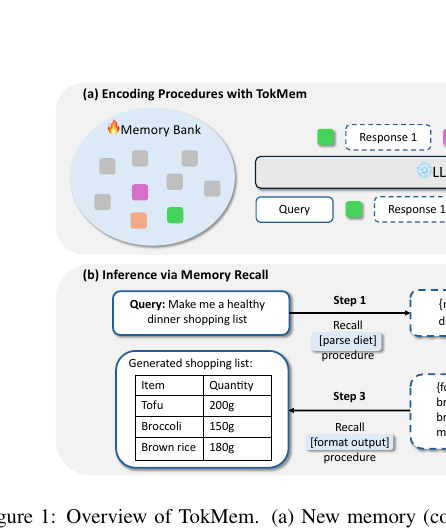

# Memory-arXiv-2025-TokMem- Tokenized Procedural Memory for Large Language Models
*论文下载地址：https://arxiv.org/abs/2510.00444*

*代码是否开源：未提及*

*分享人：自动生成*

## 一句话总结内容
> 本文提出 TokMem，将大语言模型中高频复用的过程/技能压缩为可训练记忆 token，在冻结主干模型的前提下实现高效的程序化记忆存取与组合。

## 一句话总结创新贡献
> 核心贡献是提出一套 token 化过程记忆机制及其训练与路由框架，在上千任务记忆和多步工具调用场景中以极少参数开销优于 RAG 和 LoRA 微调等传统方法。

## 举一个例子说明这篇文章的创新点
> 例如，在 Super-Natural Instructions 的 1000 个任务上，传统方法需要为每个任务拼接长提示或检索示例；TokMem 则为每个任务仅学习一个（或少量）记忆向量，并通过“查询→内部选择记忆 token→按该 token 引导生成”的流程完成任务，使推理时无需反复读取冗长文本提示，过程调用的上下文开销近似常数级。在函数调用场景中，模型还能像人类串联子技能一样，依次召回 parse/search/format 等记忆 token，自动组合成多步工具使用流程。

## 框架图

**框架工作流描述**：
> 整体流程分为：1）记忆库构建：在完全冻结 Transformer 主干的前提下，为每个“原子过程”（如一个任务或一次工具调用）分配专用 token，将其嵌入向量作为可训练的记忆单元，并通过扩展词表将这些 token 挂载到模型上；2）训练阶段：将输入构造成“query, mem_token, response, mem_token, response, …”的序列，仅对记忆 token 及其后续响应位置施加下一 token 预测损失，反向传播时只更新记忆嵌入，并在必要时对新加入记忆做范数重标定以稳定路由；3）推理阶段：给定查询，模型在生成过程中内部选择合适的记忆 token（或一串记忆 token）插入生成序列，将其同时作为过程地址与控制信号，引导后续输出，从而实现过程记忆的选择、调用与多步组合；4）持续学习：有新任务或新工具到来时，仅新增对应记忆 token 并微调其嵌入即可，无需修改或重训主干模型，且对既有记忆的干扰极小。

## 本文挑战及已有工作不足
> 1. 基于检索的记忆（RAG、MemGPT 等）本质仍以文本形式存储陈述性知识，既缺乏将高频过程压缩为可复用模块的机制，又在任务规模增大时面临检索/路由准确率下降、召回错误拖累整体性能的问题
> 2. 在保持主干冻结的前提下，让模型在推理中可靠地自发触发并串联多个记忆 token，同时控制新旧记忆嵌入的范数以避免软最大路由被新记忆挤占，是一个兼具建模与优化难度的关键问题
> 3. 将程序化知识直接写入主干参数（如多任务 LoRA 微调）容易产生任务间梯度干扰和灾难性遗忘，即便借助经验回放也难以彻底避免
> 4. 长提示和复杂上下文工程导致推理阶段需要反复读取相同程序化说明，注意力计算随序列长度二次增长，既增加计算和延迟，又严重占用上下文窗口

## 印象最深刻的点
> 1. TokMem 的任务路由准确率极高：在 1000 个任务规模下仍超过 94%，远高于基于 Sentence-BERT 的检索式 RAG 路由准确率（跌至约 80% 以下），配合简单的记忆向量范数重标定，有效缓解了持续添加新记忆时旧记忆被压制的问题
> 2. 在记忆布局实验中，采用“query⊕MEM⊕response”的中缀布局的 TokMem 在同等 token 预算下，比传统前缀调优（prefix tuning）收敛更快且困惑度更低，这一优势在 Qwen-0.5B 到 Llama-8B 等不同家族、不同规模的 LLM 上均得到验证，体现出良好的模型无关性和可移植性
> 3. 在工具调用的组合记忆任务中，TokMem 在工具选择 F1 和参数生成 F1 上全面超过 ICL 和 RAG，并在使用远少于 LoRA 的可训练参数下达到甚至超越 LoRA 微调的性能，在仅用单步调用训练、测试多步调用的 out-of-domain 组合泛化实验中参数生成 F1 还比微调高出 30 个百分点以上，体现出极强的组合泛化能力
> 4. 在 Super-Natural Instructions 的 1000 任务原子记忆场景中，TokMem 的 Rouge-L 显著优于 RAG 和 LoRA 微调，并在持续加入新任务时基本避免灾难性遗忘，记忆稳定性突出

## 对我们的启发
> 1. 记忆 token 同时承担“地址”和“控制信号”的角色，启发未来在记忆层面进一步设计层级过程、条件分支等更精细的路由与控制机制
> 2. 通过冻结主干模型，仅依靠增量添加和训练记忆 token 来扩展能力，为大模型的持续学习和线上部署提供了一条低风险、低成本、易回滚的更新路径
> 3. 将“任务/工具/技能”显式抽象为离散记忆 token，而非一味依赖长提示或全模型微调来表达过程知识，为构建可扩展、可组合的模块化技能库提供了新的范式
> 4. 围绕个体化记忆库的设想（例如每个用户挂载自己的 TokMem bank），为大模型的个性化与企业级定制提供了一条技术路径，有望实现统一主干下的多主体差异化能力

## Idea是否好想
> TokMem 的核心思想，是将“大量重复出现的过程性知识”从显式文本提示或主干参数中抽离出来，单独存储在一组可训练的专用记忆向量中。每个记忆 token 既充当离散地址，又在生成时提供过程级控制信号：只要模型在合适的位置生成或插入该 token，后续输出就会沿着对应的过程轨迹展开。训练时，作者采用标准的下一 token 预测，将 query、记忆 token 及其后续响应串联成序列，完全冻结主干，仅更新记忆嵌入；多个过程可以在一个样本中按顺序出现，从而让模型学会在单次推理中依次调用和组合不同记忆。由于过程记忆与主干参数解耦，新增任务只需增加新的记忆 token 并局部训练，不会改写已有参数，天然适配持续学习和在线扩展。与 RAG 等“文本式记忆”相比，TokMem 不再在每次调用时重复注入完整过程文本，而是把过程调用的上下文开销从 O(L) 压缩到 O(1)，同时路由完全在模型内部完成，避免依赖外部检索器和其噪声；与 LoRA 等“参数式记忆”相比，它避免了多任务微调带来的梯度干扰和灾难性遗忘，并通过简单的范数重标定抑制新记忆过度主导路由。进一步的记忆位置对比表明，在低 token 预算下，将记忆 token 放在“查询之后、响应之前”的中缀位置，更有利于模型先理解当前上下文再激活合适技能，从而提升记忆利用效率和泛化能力。整体来看，TokMem 将“过程记忆”从文本和主干参数中抽离出来，形成一个可生长、可组合、相对可解释的技能层，为构建具备长期技能累积与组合能力的 LLM 提供了清晰而实用的中间层抽象。

## 是否有开创性
> 1）提出将过程性知识显式编码为离散记忆 token 的机制，使每个任务或工具调用对应一个或一组可训练向量，而主干模型保持完全冻结，实现过程知识与通用能力的参数级解耦；2）设计了将 query、记忆 token 与响应序列化训练、并在推理时通过模型内部生成记忆 token 进行路由与多步组合的框架，实现无需外部检索器的 O(1) 过程调用；3）针对持续新增记忆时出现的新记忆“挤占”旧记忆问题，引入对新记忆嵌入进行范数重标定的简单算法，显著提升记忆路由的稳定性和向后兼容性；4）系统比较了中缀记忆布局与前缀调优，在低 token 预算下实证中缀布局在收敛速度与困惑度上的优势，丰富了社区关于记忆/提示位置设计的经验与理解；5）在原子任务记忆和多步工具调用两个代表性场景中，系统展示了 token 化过程记忆在性能、参数效率和组合泛化方面相对于 RAG 和参数微调的综合优势。

## 是否属于热点
> 工作聚焦于当前极为热门的“大模型记忆与持续学习”交叉方向，特别是如何让 LLM 高效复用程序化技能，同时摆脱上下文窗口和计算成本的制约；又紧扣工具调用、多步推理等 LLM agent 研究热点。通过在冻结 backbone 之上增设参数隔离的过程记忆层，TokMem 回应了社区对“长期记忆、模块化技能、个性化扩展”的强烈需求，具有较高的研究价值和实际落地潜力。

## 其他需要补充的点（可选）
> 1. 实验覆盖 Qwen 与 Llama 两大模型系列、从 0.5B 到 8B 的多个规模，并在部分对比中将 LoRA rank 调低到 1，以更公平地比较单位参数量的样本效率和性能
> 2. 在记忆布局对比实验中，作者利用 Fanfics 数据集，将大段文本压缩为少量记忆 token，从困惑度和收敛速度角度系统评估 TokMem 与 prefix tuning 的差异
> 3. TokMem 支持一种“解耦记忆”的变体 TokMem+DC，将记忆 token 拆分为负责地址的 token 和负责控制/引导生成的 token，在小模型上带来一定收益

## 与其他论文的关联（可选）
> 1. 与 RAG、MemGPT 等检索增强方法相比，TokMem 不再依赖外部向量检索和长文本追加，而是通过内部生成与选择记忆 token 完成路由与控制，从而显著减少上下文长度和对检索质量的依赖，更接近“程序化记忆”而非“陈述性记忆”
> 2. 与 LoRA、适配器微调等参数高效方法相比，TokMem 将任务特定参数集中在一小组记忆嵌入中并始终冻结主干，弱化任务间梯度干扰，在持续学习和记忆稳定性上更具优势，同时相比 prompt/prefix tuning，其记忆 token 具有显式路由含义，支持离散选择和组合
> 3. 与 L2P 这类“提示池”方法及 MemoryLLM、ToolGen、CoT、Toolformer 等关注内部向量或文本化多步推理/工具调用的工作相比，TokMem 同样维护一个可扩展记忆池，但其路由完全嵌入语言模型生成过程之中，不依赖额外控制器或显式检索步骤，更自然地支持过程级记忆的复用与组合

## 还有哪些不足的地方（未来工作）
> 1. 引入强化学习或其他反馈驱动的优化方式，利用环境奖励或人类反馈来调整记忆路由与组合策略，进一步提升复杂任务上的泛化能力和鲁棒性
> 2. 探索更复杂的组合结构，如条件分支、循环和层级子过程等，并研究如何在记忆 token 级别表达和路由这些结构，以支持更接近程序语言的控制流
> 3. 将 TokMem 与外部文本式记忆（如 RAG）结合，构建“过程记忆 + 陈述性记忆”的混合系统，使模型在需要时既能高效执行技能，又能检索事实或长文档信息
> 4. 构建更贴近真实应用的综合基准，将 SNI 式 NLP 任务与工具调用、API 链接等结合起来，并纳入多轮人机对话场景，更全面评估 TokMem 在开放域程序化流程中的表现
