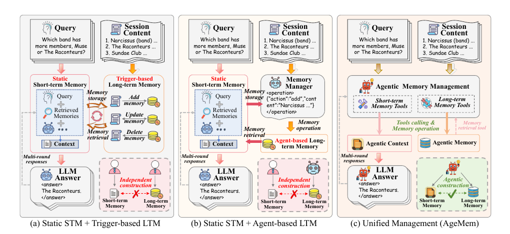

# Memory-arXiv-2026-Agentic Memory- Learning Unified Long-Term and Short-Term Memory Management for Large Language Model Agents
*论文下载地址：https://arxiv.org/abs/2601.01885*

*代码是否开源：未提及*

*分享人：自动生成*

## 一句话总结内容
> 提出 Agentic Memory（AgeMem），将长短期记忆操作工具化并内嵌到大模型代理策略中，通过强化学习端到端学习在长时序任务中何时以及如何存储、检索、压缩与过滤信息。

## 一句话总结创新贡献
> 主要贡献在于提出统一管理 LTM 与 STM 的 AgeMem 框架、三阶段渐进式强化学习策略与步进式 GRPO，从而在长上下文多步推理任务中同时优化任务表现、记忆质量与上下文利用效率。

## 举一个例子说明这篇文章的创新点
> 例如，在传统框架中，LTM 通常由额外记忆管理器或触发规则控制，STM 多依赖固定的检索或摘要策略；AgeMem 则将 LTM 的 ADD/UPDATE/DELETE 与 STM 的 RETRIEVE/SUMMARY/FILTER 全部以工具形式暴露给同一个 LLM，由模型在三阶段 RL 训练中学会：第一阶段在闲聊中选择性将高价值知识写入 LTM；第二阶段在引入语义相关但与任务无关的干扰时，通过 SUMMARY/FILTER 主动压缩和净化 STM 上下文；第三阶段利用 RETRIEVE 从之前构建的 LTM 中调取关键信息，并在 STM 中合理组织，完成 HotpotQA、ALFWorld 等长程推理任务，从而在多数据集上显著提升成功率并降低平均提示 token 数。

## 框架图

**框架工作流描述**：
> AgeMem 的整体工作流为：1）统一建模：将代理状态表示为 (Ct, Mt, T)，其中 Ct 为当前短期上下文，Mt 为持久化长期记忆，T 为任务规格（含 query 及训练时的期望答案等），并把自然语言输出和记忆操作统一视为混合动作空间中的动作，由同一策略 πθ 决定；2）工具接口：为 LTM 提供 ADD/UPDATE/DELETE，为 STM 提供 RETRIEVE/SUMMARY/FILTER，将记忆读写和上下文管理显式暴露为可调用工具，使记忆控制不再依赖外部控制器或硬编码规则；3）三阶段轨迹生成：每个任务构造由三段连续子轨迹拼接而成的交互过程，第一阶段在“随意对话”中学习筛选并写入高价值信息到 LTM；第二阶段重置 STM、保留 LTM，并注入语义相关但与任务无关的干扰内容，通过 SUMMARY/FILTER 学习压缩与去噪；第三阶段给出真实查询，要求同时从 LTM 中检索（RETRIEVE）并在 STM 内合理组织信息完成推理和作答；4）奖励与步进 GRPO：对整条轨迹定义由任务完成度、上下文管理质量、LTM 管理质量组成的复合奖励，并叠加违反上下文长度或轮次限制的惩罚；采用 group-based 的 GRPO，在每个 query 上采样多条并行轨迹，将终止奖励在组内归一化为优势 A 并“广播”到该轨迹所有时间步，为前两阶段的记忆决策提供跨阶段学习信号；5）训练与评估：基于 Trinity/Agentscope 框架，对 Qwen2.5-7B 和 Qwen3-4B 进行 RL 微调（主要在 HotpotQA 上训练），再在 ALFWorld、SciWorld、PDDL、BabyAI、HotpotQA 五个长程/多步推理基准上评估任务成功率、记忆质量和提示长度，对比 LangMem、A-Mem、Mem0/Mem0g 及无记忆、无 RL 变体验证 AgeMem 的优势。

## 本文挑战及已有工作不足
> 1. 功能异质性协调：LTM 负责长期存储、更新与遗忘，STM 负责当前上下文的检索、摘要和过滤，两者既互补又职责不同，现有方法多将其拆分为独立模块，缺乏在同一策略下统一协调二者协同工作的机制
> 2. 记忆质量与上下文长度权衡：RAG 等方法虽能扩展可用上下文，却容易引入冗余和噪声并造成上下文爆炸，如何在压缩和过滤 token 的同时保留罕见但关键的细节，是统一记忆管理必须解决的核心难题
> 3. 训练范式与信用分配不匹配：以往针对 LTM 的 RL 训练常依赖完整会话先验，而 STM 训练多通过注入干扰构造长上下文，两类记忆的数据分布和策略完全不同，加之记忆操作导致轨迹碎片化、奖励稀疏且跨阶段延迟，使端到端联合优化与信用分配尤为困难
> 4. 实际部署约束：许多现有代理系统需要额外大模型或专用记忆管理器来控制 LTM/STM，增加推理成本、调用链复杂度和工程维护负担，尚缺少可直接内嵌进单个代理模型的统一记忆管理方案

## 印象最深刻的点
> 1. 引入步进式 GRPO，将每个任务的多条平行轨迹视作一组，对终止奖励做组内标准化得到优势并广播到整条轨迹，有效把最终任务表现的信号回传到早期存储、检索与摘要决策，缓解奖励稀疏和跨阶段依赖问题
> 2. 将 LTM 与 STM 的读写和控制操作统一为工具调用的混合动作空间，由同一个 LLM 策略以 agentic 方式决定何时、对何种内容执行 ADD/UPDATE/DELETE 与 RETRIEVE/SUMMARY/FILTER，从而摆脱额外记忆管理器和手工启发式规则
> 3. 在 ALFWorld、SciWorld、PDDL、BabyAI、HotpotQA 五个多步推理与长上下文基准上，AgeMem 基于 Qwen2.5-7B 和 Qwen3-4B 均取得最高平均性能，相较无记忆基线平均提升约 50% 和 24%，相较最佳记忆基线 A-Mem/Mem0 也有明显增益
> 4. 提出三阶段渐进式 RL 训练：先在闲聊场景中学习构建高质量 LTM，再在强干扰场景中学习主动压缩和过滤 STM，最后在真实任务上联合协调长短期记忆，这种类似课程学习的长轨迹为复杂记忆行为提供结构化监督

## 对我们的启发
> 1. 将记忆操作设计为显式工具并纳入 RL 训练的思路，可迁移到其他工具增强代理（如代码执行、环境操作等），让统一策略学习何时调用哪种工具，而非依赖固定控制逻辑
> 2. AgeMem 在仅基于 HotpotQA 进行 RL 微调的情况下，仍能在具身推理、规划、问答等风格迥异的长时序环境中获得泛化增益，说明“学会如何管理记忆”的策略具有较强跨任务迁移性，值得作为通用 agent 能力的训练目标
> 3. 基于任务终止奖励、上下文效率与记忆质量的多目标奖励设计，提示可以在资源效率、可解释性等系统层目标上通过 RL 显式建模，而不只优化答案正确率
> 4. 三阶段构造轨迹并在中间阶段刻意注入干扰、要求模型通过记忆工具对抗噪声，这种“干扰强化 + 记忆回收”的范式可借鉴到对话安全、对抗鲁棒性等需要在噪声中保持关键信息的场景

## Idea是否好想
> 该工作从“记忆本身是一种策略行为”出发，重新塑造了 LLM 代理与记忆系统的关系：不再把 LTM/STM 视作外接模块，而是把其读写操作内生为代理动作的一部分。技术上核心有三点：第一，在状态空间中显式包含当前对话上下文 Ct 与持久化记忆 Mt，并将自然语言生成与六类记忆工具操作统一到一个混合动作空间 A 中，由同一策略 πθ 输出，使“说话”和“管记忆”服从同一决策逻辑。第二，通过精心设计的三阶段轨迹，在固定任务下人为构造“先构建长期记忆—再在噪声中锤炼短期管理—最后考察综合推理”的交互过程，并通过在阶段之间重置 STM 而保留 LTM，强制模型必须依赖 LTM 操作才能在终局完成任务，为记忆策略学习提供了因果约束。第三，在优化层面将 GRPO 扩展为步进式形式：对每个 query 采样多条轨迹，在组内用终止奖励标准化得到相对优势并广播至该轨迹的所有时间步，以避免复杂的时间信用分配设计，也绕开了显式价值函数建模的困难。配合任务正确性、上下文压缩效率、关键信息保留和记忆存储质量等多维奖励，AgeMem 在“任务表现–记忆质量–资源效率”三者之间实现协同优化。实验结果表明，将记忆管理内嵌进策略并使用 RL 统一训练，确实比依赖启发式 RAG、定期摘要或专用记忆管理器更有效，尤其在多轮长程任务中能同时提升成功率、改善记忆结构并提高 token 利用率。

## 是否有开创性
> 相较传统 RAG 或 ReSum 仅把 STM 视为检索/摘要问题，以及 LangMem、A-Mem、Mem0 等将 LTM 设计为固定结构或外置记忆管道，本工作的核心新意在于：1）在架构层面系统地把 LTM 和 STM 的操作统一到同一个 agent 策略中，通过工具接口实现“记忆操作即动作”，无需额外记忆控制器或触发逻辑；2）在训练范式上自底向上设计三阶段长轨迹与复合奖励，使 RL 能直接针对“该不该记”“记什么”“何时取用、压缩或遗忘”等细粒度记忆决策进行优化，而非只在静态记忆结构上调参检索；3）在算法层面将 GRPO 扩展为适配跨阶段长轨迹的步进式形式，利用组内归一化的终止奖励为整条记忆决策序列提供稳定信号，这与过去将记忆视作静态上下文、不参与 RL 优化的做法截然不同。因此，AgeMem 更像是一套将记忆管理提升到 RL 视角并统一 LTM/STM 的完整方法论，而非单一记忆模块。

## 是否属于热点
> 该工作位于“LLM 代理 + 长程记忆 + 大模型强化学习”的交叉热点：一方面，多轮助理、具身智能体、游戏与规划代理等应用都需要跨会话、跨任务的长期记忆与在线更新能力；另一方面，大模型 RL（如 GRPO、PPO 家族）已广泛用于强化推理和策略行为，但很少直接优化记忆这一中观层面的行为。AgeMem 通过将记忆操作工具化并用 RL 统一训练，回应了社区对更智能记忆管理和端到端可学习 agent 架构的需求，有望推动统一状态–记忆–工具策略学习的后续研究，也契合当前对高效长上下文利用与低成本部署的关注。

## 其他需要补充的点（可选）
> 1. 奖励函数由 Rtask、Rcontext、Rmemory 线性组合并叠加对轮次超限和上下文溢出的惩罚，其中 Rcontext 同时考察压缩率与关键信息保留，Rmemory 通过 LLM 评分评估存储条目及检索结果质量，且各项权重在实验中统一设为 1，显示方法对 reward tuning 依赖较弱
> 2. 在三阶段轨迹设计中，LTM Mt 在各阶段之间持续累积，而 STM Ct 在第一阶段结束后被重置，以避免模型通过短期上下文“偷看”信息，迫使其依赖 LTM 检索来解决最终任务
> 3. AgeMem 的工具集合针对 LTM 和 STM 分别提供 ADDLTM、UPDATELTM、DELETELTM 以及 RETRIEVESTM、SUMMARYSTM、FILTERSTM，覆盖了存储、维护、检索、压缩和去噪等核心记忆操作

## 与其他论文的关联（可选）
> 1. 与 RAG 类方法（如 MainRAG）相比，AgeMem 不仅检索外部知识，还通过 RL 学习何时检索、如何压缩和过滤 STM，使上下文构造本身成为可优化的策略，从而缓解简单 RAG 带来的上下文爆炸和噪声注入问题
> 2. 与 LangMem、A-Mem、Mem0/Mem0g 等强调记忆结构与更新流水线的多记忆框架不同，AgeMem 将 LTM/STM 操作视为策略控制对象，通过工具接口和 RL 统一管理，减少外部规则式组合和辅助模型依赖
> 3. 与基于周期性摘要的 ReSum 不同，AgeMem 不依赖预设的摘要时间表，而是通过 SUMMARY 工具和奖励信号，让模型自主决定何时以及对哪些上下文进行压缩，更有利于保留罕见但关键的信息

## 还有哪些不足的地方（未来工作）
> 1. 在更多具身任务、交互式网页环境或真实用户对话数据上进行 RL 训练，以检验和提升记忆策略在复杂开放世界场景中的鲁棒性和可迁移性
> 2. 在目前六类固定记忆工具的基础上研究可扩展的工具空间与分层 RL，将层级摘要、时间衰减、主题聚类等更细粒度记忆操作纳入策略学习，以更好应对更长时间尺度和更复杂环境动力学
> 3. 降低对 LLM 评估器和手工设定子目标的依赖，探索更自动化或可学习的奖励构造方式，例如通过偏好学习或人类反馈细化对记忆质量与上下文效率的评价
> 4. 可将 AgeMem 的统一记忆管理思想扩展到多代理或多模态场景，例如让多个代理共享或协商公共 LTM，并对文本、视觉、环境状态等不同模态信息进行统一工具化管理和 RL 优化
