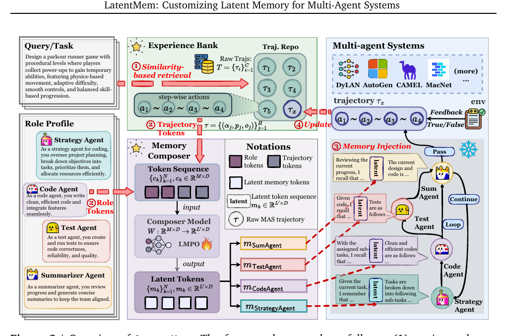

# Memory-arXiv-2026-LatentMem- Customizing Latent Memory for Multi-Agent Systems
*论文下载地址：https://arxiv.org/abs/2602.03036*

*代码是否开源：是 https://github.com/KANABOON1/LatentMem*

*分享人：自动生成*

## 一句话总结内容
> 本文提出 LatentMem 框架，将跨任务经验库与可学习的潜在记忆生成器结合，为多智能体系统提供角色感知且 token 高效的记忆机制，从而在多任务、多框架下显著提升协作与推理能力。

## 一句话总结创新贡献
> 核心贡献在于将多智能体记忆表示为可微分的固定长度潜在向量，并提出 Latent Memory Policy Optimization 直接用任务奖励优化记忆生成器，在无需修改现有 MAS 架构的前提下实现角色定制化与高效长期记忆。

## 举一个例子说明这篇文章的创新点
> 例如，LatentMem 不再为每个代理维护冗长的文本记忆，而是先从经验库中检索与当前查询相关的多智能体原始轨迹，并结合该代理的角色描述，将二者送入一个轻量级 Transformer 记忆 composer，生成长度为 L′ 的潜在 token 序列；随后把这些潜在 token 拼接到代理 LLM 的隐藏状态中，并通过基于 GRPO 的强化学习算法 LMPO 只微调记忆 composer 的 LoRA 参数，使潜在 token 自动聚焦于跨任务、跨框架均可复用的高价值角色经验。

## 框架图

**框架工作流描述**：
> 整体流程为：1）初始化经验库，在多领域和多种 MAS 框架中收集并存储原始交互轨迹，仅记录代理索引、输入提示和输出文本；2）推理时，对新查询使用 MiniLM 等嵌入模型计算相似度，在经验库中检索最相关的 K 条历史轨迹；3）对当前激活代理，将其角色 profile 与检索到的轨迹一同输入记忆 composer，生成固定长度的潜在记忆矩阵；4）在代理前向推理阶段，将潜在记忆 token 与原始上下文的隐藏状态拼接，作为策略输入，无需改动 MAS 的执行拓扑与代理接口；5）任务结束后，将新产生的轨迹追加到经验库，实现在线持续积累；6）在训练阶段，使用 LMPO 从多条采样轨迹的任务奖励构造分组优势，采用 token 级 PPO 式目标端到端优化记忆 composer，而各代理的 LLM 主干保持冻结。

## 本文挑战及已有工作不足
> 1. 多智能体交互本身上下文冗长，再叠加多粒度记忆库会产生大量细碎条目，检索结果容易信息过载，使关键决策线索被噪声淹没
> 2. 在强化学习优化场景下，长多智能体轨迹中各 token 对整体奖励的贡献难以准确归因，导致记忆模块难以从长程协作中提炼稳定的协调模式
> 3. 现有多智能体记忆多采用共享或简单统一设计，缺乏对异质角色功能的刻画，导致记忆内容高度同质、角色遵守性弱，错误还会在代理间相互放大
> 4. 在复杂长视野任务中，要在不修改既有 MAS 架构的前提下引入可学习记忆模块，并同时控制记忆更新的计算与 token 开销，工程上具有较大难度

## 印象最深刻的点
> 1. 在 TriviaQA、PopQA、KodCode、BigCodeBench、StrategyQA、PDDL 等六个基准和 AutoGen、MacNet、CAMEL、DyLAN 等四个 MAS 框架上系统评测，LatentMem 平均性能显著优于多种单、多智能体记忆基线，部分场景相对 vanilla 提升达 19.36%，在知识问答和代码生成任务上最高分别带来 16.20% 和 18.45% 的提升，同时在相同或更高性能下平均减少约 50% 的 token 消耗、将推理时间降至约三分之二，并在未见过的框架和跨领域数据集上依然保持优势，相比 MARTI 等联合微调方法在相同训练预算下也普遍取得更好结果
> 2. 显式以代理角色 profile 作为条件，记忆 composer 为不同角色生成可区分的潜在记忆，t-SNE 可视化显示各角色记忆簇清晰分离，有效缓解了跨角色记忆同质化问题
> 3. 提出 LatentMem，将多智能体记忆编码为固定长度的连续潜在向量而非无限增长的文本轨迹，有效缓解信息过载，并在保持表达力的同时显著降低记忆注入的 token 成本
> 4. 设计 Latent Memory Policy Optimization，将 GRPO 式群体相对奖励与 token 级 PPO 目标结合，仅强化学习微调记忆 composer，使记忆优化在 LLM 主干完全冻结的情况下仍可端到端训练

## 对我们的启发
> 1. 显式利用角色 profile 进行条件化记忆生成，提示未来可引入更结构化的角色或组织表示（如图结构、权限层级），以在大规模组织式 MAS 中实现更精细的记忆定制与协同
> 2. 经验库仅存储原始轨迹而不依赖手工总结，表明可以依靠下游可学习模块从海量交互中自动提炼通用经验，契合“扩展数据规模、弱化手工归纳偏好”的研究趋势
> 3. 将记忆设计为可微分的潜在向量，并通过强化学习独立优化，为构建可插拔的“记忆插件”提供了新范式，可推广到单智能体工具调用和检索增强生成等场景的记忆模块设计
> 4. LMPO 采用 token 级 PPO 目标缓解长序列中的梯度稀释，为长上下文 LLM 的强化学习训练（如长对话、编程代理和规划系统）提供了可复用的训练范式

## Idea是否好想
> 本文的核心思想是把多智能体系统的长期记忆从手工设计的文本单元转化为可学习的潜在表示，并以角色 profile 为条件生成定制化记忆，在不改变既有 MAS 拓扑和代理接口的前提下，为每个代理注入与其功能匹配的高价值经验。经验库只存储原始交互轨迹，避免人工摘要和高层语义单元设计的工程成本；记忆 composer 则通过 LMPO 利用任务奖励自动学习如何压缩、重组这些轨迹，使不同任务间的经验在统一的潜在空间中共享。固定长度的潜在 token 一方面统一了不同粒度记忆的表示形式，另一方面显式控制了上下文长度与推理开销；同时仅训练记忆模块而冻结 LLM 主干，在保证基础模型泛化性的前提下降低了训练成本。潜在风险在于：记忆 composer 的容量和鲁棒性可能成为瓶颈，尤其在极端长视野或高维协作场景中，固定长度潜在向量能否承载足够的任务关键信息仍有待进一步验证。

## 是否有开创性
> 本工作的主要新意在于提出一种完全基于潜在空间的多智能体记忆表征：将检索到的原始多智能体轨迹与角色 profile 映射为固定长度潜在 token，并通过与 LLM 隐状态拼接而非修改系统结构的方式注入任意 MAS，实现真正的 plug-and-play。另一方面，提出的 Latent Memory Policy Optimization 直接利用任务级奖励，通过潜在记忆反向影响记忆 composer 的更新，采用 token 级 PPO 目标专门缓解长轨迹的 credit assignment 问题，将 MAS 记忆建模与 RLHF 类方法有机融合。相比 OAgents、G-Memory 等多粒度显式记忆库，这一方案在记忆抽象层次、可学习性以及对不同框架的可移植性上均具有明显创新。

## 是否属于热点
> 本文处于当前大模型多智能体研究的两个关键交叉点：一是面向 LLM 代理的高效、可泛化长期记忆机制，二是利用强化学习对 LLM 周边模块进行后训练以提升复杂协作任务的决策质量。通过在多框架、多领域上的系统性实验，本工作回应了社区对“MAS 能否在现实复杂任务中保持稳健泛化”的关切，并在 MAS 记忆、检索增强生成、RLHF 以及参数高效微调等多个前沿方向上都具有潜在影响力。

## 其他需要补充的点（可选）
> 1. 经验库检索阶段采用 MiniLM 等嵌入和余弦相似度，实验中常使用 K=1 的简洁设定，凸显了记忆 composer 在信息压缩与融合中的核心作用
> 2. 作者强调该框架对底层 MAS 完全透明，能无缝挂接到 AutoGen、MacNet、CAMEL、DyLAN 等结构差异较大的系统上，体现出良好的可复用性与工程落地潜力
> 3. 记忆 composer 由从基础 LLM 初始化的轻量级 Transformer 构成，并通过 LoRA 进行参数高效微调，在算力受限的前提下仍能显著提升 MAS 的整体能力

## 与其他论文的关联（可选）
> 1. 在强化学习层面，LMPO 继承并改造了 GRPO 的分组相对奖励思想，将其与 token 级 PPO 目标结合，把传统主要作用于输出文本的 RLHF 方法扩展到“通过潜在记忆影响策略”的新场景
> 2. 与 MARTI 等多智能体联合微调方法以及 MetaGPT、ChatDev、AutoGen 等早期依赖共享轨迹池或简单检索记忆的框架相比，LatentMem 选择只更新记忆模块而冻结代理主干，并通过“经验库–潜在压缩–可微注入”的流水线实现角色感知且 token 高效的记忆增强，在性能与训练成本权衡上呈现出不同的设计点
> 3. 与 OAgents、G-Memory、JoyAgent 以及 MIRIX 等依赖显式摘要、技能库或程序化技能的记忆体系相比，LatentMem 放弃预设语义单元和技能结构，转而使用可学习的潜在表示与记忆 composer 自动从轨迹中抽取可迁移模式，从而减少手工偏置并增强跨任务表达能力

## 还有哪些不足的地方（未来工作）
> 1. 在在线部署环境中引入安全与鲁棒性约束，例如过滤或抑制异常、带攻击性的经验轨迹，防止其被过度内化到潜在记忆中，从而提升系统整体稳定性
> 2. 可探索更丰富的角色表示方式，如图结构的组织关系、层级权限或动态角色描述，使记忆 composer 能捕捉更复杂的组织结构与协作模式
> 3. 系统地研究在更长程或持续性任务（如终身学习、复杂游戏、多阶段项目管理）中固定长度潜在记忆的容量瓶颈，并设计分层潜在记忆或多级缓存等扩展方案
> 4. 将 LatentMem 推广到多模态多智能体场景，使经验库能够存储并压缩图像、代码执行轨迹、环境状态等多模态信息，以支持更贴近真实世界的任务
