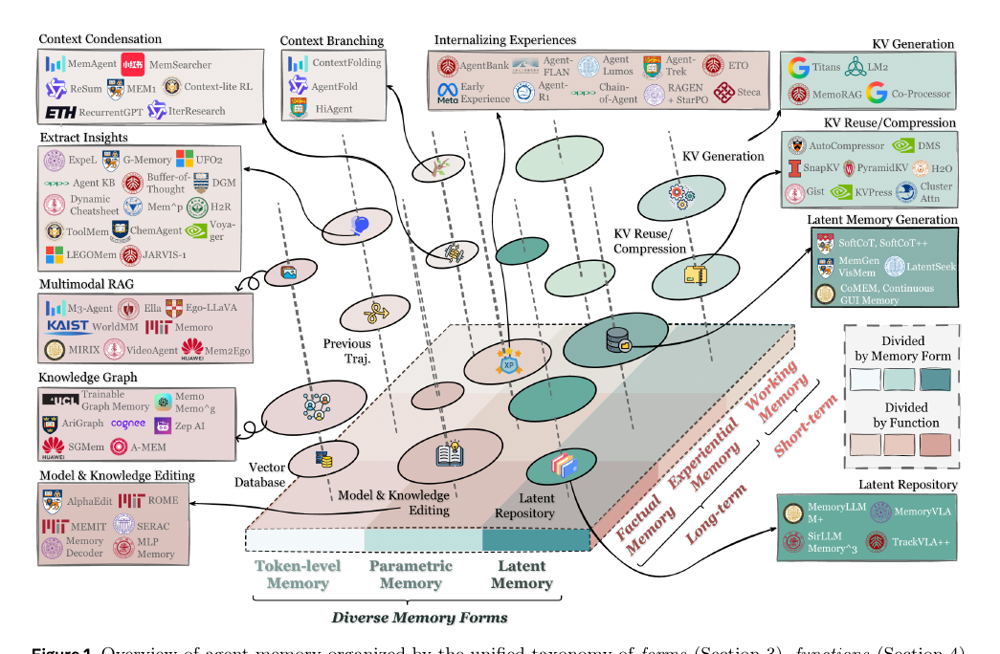

# Memory-arXiv-2026-Memory in the Age of AI Agents- A Survey Forms, Functions and Dynamics
*论文下载地址：https://arxiv.org/abs/2512.13564*

*代码是否开源：是（Agent Memory 相关论文与资源列表的 GitHub 仓库） https://github.com/Shichun-Liu/Agent-Memory-Paper-List*

*分享人：自动生成*

## 一句话总结内容
> 文章系统梳理 AI Agent 时代的记忆研究，提出以“形式–功能–动态”为核心的统一框架，对现有工作进行分类、对比并给出前沿展望。

## 一句话总结创新贡献
> 论文主要贡献在于重新界定“Agent Memory”并与 LLM Memory、RAG、上下文工程等划清边界，构建多维分类体系并整理资源与开放问题，为后续研究提供统一话语与研究路线。

## 举一个例子说明这篇文章的创新点
> 作者将 Agent 记忆生命周期抽象为“形成 F–演化 E–检索 R”三个算子，用统一记忆状态 Mt 表示任务内与跨任务的记忆，将日志缓冲、向量库、结构化知识库、参数内化等视为对同一 Mt 的不同实现，并把“短期/长期记忆”解释为不同时间调用模式的涌现现象，而非刚性模块划分，从而在理论上统一了多种记忆机制。

## 框架图

**框架工作流描述**：
> 文章首先形式化 LLM-based Agent 与环境的交互过程，定义记忆状态 Mt 及其与决策策略的耦合；随后从“形式”维度讨论 token 级、参数化与潜在记忆及其适配场景，从“功能”维度区分事实记忆、经验记忆与工作记忆，从“动态”维度细化记忆的形成、演化与检索机制；接着汇总相关基准与开源框架，最后提出自动化记忆管理、RL 与记忆融合、多模态与多智能体共享记忆、可信记忆等前沿方向。

## 本文挑战及已有工作不足
> 1. 目前缺乏对记忆与决策过程耦合方式的统一抽象，不易系统比较不同记忆策略对交互行为和任务表现的影响
> 2. 传统以“短期/长期记忆”为主的划分难以刻画当下多样且高度动态的记忆形态及其认知功能，难以指导复杂 Agent 的系统设计
> 3. 记忆生命周期管理（筛选、压缩、整合、更新与遗忘）尚无成熟范式，跨任务的持续学习与自我纠错多依赖手工启发式，难以在保证效率与稳定性的前提下扩展
> 4. 记忆相关工作在动机、实现和评估上高度异质，“Agent/LLM memory、RAG、上下文”等术语边界模糊，缺乏统一概念与分类标准，导致研究难以对齐与复用

## 印象最深刻的点
> 1. 提出“形式–功能–动态”三角框架，从表示载体、认知角色和时间演化三维统一组织 Agent 记忆文献，相比传统短期/长期划分更细致、可扩展
> 2. 在梳理记忆文献的同时整理相关基准与开源框架，并提出自动化记忆设计、RL 驱动记忆管理、多模态与多智能体共享记忆、可信记忆等前瞻议题，给出清晰研究路线图
> 3. 用统一记忆状态 Mt 和三个算子 F/E/R 刻画任务内与跨任务的记忆过程，将“短时 vs 长时”视为不同时间调用模式而非结构拆分，概念简洁且解释力强
> 4. 系统区分 Agent Memory 与 LLM 内部记忆、RAG、上下文工程等概念，配合示意图和实例梳理它们在范围、时间属性和功能目标上的异同，有效澄清长期存在的概念混用

## 对我们的启发
> 1. 对希望长期运行并自我进化的 Agent，需要把记忆的整合、冲突消解与遗忘等质量控制机制纳入核心设计，而不仅关注检索精度或上下文长度
> 2. 值得将记忆管理决策（何时写入、写入什么、如何摘要与何时遗忘）纳入可学习的策略，利用强化学习在复杂环境中自动优化记忆使用，而不是依赖人工规则
> 3. 设计 Agent 时应先明确记忆需要支撑的功能（如环境/用户事实、可复用经验或任务内工作空间），再反向选择合适的记忆形式与动态机制，而非从“是否用向量库”出发
> 4. 可借鉴文中的 F–E–R 生命周期抽象，将各类历史信息处理模块统一视作“形成–演化–检索”的组合，便于比较不同系统并进行模块化替换或自动化搜索

## Idea是否好想
> 核心思想是：在大模型驱动的 AI Agent 时代，记忆应被视为支撑长期推理、持续适应与复杂交互的基础设施，而非简单的对话历史或检索库。文章首先将 LLM-based Agent 形式化为在状态空间 S 上通过策略 π 与环境转移 Ψ 交互的决策主体，引入统一记忆状态 Mt，并刻画其与观测 oi_t、任务 Q 及策略的耦合方式，使“有记忆的决策”可以与强化学习等框架对齐。在此基础上，作者提出“形式–功能–动态”的三角框架：在“形式”维度，以载体为轴，将记忆划分为 token 级（含 1D/2D/3D 结构化缓冲）、参数化记忆（通过内部或外部参数内化知识）和潜在记忆（以生成、复用、变换的隐表示存储），并讨论它们在不同任务与资源约束下的适配；在“功能”维度，用事实记忆、经验记忆（进一步细分为案例型、策略型、技能型和混合型）与工作记忆替代传统短/长期划分，对应用户与环境知识积累、策略与技能学习以及任务内工作空间管理；在“动态”维度，通过“形成–演化–检索”（F/E/R）三个算子统一描述记忆如何从工具输出、推理轨迹和环境反馈中被抽取、压缩和结构化，又如何经由巩固、更新与遗忘维持质量，并在不同时间点构造查询与采用多种检索策略。借助这一框架，文章系统重审大量被称为“LLM Memory”的工作，指出它们更适合作为 Agent Memory 的具体实例，并将其与以静态知识访问为主的 RAG、以上下文资源管理为主的上下文工程以及专注 KV 管理和长序列架构的模型内部记忆加以区分，完成概念层面的“去混淆”。最后，作者结合现有基准与开源框架，讨论自动化记忆管理、RL+Memory、多模态与多智能体共享记忆、世界模型中的记忆以及可信和类人记忆等前沿议题，为未来 Agent 记忆研究提供统一理论参照和实践蓝图。

## 是否有开创性
> 该工作的创新主要体现在三点：一是提出“形式–功能–动态”的三角视角，同时刻画记忆的载体、认知作用与时间演化，相比仅按时间跨度或存储位置分类更系统；二是以统一记忆状态 Mt 和 F/E/R 三个算子抽象任务内与跨任务的记忆过程，将短期与长期记忆视作不同时间调用模式的自然涌现，从理论上统一日志、向量库、知识图谱、参数内化等多种实现形态；三是系统梳理“Agent Memory、LLM Memory、RAG、上下文工程”等重叠术语的边界，重新归类大量既有工作并指出 Agent Memory 基本涵盖历史上的 LLM Memory 研究但不包括纯架构层的内部记忆优化，为社区提供更清晰的概念谱系。

## 是否属于热点
> 本文聚焦大模型驱动智能体中的记忆建模与管理问题，这一议题位于“Agent 化大模型”“持续学习与自进化系统”“多模态与多智能体协作”的交汇处，是构建具长期适应与复杂推理能力的下一代通用智能的关键研究热点。

## 其他需要补充的点（可选）
> 1. 前沿讨论中提出从检索式记忆向生成式记忆演进的趋势，并将可信记忆与类人认知记忆纳入视野，关注隐私、安全、错误传播和可解释性等问题
> 2. 论文指出 2023–2024 年间大量自称“LLM memory”的工作本质上是在解决个性化对话、状态追踪、经验积累等 Agent 记忆问题，反映出当时社区对“Agent”概念尚未统一
> 3. 在 Agent 形式化中，作者强调动作空间包含自然语言生成、工具调用、规划、环境控制和通信等多种形式，并指出记忆可以直接参与这些动作的生成

## 与其他论文的关联（可选）
> 1. 与强化学习和持续学习研究紧密相连：记忆直接影响 Agent 的策略 π，文中倡导将记忆形成与检索视作可优化的决策过程，并将跨任务的记忆演化与经验积累纳入终身学习范式
> 2. 与多模态与具身智能、多智能体系统、世界模型以及人类认知科学等方向存在交叉：多模态和共享记忆被视为支撑具身行为、群体智能和环境世界模型构建的关键机制，人类语义/情景/技能记忆则为 Agent 记忆结构提供重要启发
> 3. 与 LLM Memory、RAG 和上下文工程密切相关：文章一方面指出大量历史“LLM memory”工作可视为 Agent Memory 的实例，另一方面将静态知识访问的 RAG 和有限窗口内提示编排的上下文工程界定为与 Agent Memory 相邻但不相同的问题

## 还有哪些不足的地方（未来工作）
> 1. 发展从“检索式记忆”向“生成式记忆”演进的机制，并通过自动化方法决定何时写入、写入什么、如何压缩和何时遗忘，以提升记忆的灵活性与抽象能力
> 2. 将记忆形成与检索策略显式纳入强化学习等优化目标，使 Agent 在复杂环境和长时任务中学会更高效地利用和管理记忆
> 3. 系统开展可信且类人对齐的记忆研究，建立覆盖可靠性、错误检测与纠正、隐私安全和可解释性的评测基准与工具链，并推动记忆中间层等工程化基础设施的标准化
> 4. 构建统一的多模态与多智能体记忆空间，将文本、图像、语音及传感器数据等多源信息与共享世界模型结合，在控制信息干扰和隐私风险的前提下支撑具身与协作 Agent
