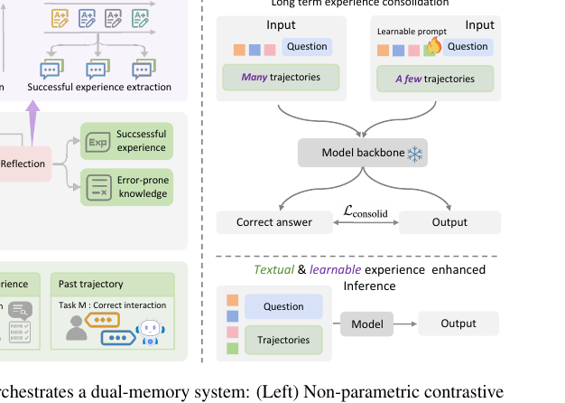

# Memory-arXiv-2026-Self-Consolidation for Self-Evolving Agents
*论文下载地址：https://arxiv.org/abs/2602.01966*

*代码是否开源：未提及*

*分享人：自动生成*

## 一句话总结内容
> 本文提出 EvoSC 自我巩固框架，通过对成功与失败轨迹的对比反思与参数化记忆巩固，使 LLM 代理在测试阶段持续自我演化并提升长期任务表现。

## 一句话总结创新贡献
> 核心贡献在于将非参数化对比经验抽取与可学习提示驱动的参数化轨迹巩固相结合，既系统利用失败经验又突破上下文窗口限制，构建可扩展的终身学习代理范式。

## 举一个例子说明这篇文章的创新点
> 论文中最具代表性的创新是“对比反思 + 参数化巩固”的双通路经验机制：一方面，系统同时检索成功与失败的历史轨迹，使用对比提示模板 Pc 引导 LLM 分析二者在推理过程中的关键分叉点，抽取“易错知识”和“成功模式”，并以 FIFO 队列形式缓存为文本经验，直接注入后续任务；另一方面，提出参数化轨迹巩固（Parametric Trajectory Consolidation），让教师模型在看到大量历史轨迹 Emany 时生成高质量专家动作 A*k,s，学生模型仅使用少量轨迹 Efew 和一段长度约 20 token 的可学习提示 Pθ 来重构这些专家动作，通过逐 token 交叉熵损失优化 Pθ，将冗长的显式交互经历压缩为紧凑的“潜在直觉式记忆”。在知识图谱 KG 场景中，系统能够从对比反思中抽取诸如“调用顺序应为 get_relations() -> get_neighbors() -> get_attributes() -> 聚合函数（count、argmax 等）”这类结构化操作模式，并将其进一步内化到 Pθ 中，从而在几乎不额外占用上下文的前提下显著提升复杂长链推理任务的成功率。

## 框架图

**框架工作流描述**：
> 整体工作流分为五步：1）任务与环境交互：LLM 代理在给定领域的系统提示 Psys 下顺序接收任务流 T 中的任务 tk，在限定轮数 r 内与环境交互，生成动作 Ak,s 并获得反馈 Fk,s，形成完整轨迹 ξ(k)，任务结束后环境给出成功/失败的二值奖励；2）经验检索与对比反思：对于新任务，从成功经验库 Rsucc 中检索最近 K 条成功对话 Crec_succ，并结合最近的失败对话 Cfail，利用对比提示模板 Pc 让 LLM 生成易错知识 Expc（如错误原因与避免策略），同时用成功提示模板 Ps 在多条成功轨迹间抽象出通用成功模式 Exps，这两类文本经验分别存入 FIFO 队列 Qerr 与 Qsucc；3）经验增强推理：在实际求解当前任务 tk 时，构造输入 Ik = Pθ ⊕ Psys ⊕ Expc ⊕ Exps ⊕ Cs ⊕ tk，其中 Pθ 为长期学习得到的可学习提示，Cs 为检索到的成功对话片段，代理以该多层次输入为上下文，在 r 轮之内与环境交互完成任务；4）参数化轨迹巩固：在周期性触发的巩固阶段，从历史成功轨迹集合 E 中采样大量轨迹 Emany 作为教师视野，在给定当前历史 Hk,s−1 和输入 Ik 时，教师 LLM 输出专家动作 A*k,s，学生 LLM 仅看到少量轨迹 Efew 和当前可学习提示 Pθ，输出动作 Âk,s，通过在所有轮次和 token 上最小化交叉熵损失 Lconsolid，使 Pθ 学会在“短上下文”条件下重建“长上下文”下的推理行为；5）经验库更新与循环：每个任务完成后，若验证为成功，则将完整对话加入 Rsucc，并更新成功经验队列 Qsucc；若失败，则更新易错经验队列 Qerr。随着任务流推进，代理一边用最新的显式文本经验指导即时推理，一边通过参数化巩固持续把历史轨迹内化为紧凑的长期记忆，从而实现可扩展的终身演化。

## 本文挑战及已有工作不足
> 1. 主流经验重放方法往往只检索成功轨迹作为示例，难以系统挖掘失败与成功之间的对比信息，从而提炼可迁移的高层策略
> 2. 现有 LLM 代理多在任务隔离设定下以“无状态”形式运行，每次会话后重置，缺乏跨任务累积经验并形成长期自我演化能力的机制
> 3. 现有经验检索模块多依赖 FIFO 与简单相似度，检索质量和效率容易成为端到端性能的瓶颈，尤其在开放、异质任务流下更为突出
> 4. LLM 固定且有限的上下文窗口叠加线性增长的文本重放成本，使得难以在推理时注入足够多的历史经验而不引入严重噪声与注意力稀释

## 印象最深刻的点
> 1. 创新性地系统利用失败经验，通过对比成功和失败的完整交互轨迹，让模型显式提取“易错知识”和“错误避免策略”，而非仅依赖成功示例
> 2. 提出面向 LLM 代理终身学习的 EvoSC 自我巩固框架，在一个可插拔体系内统一非参数化文本记忆与轻量参数化记忆，兼顾短期上下文利用与长期知识内化
> 3. 设计参数化轨迹巩固机制，将大量多轮交互轨迹蒸馏为短小的可学习提示 Pθ，使代理在极小上下文下近似重现大上下文条件下的专家推理，有效缓解上下文长度与显存开销爆炸
> 4. 在 LifelongAgentBench 的数据库、操作系统和知识图谱三大终身学习基准上，EvoSC 在不同基座模型与高经验量设置下依然保持稳定的性能增益与上升趋势，而传统文本重放方法容易在 Exp 较大时出现 OOM 或性能波动

## 对我们的启发
> 1. 将“对比失败与成功”的反思机制显式纳入代理设计，提示后续工作在构建记忆与学习模块时应系统挖掘负例的教学价值，而非只关注正例
> 2. 该框架给出了在上下文受限条件下处理不断累积交互历史的范式，将问题从单纯扩展上下文窗口转化为“显式记忆 + 潜在记忆”的联合设计思路
> 3. 参数化轨迹巩固展示了一条在不微调主模型参数的前提下，通过可学习提示吸收大规模历史经验的路径，可启发在代码代理、工具调用代理、机器人控制等场景中设计类似的“提示级持续学习”方法
> 4. EvoSC 的设计可与强化学习、自监督轨迹生成、自博弈等结合，用更自动化的方式生成和筛选可用于巩固的互动轨迹，构建闭环的自我改进代理系统

## Idea是否好想
> 整体思路是面向测试时终身学习的记忆增强代理框架：一方面，通过对比成功与失败交互，将细粒度推理偏差归纳为高层可迁移知识，减少直接重放示例带来的噪声；另一方面，用可学习提示 Pθ 承载长期经验，实现从“长轨迹→短提示”的压缩映射，以近乎常数的上下文开销逼近大上下文推理能力。相较于仅做记忆检索或仅做提示微调的工作，EvoSC 强调显式文本经验与参数化提示的协同：前者支撑短期适应与可解释规则总结，后者负责长期累积与可扩展性，整体设计在理论上自洽，并在 OOM 对比与消融实验中得到验证。需要注意的是，目前仍依赖 FIFO 和简单相似度的朴素检索策略，在开放、异质任务流中可能限制性能上限；同时，提示长度和蒸馏配置对效果较为敏感，如何在大规模、多领域场景下自动调节仍是有待探索的问题。

## 是否有开创性
> 相较于 AWM、TER、SCM、A-MEM 等主要聚焦“如何检索和组织历史文本记忆”的工作，EvoSC 的新颖性主要体现在三方面：1）显式的对比反思机制，不仅从成功轨迹挖掘经验，还成对比较成功与失败的完整对话，定位具体错误分叉点，并将“错误模式 + 避免策略”以结构化文本写入记忆库；2）参数化轨迹巩固，将大量长轨迹视为教师信号，通过可学习提示 Pθ 让学生模型在短上下文下重建教师行为，相当于把“上下文中的显式经验”迁移到“参数空间中的隐式经验”，从源头上缓解文本重放带来的上下文线性膨胀；3）混合记忆注入范式，在推理时同时注入 Pθ（隐式长期记忆）与 Expc/Exps/Cs（显式短期经验），形成多层经验叠加输入，这种显式 + 隐式联合记忆在 LLM 代理终身学习场景中仍较少见。整体看，创新更多来自系统级设计与模块组合带来的新能力，而非单一算法技巧。

## 是否属于热点
> 该工作聚焦的热点方向包括：大模型代理的终身学习与自演化、测试时学习（test-time learning）与持续适应、基于 LLM 的记忆与检索机制设计、长上下文与经验重放的效率瓶颈破解、通过可学习提示或前缀进行参数化经验巩固，以及在数据库操作、操作系统控制、知识图谱查询等多领域交互任务上的统一代理框架构建。

## 其他需要补充的点（可选）
> 1. 实验在 Llama 3.1-8B-Instruct 与 Qwen 2.5-7B-Instruct 等不同基座模型上进行，表明 EvoSC 主要通过提示与前缀改动即可迁移，具有一定的模型泛化性
> 2. 论文采用 LifelongAgentBench 作为主要评测基准，涵盖数据库（DB）、操作系统（OS）、知识图谱（KG）三个领域，包含约 1400 个任务，强调在任务流下评估代理的长期演化能力而非单次任务表现
> 3. 可学习提示 Pθ 的长度被设为 20 个 token，在如 Exp=32 的高经验量设置下，教师模型使用 20 条轨迹而学生仅用 8 条轨迹配合 Pθ 对齐教师输出，说明部分轨迹信息已被成功压缩进提示的潜在空间

## 与其他论文的关联（可选）
> 1. 相比 AWM（Agent Workflow Memory）、SCM（Self-Controlled Memory）和 A-MEM（Agentic Memory）等侧重从历史轨迹构建工作流或流式记忆控制的框架，EvoSC 更强调对成功与失败案例的对比反思以及提示级参数化巩固，将历史经验转化为可再利用的高层策略与隐式前缀记忆
> 2. 与 TER（Textual Experience Replay）直接重放大量历史文本不同，EvoSC 通过 Expc/Exps 抽取高价值知识，并用可学习提示 Pθ 将大规模轨迹蒸馏为短提示，从而在相同 LifelongAgentBench 设定下有效避免 TER 在高 Exp 时出现的上下文爆炸与 OOM 问题
> 3. 在记忆增强大模型的整体谱系中，EvoSC 与 MemoryBank、Agentic Memory、Self-Controlled Memory 以及 ChatDB 等工作同属一条研究脉络，但其更突出“从非参数文本到参数化提示”的迁移，对如何在外部可读写存储与内部长期记忆间分工提供了互补视角

## 还有哪些不足的地方（未来工作）
> 1. 提升经验检索模块的智能性，例如引入学习型检索器、图结构记忆或基于因果贡献度的样本选择，以替代当前较为朴素的 FIFO 与相似度检索机制，从而提供更相关、更精炼的经验
> 2. 探索与强化学习、自监督轨迹生成、自博弈等方法的结合，让代理通过主动探索产生多样化的成功与失败轨迹，再由 EvoSC 框架进行反思与巩固，形成闭环的自我改进系统
> 3. 将 EvoSC 扩展到更复杂和开放的环境中，如真实 Web 操作、软件自动化与具身机器人控制等，以验证其在非合成任务上的鲁棒性与实用价值
> 4. 进一步研究可学习提示 Pθ 的可解释性与可控性，例如分析其对不同任务类型和错误模式的敏感度，并设计可编辑或可分解的提示结构以支持精细的能力编辑与干预
