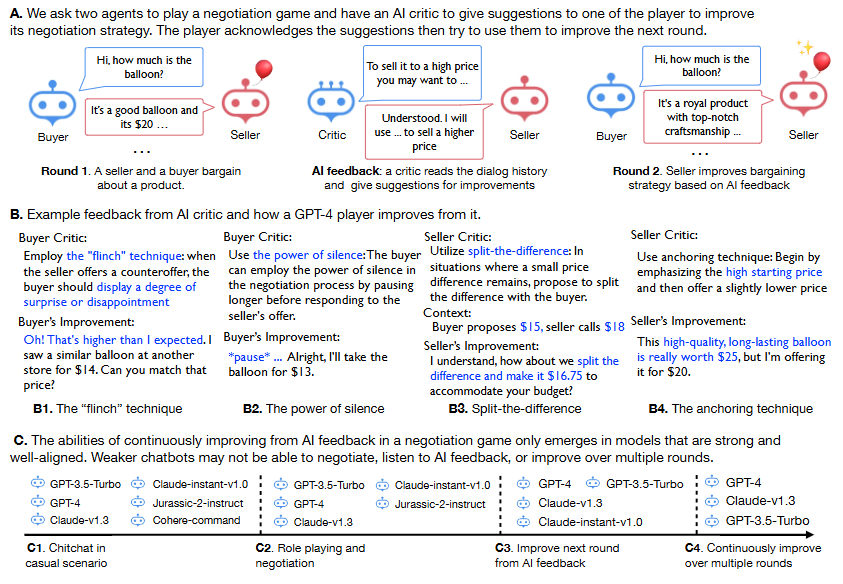

# PD+RLHF-arXiv-2023-Improving-Language-Model-Negotiation-with-Self-Play-and-In-Context-Learning-from-AI-Feedback.md

*论文下载地址（可选）：[https://arxiv.org/abs/2305.10142]*
*代码是否开源：是 [https://github.com/FranxYao/GPT-Bargaining]*
*分享人：马明晖*

## 一句话总结内容
> 本文设计买家-卖家-评论家三智能体博弈框架，让LLM通过自博弈谈判+AI自然语言反馈的上下文学习，自主迭代优化议价策略，证明强模型可在无人工干预下持续提升谈判效果。

## 一句话总结创新贡献
> 首次将自然语言形式的AI反馈与上下文学习结合用于谈判策略迭代，构建可自动化演进的多智能体谈判系统，揭示模型能力层级与角色差异，并发现效果与成交率的内在权衡。

## 举一个例子说明这篇文章的创新点
> 传统谈判模型只会固定砍价/报价；本框架让卖家与买家先谈判，评论家给出“强调稀缺性、建立信任、必要时离场”三条自然语言建议，下一轮卖家直接用这些策略把成交价从$16提到$17，完全自主进化。

## 框架图
`
> 
> **框架工作流描述**：1. 买家与卖家LLM进行多轮价格谈判；2. 评论家LLM基于历史对话给出自然语言改进建议；3. 目标智能体将历史对话+反馈作为上下文示例学习；4. 进入下一轮博弈，迭代优化策略；5.  moderator判断成交/破裂，统计成交价与成功率。

## 本文挑战及已有工作不足
1. 传统LLM谈判依赖手工提示，无自主迭代能力。
2.  RLHF依赖标量奖励，无法利用细粒度自然语言反馈。
3. 缺少统一框架评估不同模型的谈判与学习能力。
4. 多轮迭代中策略改进易饱和，且提升效果会降低成交率。
5. 不同模型在买家/卖家角色上的学习能力差异不明确。

## 印象最深刻的点
> 只有GPT-3.5-turbo、GPT-4、Claude-v1.3能持续从AI反馈进化；弱模型要么不懂规则，要么不听反馈；且买家角色比卖家更难优化，GPT-4可实现5轮持续提升。

## 对我们的启发
1. 自然语言AI反馈可替代人工反馈，实现低成本自动化迭代。
2. 自博弈+上下文学习是策略进化的高效范式。
3. 谈判能力与模型强度、对齐程度强相关，可作为模型评测基准。
4. 追求最优价格必然降低成交率，需做均衡设计。

## Idea是否好想
> Idea清晰、结构完整、实验充分，是自博弈、多智能体、AI反馈、谈判对话的经典交叉工作，极易复现与扩展。

## 是否有开创性
> 是开创性工作；首次用纯自然语言反馈实现LLM谈判策略自主进化，开创AI反馈驱动的策略迭代新方向。

## 是否属于热点
> 属于顶级热点：多智能体、自博弈、AI反馈、谈判对话、策略学习、大模型自主进化。

## 其他需要补充的点（可选）
> 核心发现：AI反馈效果≈人工反馈；买家更难优化；越强模型迭代越稳；越迭代越长文本，但GPT-4更精简高效。
> 测试模型：GPT-4、GPT-3.5-turbo、Claude-v1.3、Claude-instant、Jurassic-2、Cohere。

## 与其他论文的关联（可选）
> 受AlphaGo Zero、Constitutional AI、Self-Refine启发；区别于RLHF，使用自然语言反馈+上下文学习，无需训练。

## 还有哪些不足的地方（未来工作）
1. 仅支持固定商品气球，可扩展多物品与复杂场景。
2. 只优化单方，可实现双边同时进化。
3. 可加入说服策略、情感表达、长期收益建模。
4. 可设计均衡目标，兼顾成交价与成交率。
5. 可扩展到多人谈判、辩论、仲裁、外交等复杂博弈。