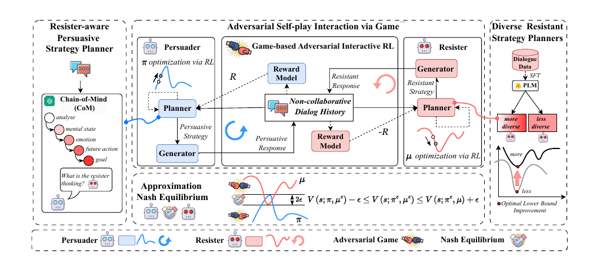

# PD-ACL-2025-Battling against Tough Resister- Strategy Planning with Adversarial Game for Non-collaborative Dialogues
> 说明：本文档内容默认使用中文生成（论文标题与必要专有名词除外）。

*论文下载地址：未提及*

*代码是否开源：未提及*

*分享人：马明晖*

## 一句话总结内容
> 本文提出GAIA，将非协作对话建模为对抗博弈，通过策略规划、自博弈强化学习和近似纳什均衡验证提升说服强抗拒对手的能力。

## 一句话总结创新贡献
> 作者将说服者与抵抗者显式建模为零和博弈双方，引入Chain-of-Mind推理、多样化抵抗者池和ϵ-NE迭代验证，使策略规划器能在对抗互动中持续优化并增强泛化。

## 举一个例子说明这篇文章的创新点
> 例如在价格谈判中，GAIA不会只依据当前回合生成下一步策略，而是先推理卖方的情绪、未来动作和目标，再在多个不同强度的卖家策略规划器上进行自博弈强化学习，最终学到更稳健的说服策略。

## 框架图

**框架工作流描述**：
> 先用Chain-of-Mind提示对抵抗者的情绪、意图、未来行动和对话目标进行逐步推理；再初始化说服策略规划器和多样化抵抗策略规划器；随后构建说服者-抵抗者零和马尔可夫博弈，通过自博弈交互式强化学习交替优化双方策略；最后用ϵ-NE迭代验证算法检测是否接近纳什均衡，并输出近最优策略。

## 本文挑战及已有工作不足
> 1. 传统提示式方法难以显式教会模型进行策略规划
> 2. 静态对手提示无法随训练动态增强，导致鲁棒性不足
> 3. 外部策略规划器训练时未充分考虑对抗交互，面对强抵抗者时效果受限
> 4. 非协作对话中需要同时兼顾感知、规划和对抗适应能力

## 印象最深刻的点
> 1. 面对更强的tough resister时提升更明显，说明方法更适合高对抗场景
> 2. 在三个非协作对话数据集上取得了最优结果
> 3. 平均成功率提升约6.6%，平均对话轮数减少约5.9%
> 4. 消融实验表明感知模块、多样化抵抗者、对抗交互和NE验证均有效

## 对我们的启发
> 1. 通过自博弈强化学习动态提升双方策略能力
> 2. 将非协作对话显式建模为双人零和马尔可夫博弈
> 3. 借鉴Theory of Mind对对手心智状态进行推理

## Idea是否好想
> 本文核心思想是把非协作对话中的策略规划问题转化为一个持续演化的对抗博弈：说服者不仅要根据历史对话决定下一步策略，还要推断对手的情绪、目标和未来行动；与此同时，抵抗者不再是静态提示生成，而是由多个不同强度的策略规划器构成的动态对手池。通过交替式自博弈强化学习，模型在不断增强的对抗压力下学习更稳健的策略，并用ϵ-NE验证控制训练终止条件。该方法兼具理论动机、训练机制和实证效果，比较完整地解决了“如何让策略规划真正适应强对抗对话”的问题。

## 是否有开创性
> 创新点主要体现在三方面：第一，提出Chain-of-Mind提示，把对手的情绪、未来行动、对话目标纳入策略规划；第二，构造多样化抵抗者并理论证明可提升说服者的最优下界；第三，设计对抗自博弈交互式RL与ϵ-NE迭代验证，使训练更接近博弈均衡并获得近最优策略。

## 是否属于热点
> 非协作对话、策略规划、对抗训练、自博弈强化学习、纳什均衡、ToM

## 其他需要补充的点（可选）
> 1. 使用RoBERTa作为默认可插拔对话策略规划器
> 2. 实验覆盖价格谈判、反仇恨言论和慈善劝说三类场景

## 与其他论文的关联（可选）
> 1. 与PPDPP、TRIP等外部策略规划器方法相比，本文进一步考虑动态对手与博弈均衡
> 2. 与Prompt-based planning方法相比，本文显式引入策略规划与对抗学习
> 3. 与ToM相关工作存在关联，因为本文利用心智推理增强说服策略

## 还有哪些不足的地方（未来工作）
> 1. 将该对抗策略规划框架推广到更多非协作对话任务
> 2. 探索更高效的纳什均衡近似与验证方法
> 3. 进一步提升抵抗者建模的真实性与动态适应性
