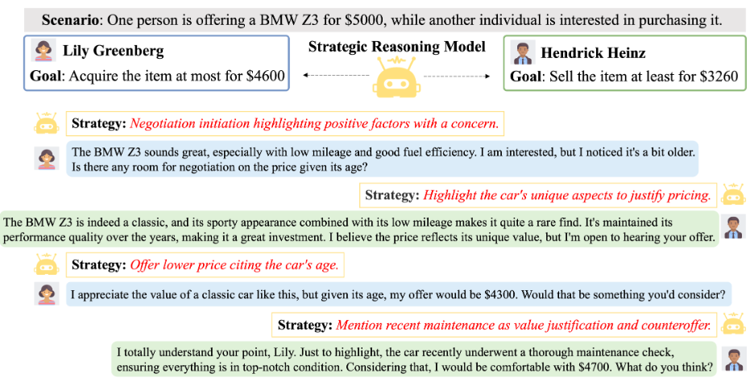

# PD-ACL-2025-EPO-Explicit-Policy-Optimization-for-Strategic-Reasoning-in-LLMs-via-RL.md
*论文下载地址（可选）：[https://aclanthology.org/2025.acl-long.747/]*
*代码是否开源：是 [https://github.com/lxqpku/EPO]*
*分享人：马明晖*

## 一句话总结内容
> 本文提出EPO显式策略优化框架，将战略推理独立为专用LLM模块，通过多轮强化学习、过程奖励与迭代自博弈训练，为任意目标LLM提供实时战略指导，显著提升长期目标达成能力。

## 一句话总结创新贡献
> 首次将战略推理与行为生成解耦为双模块架构，用纯RL（无需SFT前置）训练专用策略模型，实现可插拔、可迁移、开放式策略空间的战略对话能力。

## 举一个例子说明这篇文章的创新点
> 传统谈判模型直接生成话术，容易短视、僵硬、偏离长期目标；EPO单独训练一个“策略军师”LLM，每轮先输出战略（如“强调车况压价”“制造稀缺感”），再让对话模型生成自然回复，长期收益更高、更灵活。

## 框架图

> **框架工作流描述**：1. 环境给出目标与观察；2. 策略模型LLM_s生成当前最优战略；3. 对话模型LLM_d依据战略生成回复；4. 交互后获得环境反馈；5. 过程奖励模型（PRM）评估每一步策略价值；6. 多轮RL+自博弈迭代优化策略模型。

## 本文挑战及已有工作不足
1. 现有LLM在动态谈判、社交博弈等场景缺乏长期战略推理。
2. 提示式方法（CoT/ReAct）适应性差，无法随环境进化。
3. 微调/RL方法易过拟合，泛化与迁移能力弱。
4. 搜索类方法（MCTS）计算昂贵，不支持开放式动作空间。
5. 策略与行为耦合，无法灵活插拔到不同模型。

## 印象最深刻的点
> 解耦架构带来极强通用性：策略模型可插任意LLM，训练一次全场景通用；纯RL即可训练，无需SFT，效率更高、泛化更强。

## 对我们的启发
1. 复杂交互任务应拆分为“战略规划+行为生成”双模块。
2. 过程奖励比最终奖励更适合多轮长期任务。
3. 自博弈是低成本、高泛化的战略能力进化方式。
4. 可插拔战略层是下一代对话Agent的关键架构。

## Idea是否好想
> Idea架构清晰、动机充分、工程友好、效果显著，是战略对话与强化学习的顶级范式工作。

## 是否有开创性
> 是开创性工作；首次提出解耦式显式策略优化架构，重新定义LLM战略推理范式。

## 是否属于热点
> 属于顶级热点：战略推理、多轮对话、谈判、社交智能、LLM Agent、模块化RL。

## 其他需要补充的点（可选）
> 验证场景：SOTOPIA社交互动、WebShop网页导航、ALFWorld具身任务。
> 核心创新：解耦架构、纯RL训练、过程奖励、迭代自博弈。
> 效果：全面超越ReAct、PPDPP、DAT等基线，SOTOPIA+WebShop双SOTA。

## 与其他论文的关联（可选）
> 基于ReAct、PPO、自博弈、过程奖励、模块化Agent；区别于端到端生成，将战略显式化、模块化、可优化。

## 还有哪些不足的地方（未来工作）
1. 仅支持双智能体，可扩展到多人/群体博弈。
2. 可加入多模态、长期记忆、反事实推理。
3. 可结合世界模型做前瞻规划。
4. 需加入伦理约束，防止恶意战略。
5. 可扩展到外交、辩论、教育、医疗干预等场景。