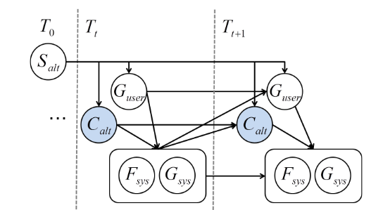

# PD-COLING-2014-Reinforcement-Learning-of-Cooperative-Persuasive-Dialogue-Policies-using-Framing.md
*论文下载地址（可选）：[https://aclanthology.org/C14-1161/]*
*代码是否开源：否*
*分享人：马明晖*

## 一句话总结内容
> 本文基于POMDP与强化学习，从人类劝说对话语料中学习用户模拟器与奖励函数，将**框架效应（Framing）**作为系统动作，训练能兼顾用户满意度与劝说成功率的合作型劝说对话策略。

## 一句话总结创新贡献
> 首次将正负框架（Framing）显式作为劝说对话的系统动作，用真实人对人语料学习奖励与用户模拟器，在仿真与真实用户实验中均证明带框架的RL策略显著提升劝说效果，且接近人类水平。

## 举一个例子说明这篇文章的创新点
> 传统销售对话只回答、提问、建议；本文加入**Positive Framing**（如“相机A性能媲美单反还便携”）和**Negative Framing**（如“相机B画质差长期不划算”）。RL会学到：先问用户偏好→用正向框架夸目标相机→用负向框架弱化竞品→显著提高购买率，同时保持用户满意。

## 框架图
`

> **框架工作流描述**：1. 从人类销售对话语料抽取对话行为（GPF）与框架标签；2. 训练一阶马尔可夫用户模拟器，预测用户对话行为与CPD（偏好被说服状态）；3. 构建POMDP，状态为对话特征，动作=框架+GPF，奖励=满意度+劝说成功率+自然度；4. 用Neural Fitted Q Iteration学习策略；5. 在仿真与真实用户下评估。

## 本文挑战及已有工作不足
1. 传统对话RL多面向任务槽位填充，不适合劝说场景。
2. 已有劝说对话依赖手工规则，未自动学习策略。
3. 缺少从真实语料学习的用户模拟器与奖励函数。
4. 未将情绪框架（Framing）作为可学习动作。
5. 多数工作只做仿真，未在真实用户验证。

## 印象最深刻的点
> 把心理学的“框架效应”直接变成可学习的对话动作，用简单RL就显著提升劝说效果，且在真实用户上接近人类销售水平，极具落地价值。

## 对我们的启发
1. 劝说对话的核心是**结构化策略+情绪框架**，而非单纯生成话术。
2. 用户模拟器与奖励必须从真实人类对话学习，才能对齐真实行为。
3. POMDP适合建模部分可观测的用户偏好与信念状态。
4. 合作型劝说要同时优化系统目标与用户体验。

## Idea是否好想
> Idea非常直观、跨学科、工程可实现，是劝说对话与RL结合的早期经典思路，影响后续对话策略学习。

## 是否有开创性
> 是开创性工作；首个将RL+Framing用于合作劝说对话，奠定数据驱动劝说策略的基础。

## 是否属于热点
> 属于长期经典方向：对话策略学习、劝说对话、情绪框架、用户模拟器、POMDP对话管理。

## 其他需要补充的点（可选）
> 场景：相机销售劝说；目标：劝说用户买相机A。
> 奖励三要素：用户满意度、劝说成功、对话自然度。
> 动作空间：13种（Framing+GPF），过滤低频组合。
> 算法：Neural Fitted Q Iteration。

## 与其他论文的关联（可选）
> 基于POMDP对话管理、RL对话策略、劝说心理学框架效应；区别于手工规则与纯谈判对话，聚焦合作型劝说并引入Framing。

## 还有哪些不足的地方（未来工作）
1. 语料规模小，用户模拟器不够精准。
2. 依赖Wizard-of-Oz，未实现端到端自动系统。
3. 未加入多模态、非语言信息。
4. 只验证了相机销售单一领域。
5. 可扩展到动态偏好、长对话、多智能体劝说。