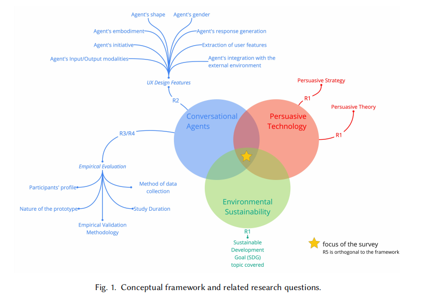

# PD-CSUR-2025-Persuasive Conversational Agents for Environmental Sustainability: A Survey

*论文下载地址（可选）：https://arxiv.org/*
*代码是否开源：否*
*分享人：*

---

## 一句话总结内容
> 本文系统综述了**面向环境可持续发展的劝说型对话系统（Persuasive Conversational Agents, PCA）**，总结了其在行为改变（如节能减排、绿色消费）中的应用，并分析了当前方法（规则、机器学习、LLM）及其挑战。

---

## 一句话总结创新贡献
> 从“环境可持续”这一具体应用场景出发，系统整理了劝说对话系统的技术路线、设计原则与评估方法，并指出未来向**个性化、多模态与伦理对齐**发展的方向。

---

## 举一个例子说明这篇文章的核心思想
> 比如一个节能助手：
- 传统系统：只提供信息（“关灯可以省电”）
- 劝说系统：结合用户习惯+心理策略（“你上个月已经减少10%用电，再坚持会更环保”）

👉 通过个性化劝说，提高用户改变行为的概率

---

## 框架图

> **框架说明**：
1. 用户建模（行为、偏好、动机）
2. 劝说策略选择（情感、社会规范、奖励等）
3. 对话生成（规则 / ML / LLM）
4. 行为评估（是否真的改变用户行为）

---

## 本文挑战及已有工作不足

1. 劝说效果难以量化（行为改变 vs 短期反馈）
2. 用户建模困难（个体差异大）
3. 长期对话数据缺乏
4. 多数系统缺乏个性化
5. 存在伦理问题（操控 vs 引导）

---

## 印象最深刻的点
> 劝说对话的核心不是“说什么”，而是“如何针对不同用户说”，即**个性化策略比内容本身更重要**。

---

## 对我们的启发

1. 劝说对话 = 策略学习问题（可用RL建模）
2. 用户建模是核心（类似POMDP）
3. LLM可以增强自然性，但策略仍需学习
4. 可以结合心理学（如框架效应、社会认同）

---

## Idea是否好想
> 属于总结性工作，idea不复杂，但系统性很强。

---

## 是否有开创性
> 在“环境可持续 + 劝说对话”交叉领域具有代表性综述意义。

---

## 是否属于热点
> 是热点方向（Persuasion + LLM + Behavior Change）

---

## 其他需要补充的点（可选）

> 应用场景：
- 节能减排
- 绿色出行
- 环保消费

---

## 与其他论文的关联（可选）

> 与以下方向相关：
- RL对话策略
- Persuasive Dialogue
- 用户模拟器
- 行为科学

---

## 还有哪些不足的地方（未来工作）

1. 缺少真实长期用户实验
2. 多模态交互不足
3. 个性化仍较弱
4. 伦理规范需要加强
5. 与RL结合仍不充分