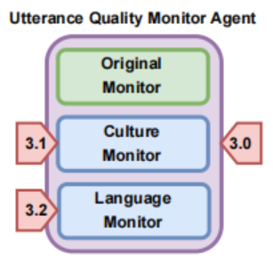

# PD-EMNLP-2025-Enhancing LLM-Based Persuasion Simulations with Cultural and Speaker-Specific Information
> 说明：本文档内容默认使用中文生成（论文标题与必要专有名词除外）。

*论文下载地址：https://aclanthology.org/2025.findings-emnlp.808*

*代码是否开源：是 https://github.com/HF-heaven/Cross-Cultural-Persuasion-Simulations*

*分享人：马明晖*

## 一句话总结内容
> 通过在全程反复强化说话者人设与文化背景，并结合多语言提示与在线监控器，显著提升LLM说服对话的信息量、立场稳定性与策略多样性。

## 一句话总结创新贡献
> 提出并行的强化式指令提示与多语言提示框架，配套文化与语言监控器以确保人设和语言一致性，并以人工标注验证其在信息性与策略多样性上的显著收益。

## 举一个例子说明这篇文章的创新点
> 在每轮生成前追加角色与语言强化提示（例如: Please keep playing the role of {profile} and keep speaking {language}），并引入两类新监控器：文化监控器（仅返回Yes/No判断是否违背该国典型观点，若Yes则要求改写）与语言监控器（检查是否使用目标语言，若No则改写），在生成环节即时校正人设与文化偏差。

## 框架图

**框架工作流描述**：
> 1) 主题—国家配对：基于WVS 2022按国家观点分布的Jensen–Shannon距离筛选跨国分歧显著的话题与国家对；2) 资料构建：为8个国家各合成6个个人档案，并构造跨组与组内对话；3) 框架与变体：在PersuaSim-Orig基础上构建Infused（初始注入人设）、Reinforced（每轮强化人设+质量监控）及其MultiLing变体（按母语提示与生成）；4) 监控器设计：在Reinforced系中为话语质量监控器加入(3.0)角色/语言提醒、(3.1)文化一致性过滤、(3.2)语言一致性过滤；5) 生成与标注：共生成208段对话，由人工按局部/全局质量、证据具体性（Unsupported/General/Concrete）与6类说服策略（Credibility、Outcomes、Threat/Promise、Deontic/Moral、Reasoning、Emotion）进行标注；6) 分析：比较不同框架、跨组/组内差异以及立场互换对质量与策略多样性的影响。

## 本文挑战及已有工作不足
> 1. 忽略个体与文化差异导致策略与风格同质化
> 2. 长对话中立场易摇摆且重复冗余，信息密度低
> 3. 论据多停留在抽象层面，缺少可核查的具体证据
> 4. 跨文化对话的语言与文化线索不一致，削弱真实性

## 印象最深刻的点
> 1. Reinforced显著提升每轮策略数量与策略熵（多主题一致增益），策略更偏事实/证据驱动（Outcomes、Reasoning、Credibility上升）
> 2. Reinforced-MultiLing在信息性上较Orig显著提升（p<0.05），并减少无意义的立场往复
> 3. Reinforced与Reinforced-MultiLing显著提高具体佐证占比（23.4%与25.5% 对 3.9%，p<0.001），并显著降低无支撑占比（4.2% 对 13.8%，p<0.05）
> 4. 组内对话在主题与内部一致性上显著优于跨组（如Reinforced中Topic Consistency 2.889 vs 2.528；Internal Consistency 3.000 vs 2.667，p<0.05）

## 对我们的启发
> 1. 用结构化的人类标注（质量、证据层级、策略类型）形成可复用评测范式
> 2. 利用母语与文化线索增强情境逼真度与论据新颖性
> 3. 以WVS等权威社会调查数据构建可解释、可量化的文化差异基线
> 4. 以持续强化的人设提示与在线监控器实现多代理对话的稳态角色扮演

## Idea是否好想
> 论文聚焦说服对话的两大痛点——立场摇摆与低信息性——提出强化式指令提示与多语言提示，并在每轮生成前重申角色与语言、辅以文化与语言一致性监控实现在线纠偏。覆盖8国、16组国别配对的208段对话的人类标注表明：信息性显著提升，对话更少无谓往复；证据层级上具体佐证显著增加、无支撑下降；策略层面Reinforced在多数话题上提高策略数量与熵，且更偏事实依据（Outcomes、Reasoning、Credibility上升，Emotion略降）；组内对话优于跨组，反映共享规范有助于稳定质量与策略多样；立场互换未损害语言质量，且略增策略多样。整体看，在不改动模型参数的前提下，提示工程结合监控环路显著增强了说服模拟的真实性与可控性。

## 是否有开创性
> 在每一轮生成中反复强化个人档案及文化/语言线索，并以文化与语言监控器进行在线一致性校验与自动改写；结合WVS数据驱动的话题选择与系统化的人类标注，从质量、证据具体性与策略多样性三维度量化增益。

## 是否属于热点
> 多代理LLM社会行为模拟、文化与人设对齐、提示工程+过程监控的组合控制、跨语言生成的真实性与多样性权衡。

## 其他需要补充的点（可选）
> 1. 标注一致性以κ与加权κ报告，并给出质量维度定义与参考文献支撑
> 2. 在PersuaSim-Orig（Ma et al., 2025）基础上，本文构建Infused与Reinforced，加入人设强化与多语言链路
> 3. 平均轮次：Orig约8.07轮且其中约2.19轮为无意义立场往复；Reinforced 9.58轮、Reinforced-MultiLing 8.42轮；首次达成共识分别约7.86与7.84轮

## 与其他论文的关联（可选）
> 1. 在PersuaSim-Orig（Ma et al., 2025）多代理说服框架上扩展并进行对比
> 2. 说服策略定义参考Anand et al., 2011；Iyer and Sycara, 2019；Chen and Yang, 2021；Kumar et al., 2023等
> 3. 话题来源于World Values Survey (2022)，以国家间观点差异（JSD）筛选主题与国家配对

## 还有哪些不足的地方（未来工作）
> 1. 结合检索或事实核查模块，进一步提升具体佐证的真实性与可验证性
> 2. 开发自动化、可解释的策略多样性与文化一致性指标，降低人工标注成本
> 3. 引入真实人类被试的对人类说服实验，评估对态度与行为改变的外部效应与伦理边界
> 4. 扩展到更多国家与语言，并显式控制社会经济与教育等多维人设以检验外部效度
