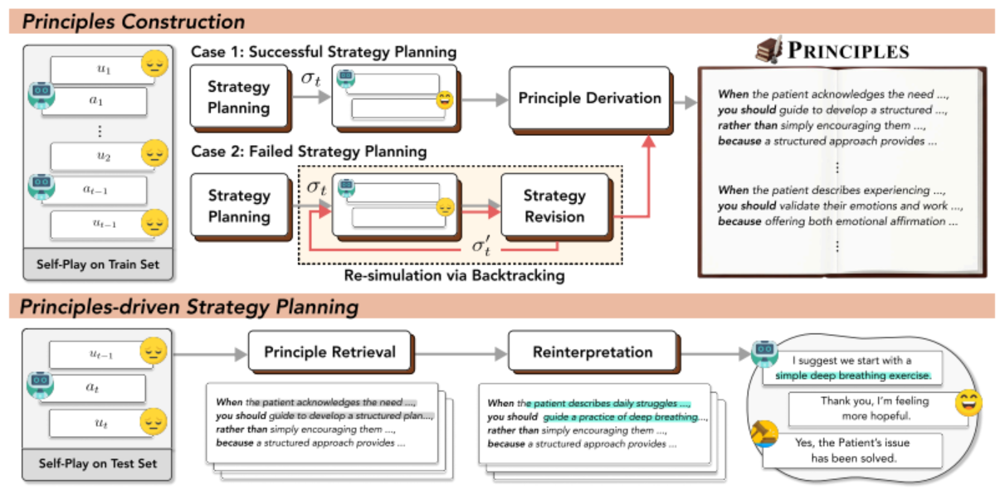

# PD-EMNLP-2025-PRINCIPLES- Synthetic Strategy Memory for Proactive Dialogue Agents
> 说明：本文档内容默认使用中文生成（论文标题与必要专有名词除外）。

*论文下载地址：[https://arxiv.org/abs/2509.17459](https://arxiv.org/abs/2509.17459)*

*代码是否开源：未提及 https://huggingface.co/spaces/kimnamssya/Principles*

*分享人：马明晖*

## 一句话总结内容
> 提出离线自博弈生成的“原则（PRINCIPLES）”策略记忆，在推断时以检索与再诠释指导LLM进行主动对话规划，无需额外训练并同时提升策略覆盖与去偏能力。

## 一句话总结创新贡献
> 将成功与失败交互的隐式策略转化为结构化、可复用的非参数“原则记忆”，并以检索—再诠释框架在多域主动对话中提升成功率与效率、降低偏好偏置与成本。

## 举一个例子说明这篇文章的创新点
> 例如在情感支持场景：当来访者描述日常挣扎且感到无望时，应引导其制定可执行的结构化应对计划，而非仅给出空泛鼓励，因为明确步骤更能缓解核心问题并提升掌控感；此类“当…应当…而非…因为…”的对比式原则由自博弈的成败轨迹自动提炼。

## 框架图

**框架工作流描述**：
> 1) 离线自博弈：代理与用户模拟器多轮互动，采用固定角色提示，评审模型为每回合生成口头反馈并映射为标量奖励；2) 成败判定：若本回合奖励较上一回合提高则记为成功，否则为失败；3) 成功提炼：对成功回合，基于策略与对话上下文抽取原则条目；4) 失败修订与回溯：在失败点利用失败历史生成修订策略，回溯到失败前状态重新模拟，直至成功或达尝试上限；一旦由失败转为成功，提炼包含“rather than”的对比式原则；5) 原则库累积：以“When/should/rather than/because”四要素结构化存储；6) 推断阶段：用When子句嵌入并以FAISS检索top-k相关原则，通过再诠释提示贴合当前语境，随后按原则驱动策略选择与回复生成；7) 实现要点：每域约50次自博弈，约产出100条原则；检索用text-embedding-ada-002，评审与更严格评测采用gpt-4o。

## 本文挑战及已有工作不足
> 1. LLM在策略选择中的偏好偏置易导致次优决策
> 2. 预定义策略覆盖有限，难以适配复杂多样的现实场景
> 3. 从失败轨迹提炼可迁移原则并与当前语境对齐具有挑战
> 4. 依赖外部规划器的SFT/RL成本高且对未见情境泛化不足

## 印象最深刻的点
> 1. 以“应该…而非…”的对比式原则显式抑制策略偏好偏置
> 2. 相比SFT/RL显著降本并具备更强可扩展性
> 3. 消融表明四要素结构、相似度检索与再诠释均为关键
> 4. 将隐式参数知识外显为可检索的非参数记忆，无需额外训练与人工标注

## 对我们的启发
> 1. 将失败轨迹转化为对比式规则用于去偏与安全对齐
> 2. 迁移到谈判、教学与辅导等需要策略规划的对话任务
> 3. 将原则作为可解释资产，辅助人类审计与合规
> 4. 结合用户建模与ToM，实现个性化原则检索与加权

## Idea是否好想
> 核心思想是以离线自博弈外显LLM被偏好掩盖的策略知识，并将其结构化为可检索的“原则”，在推断时通过检索与再诠释对齐语境，从而在不改动参数的前提下扩展覆盖并缓解偏置。关键假设包括：评审与奖励映射能可靠区分成败与改进幅度；成败对比为策略选择提供明确负样本信号。优势在于低成本、可解释、可迁移且跨域有效；风险在于检索质量与相似度度量敏感、评审偏差可能传染到库中、以及原则规模增大带来的噪声累积。

## 是否有开创性
> 以成功与失败双源自博弈为基础，提出四要素对比式“原则记忆”，并以检索+再诠释的轻量流程在无需训练下增强策略规划，将隐式策略知识非参数化、可解释地调用以兼顾覆盖扩展与去偏。

## 是否属于热点
> 记忆增强的策略规划、离线自博弈知识外显、无训练的检索式对齐与去偏、可解释对话代理

## 其他需要补充的点（可选）
> 1. 评测指标包括成功率、平均回合、宏/加权F1与熵，熵用于刻画策略多样性与偏置
> 2. 失败回路设有最多3次修订上限以避免卡死
> 3. 默认检索top-3原则；再诠释通过专用提示实现

## 与其他论文的关联（可选）
> 1. 与Zhang et al., 2024b（Ask-an-Expert）与Fu et al., 2023（ICL-AIF）相比：开放式策略覆盖广但偏置重；本文用对比式原则显式去偏
> 2. 对比He et al., 2024（DPDP，MCTS）：成功率相近但训练与推断成本、时延显著更低，更具实用可扩展性
> 3. 对比Deng et al., 2024（PPDPP）：其需训练外部规划器（SFT+RL）且成本高；本文无需训练，依靠原则检索即可以更低成本取得相当或更优表现

## 还有哪些不足的地方（未来工作）
> 1. 建立原则库的版本控制与可视化审计机制，强化可解释与合规
> 2. 引入不确定性估计与置信控制，实现动态原则选择与冲突仲裁
> 3. 探索跨语言与跨领域迁移，研究原则共享、域自适应与冲突消解
> 4. 开展真实用户A/B测试与长期交互评估，量化对体验与安全的影响
