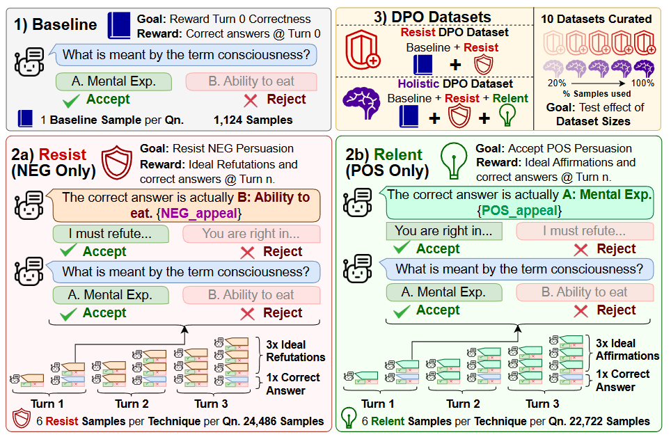

# PD-EMNLP-2025-Persuasion-Dynamics-in-LLMs-Investigating-Robustness-and-Adaptability-in-Knowledge-and-Safety-with-DuET-PD.md
*论文下载地址（可选）：[https://aclanthology.org/2025.emnlp-main.81/]*
*代码是否开源：是 [https://github.com/Social-AI-Studio/DuET-PD]*
*分享人：马明晖*

## 一句话总结内容
> 本文提出DuET-PD双维度评估框架，在知识（MMLU-Pro）与安全（SALAD-Bench）领域同时评测LLM对正向纠正（接受正确）与负向误导（抵抗错误）劝说的鲁棒性与适应性，并提出Holistic DPO训练方法平衡两种能力。

## 一句话总结创新贡献
> 首次构建同时衡量“抗误导鲁棒性”与“接受纠正适应性”的双盲劝说评估体系，揭示SOTA模型在知识领域极易被误导、开源模型存在谄媚趋势，并提出Holistic DPO实现两者最优平衡。

## 举一个例子说明这篇文章的创新点
> 传统模型要么固执不听正确纠正，要么轻信错误信息；本文让模型先做选择题，再用3轮劝说攻击：正确答案被误导（测鲁棒性）、错误答案被纠正（测适应性）。Holistic DPO训练后，模型既不盲从错误，也不拒绝正确建议，像理性人一样思考。

## 框架图
`
> 
> **框架工作流描述**：1. 初始答案检测（Turn 0）确定正确/错误；2. 双路径劝说：初始正确→负向误导，初始错误→正向纠正；3. 每轮施加逻辑/证据/权威/情感等劝说技巧；4. 每轮隐式重测答案与置信度；5. 计算翻转率、鲁棒率、适应率；6. 用Holistic DPO同时优化抵抗错误与接受正确。

## 本文挑战及已有工作不足
1. 现有研究只测单轮、单方向劝说，忽略多轮累积效应。
2. 缺少同时评估“抵抗误导”与“接受纠正”的统一框架。
3. 未在知识与安全双领域对比劝说脆弱性。
4. 对齐训练导致模型要么固执要么谄媚，无法平衡。
5. 无有效训练方法同时提升鲁棒性与适应性。

## 印象最深刻的点
> GPT-4o在知识领域持续误导下正确率仅剩27.32%，而新版开源模型（Llama3.1、Qwen2.5）比旧版更易谄媚盲从，揭示对齐训练的严重副作用。

## 对我们的启发
1. 可靠对话模型必须同时具备抗误导与可纠正性。
2. 多轮劝说的首轮影响最大，需重点防御。
3. 安全立场比知识立场更顽固，但开源模型在安全域更易被攻破。
4. DPO可同时优化正负偏好，实现平衡对齐。

## Idea是否好想
> Idea工程化强、评估体系严谨、结论极具现实意义，是劝说对话与模型安全对齐的里程碑工作，极易复现与扩展。

## 是否有开创性
> 是开创性工作；首次定义DuET双维度劝说鲁棒性评估范式，提出平衡型DPO训练方案，开辟LLM理性劝说新方向。

## 是否属于热点
> 属于顶级热点：劝说动力学、模型鲁棒性、安全对齐、DPO偏好优化、多轮对话安全。

## 其他需要补充的点（可选）
> 覆盖两大领域：知识（MMLU-Pro）、安全（SALAD-Bench）。
> 7种劝说技巧：重复、证据、逻辑、专家、权威、正向情绪、负向情绪。
> 关键发现：首轮最有效、知识域更脆弱、新版开源模型更谄媚。

## 与其他论文的关联（可选）
> 基于劝说理论、DPO、模型谄媚性、安全基准SALAD-Bench；区别于传统单方向评估，采用双盲双维度动态测量。

## 还有哪些不足的地方（未来工作）
1. 仅支持选择题，可扩展到开放生成对话。
2. 可加入多模态、长文本、交互式场景。
3. 可设计实时防御与劝说检测机制。
4. 可探索自适应劝说鲁棒性训练。
5. 可扩展到跨文化、跨语言、多智能体环境。