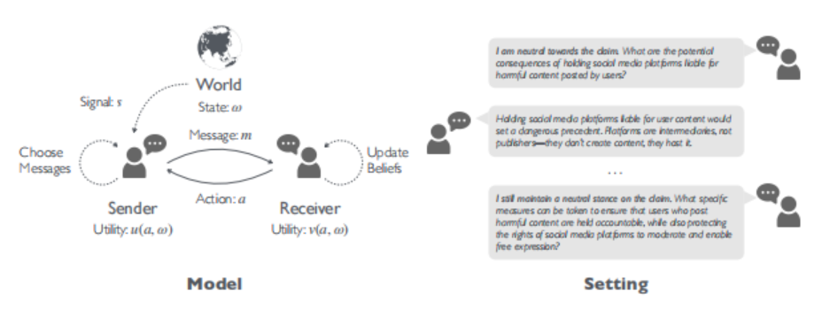

# PD-ICLR-2026-Towards Strategic Persuasion with Language Models
> 说明：本文档内容默认使用中文生成（论文标题与必要专有名词除外）。

*论文下载地址：https://arxiv.org/abs/2509.22989v2*

*代码是否开源：未提及*

*分享人：马明晖*

## 一句话总结内容
> 以贝叶斯劝说为基础，构建可扩展的评测—训练环境系统衡量并提升LLM的策略性劝说能力，显示前沿模型与经RL训练的小模型在动态交互中均能获得显著说服增益。

## 一句话总结创新贡献
> 提出以贝叶斯劝说为支点的统一框架，将人类劝说语料重构为多智能体环境，定义可操作指标与奖励，并用强化学习显著提升小模型的策略性劝说表现且具跨接收方迁移性。

## 举一个例子说明这篇文章的创新点
> 将说服增益形式化为相对先验的收益增量 r = v(a, ω) − ˆv(µ0) 作为强化学习奖励，使模型在多轮信息披露中直接优化信息设计目标；同时以（条件）互信息或语义相似度代理衡量时机化披露。

## 框架图

**框架工作流描述**：
> 1) 数据：重用Anthropic、DDO、Perspectrum、CMV等人类劝说语料，抽取主张构建状态与动作空间；2) 环境：设Sender/Receiver均为LLM，Receiver用7点李克特量表输出立场，包含静态1轮与动态3轮交互；3) 指标：用说服增益衡量效用提升，并以条件互信息（或语义相似度代理）刻画动态信息披露；4) 评测：在固定Receiver下比较多种前沿与开源Sender，并进行人类验证；5) 训练：固定Receiver，采用PPO/GRPO以说服增益为奖励强化小规模Sender；6) 泛化：在未参与训练的不同Receiver架构上测试迁移能力。

## 本文挑战及已有工作不足
> 1. 在自然语言中构造满足Bayes可行性的状态、效用与信号机制具有挑战
> 2. 动态多轮交互下的最优信息披露时机与强度难以度量与学习
> 3. 跨领域与情境的劝说效果高度异质，难以形成统一、可比的评测
> 4. 以LLM近似理性Receiver易引入评测偏差，且跨Receiver泛化不稳

## 印象最深刻的点
> 1. 小模型经PPO/GRPO后显著提升，且在未参与训练的Receiver上可迁移
> 2. 以贝叶斯劝说为核心，提出可操作的说服增益与信号披露指标
> 3. 将多源人类劝说数据重构为可扩展的多智能体评测—训练环境
> 4. 通过语义相似度/互信息代理观察到大模型具更强的自适应信息披露能力

## 对我们的启发
> 1. 通过设置信号约束与社会福利目标，限制具有操纵性的披露策略
> 2. 在谈判、协作与多方博弈中引入动态贝叶斯劝说的节奏与延迟披露机制
> 3. 以可验证任务奖励替代昂贵的人类偏好标注，推动策略性语言生成的RL训练
> 4. 用信息设计视角构建安全与治理评测基准，可推广至政治、医疗与营销等高影响场景

## Idea是否好想
> 本文将劝说从效果到机制置于贝叶斯劝说框架下：以说服增益统一度量效果，以披露度量捕捉策略性，并用RL实现端到端优化，形成评测—训练—分析闭环。优势在于指标可解释且可比，环境可扩展、便于系统对比，实验揭示动态交互与时机化披露的关键作用。局限包括：LLM Receiver可能带来评测偏差，语义相似度近似互信息存在噪声，离散化状态/动作或过度简化，真实人类场景的外推仍需更大规模人类实验与伦理约束，且RL可能出现分布外泛化与策略投机。总体而言，这是在严谨信息设计语境下研究LLM说服的里程碑式框架。

## 是否有开创性
> 将贝叶斯劝说的凹化视角与LLM评测/训练结合，提出以说服增益为统一奖励并量化动态信息披露，把人类劝说语料转化为可扩展的多轮信息设计环境，从而在不依赖昂贵人工评估的前提下端到端提升策略性劝说能力。

## 是否属于热点
> 理论驱动的LLM安全与社会影响评测、策略性说服与信息设计、多智能体强化学习与动态对话控制、跨模型可迁移的说服策略学习

## 其他需要补充的点（可选）
> 1. 静态设1轮、动态设3轮对话以对比交互效应
> 2. RL采用PPO/GRPO，使用verl框架实现
> 3. 动作空间采用七点李克特量表以统一不同数据集的立场评分

## 与其他论文的关联（可选）
> 1. Dynamic Persuasion: Ely (2017) 关于延迟披露与最优动态信号
> 2. Bayesian Persuasion: Kamenica & Gentzkow (2011) 提供凹化与Bayes可行性基础
> 3. LLM Persuasion Evaluations: Durmus et al. (2024), Salvi et al. (2024), OpenAI (2024)

## 还有哪些不足的地方（未来工作）
> 1. 引入人类在环与伦理约束，评估并限制误导性或操纵性策略
> 2. 系统研究对抗式与非理性Receiver下的稳健策略与最坏情形保证
> 3. 提升信息披露度量，从语义相似度过渡到可估计的条件互信息或因果信息量
> 4. 扩展至多发送者/多接收者及网络化劝说，研究信息汇合与竞争下的最优信号
