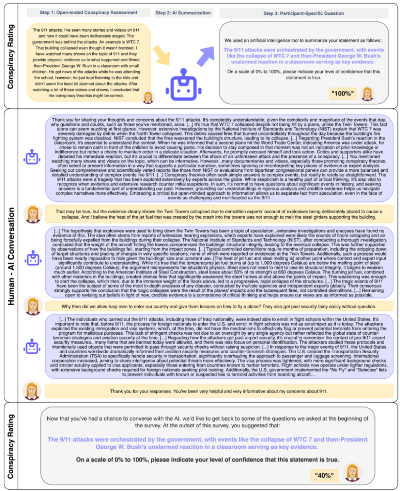

# PD-Science-2025-Durably reducing conspiracy beliefs through dialogues with AI

*论文下载地址：https://www.nature.com/articles/s41586-025-08866-7*

*代码是否开源：未公开*

*分享人：马明晖*

---

## 一句话总结内容
本文提出用大模型（GPT-4）开展**三轮深度对话式说服**，对2000+阴谋论信徒的大规模实验证明：AI可稳定、持久降低阴谋论信念强度（降幅约20%），且效果可持续2个月、跨信念泛化。

## 一句话总结创新贡献
首次用**大规模随机双盲对照实验**证明：AI个性化、有理有据的对话说服，能**长期、稳健削弱根深蒂固的阴谋论信念**，且效果远超传统科普。

## 举一个例子说明创新点
传统辟谣：一句“阴谋论是假”，易触发逆反、毫无效果；
AI对话：先理解你相信9/11阴谋的**具体理由**，再逐条摆证据、逻辑反驳、引导反思，温和共情、有理有据，最终**信念从90%降至40%，2个月不反弹**。

## 框架图

**框架工作流描述**
1. 信念采集：用户自由描述所信阴谋论及证据，AI总结标准化信念；
2. 个性化对话：AI基于用户理由，用**证据+逻辑+共情**三轮深度反驳；
3. 信念复测：对话后、10天、2个月复测信念强度；
4. 效果评估：对比对照组，测信念降幅、稳定性、跨信念泛化。

## 本文挑战及已有工作不足
1. 阴谋论信念**根深蒂固、高度个人化**，传统辟谣易逆反；
2. 人类说服成本高、难规模化、易情绪化；
3. 缺少**大规模、长期、可复现**的AI说服效果验证；
4. 过往仅做静态科普，无法**个性化、动态反驳**。

## 印象最深刻的点
1. **效果强：信念平均降20%，27%人从坚信变怀疑**；
2. **持久：2个月随访，效果几乎不衰减**；
3. **泛化：削弱目标阴谋论，连带降低其他阴谋论信念**；
4. **适用：对极顽固信徒依然有效**。

## 对我们的启发
1. **AI个性化对话**是消解极端信念的高效新范式；
2. 说服要**共情+讲理+证据**，而非硬怼；
3. 大规模社会干预可用**低成本AI对话**替代人工；
4. 谣言治理、认知纠偏可走**长期对话渗透**路线。

## Idea是否好想
Idea**超级落地、价值巨大、社会意义强**：
把心理说服+逻辑反驳+共情沟通，交给AI规模化、个性化执行。

## 是否有开创性
是**社会计算/认知干预领域里程碑**：
首次用严谨大样本实验证明AI能**持久改变深层信念**，颠覆传统认知。

## 是否属于热点
**顶会+产业双热点**：
AI对齐、认知安全、谣言治理、社会影响、说服对话。

## 其他需要补充的点
1. 样本：2190人，覆盖12类主流阴谋论；
2. 对照：空白话题讨论，排除安慰剂效应；
3. 策略：AI主打**理性证据+批判性思维+共情理解**；
4. 行为：还能减少传播、参与极端活动意愿。

## 与其他论文的关联
1. 承接AI说服、认知干预、社会计算方向；
2. 对比传统辟谣、事实核查、静态科普研究；
3. 延伸大模型社会影响、价值对齐工作。

## 不足与未来工作
1. 仅英文、西方样本，**跨文化适配待验证**；
2. 未对抗更强极端信念、极端群体；
3. 可结合**心智理论、人格建模**做精准说服；
4. 需防滥用：避免AI反向灌输极端信念；
5. 扩展多模态、长对话、社群干预场景。