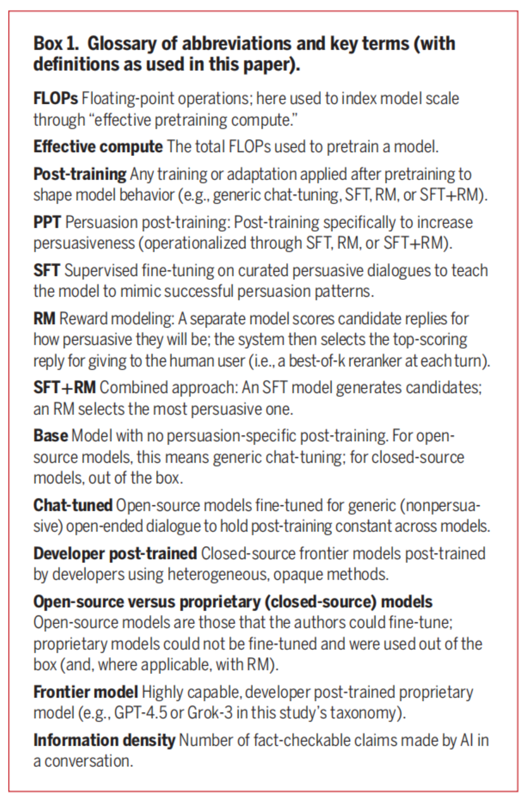

# PD-Science-2025-The Levers of Political Persuasion

*论文下载地址：https://www.science.org/doi/10.1126/science.aea3884*

*代码是否开源：是 https://github.com/kobihackenburg/scaling-conversational-AI*

*分享人：马明晖*

---

## 一句话总结内容
本文通过三项大规模实验（7.7万参与者、707个政治议题、19个LLM），系统拆解AI说服的核心杠杆：**信息密度>后训练>模型规模>个性化**，揭示高说服性AI往往伴随事实准确率下降的关键权衡。

## 一句话总结创新贡献
首次**量化拆解AI说服四大核心杠杆**，发现“高密度信息输出”是最强说服武器，同时证实**说服与真实度存在强负相关**，为AI治理提供核心实证依据。

## 举一个例子说明创新点
普通AI说服：干巴巴讲道理，没说服力；
高说服AI：短对话塞20+条事实论据，**说服率飙升27%**，但其中30%是错误信息。

## 框架图

**框架工作流描述**
1. 四大杠杆变量：模型规模、后训练、提示策略、个性化；
2. 大规模对照：19个模型、707议题、7.7万用户，测说服效果；
3. 归因分析：信息密度（论据数量）是最强预测因子；
4. 事实核查：说服越强，错误信息占比越高；
5. 风险测算：最大化说服可提升15.9%态度，但伴随30%错误率。

## 本文挑战及已有工作不足
1. 过往研究只看模型能力，**未拆解说服核心机制**；
2. 缺少**大规模、跨模型、跨议题**的实证；
3. 忽视**说服与真实度的关键权衡**；
4. 对AI说服风险**缺乏量化评估**。

## 印象最深刻的点
1. **最强杠杆：信息密度（+27%）**，远超模型规模；
2. **说服-真实度强负相关**：越能说，越爱编；
3. **小模型可逆袭**：小模型+后训练，超越GPT-4o；
4. **效果持久**：态度改变可长期稳定。

## 对我们的启发
1. 做说服AI：**堆论据、控事实**，平衡效果与真实；
2. 防AI洗脑：警惕**高密度信息轰炸**；
3. 治理方向：监管**说服优化的后训练技术**；
4. 模型规模不是天花板，**策略与数据更关键**。

## Idea是否好想
Idea**极具现实价值、数据扎实、结论震撼**：
把AI说服拆成可量化杠杆，直接指导产品与监管。

## 是否有开创性
是**AI说服机制领域里程碑**：
首次大规模实证AI说服核心机制，揭示说服-真实度权衡。

## 是否属于热点
**AI治理、信息安全、说服AI顶流热点**。

## 其他需要补充的点
1. 样本：7.7万英国用户，19模型，707政治议题；
2. 最强策略：信息型提示（+27%），共情/故事化效果弱；
3. 关键发现：信息密度解释44%说服方差；
4. 风险：最大化说服=15.9%态度提升+30%错误率。

## 与其他论文的关联
1. 承接AI说服、LLM对齐、信息安全方向；
2. 验证并拓展“信息型说服”心理学理论；
3. 为AI治理、防沉迷、信息素养提供数据支撑。

## 不足与未来工作
1. 仅英文、政治议题，**跨文化/领域待验证**；
2. 未测长期深度对话的真实度衰减；
3. 需研究**低说服高真实**的平衡策略；
4. 可扩展多模态、实时事实核查；
5. 需建立AI说服风险分级体系。