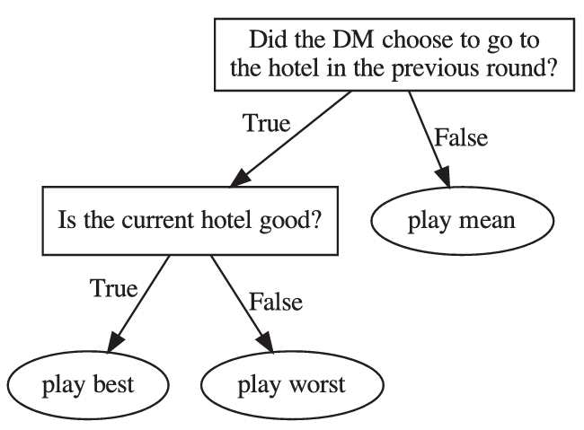

# PD-TACL-2025-Human Choice Prediction in Language-based Persuasion Games- Simulation-based Off-Policy Evaluation
> 说明：本文档内容默认使用中文生成（论文标题与必要专有名词除外）。

*论文下载地址：https://doi.org/10.1162/TACL.a.16*

*代码是否开源：是 https://github.com/eilamshapira/HumanChoicePrediction*

*分享人：自动生成*

## 一句话总结内容
> 本文提出一种基于仿真的离策略评估框架，用于在语言说服博弈中预测人类决策者面对未见专家策略时的选择。

## 一句话总结创新贡献
> 作者构建了一个包含87,204次决策的人机交互数据集，并设计了带逐步学习机制的模拟决策者，从而提升了对新专家策略的预测性能。

## 举一个例子说明这篇文章的创新点
> 将真实人机交互数据与大量模拟交互数据联合训练，并引入随时间增强的 oracle 启发式来模拟人类学习过程。

## 框架图

**框架工作流描述**：
> 先用手机应用收集人类决策者与一组规则专家的多轮说服博弈数据；再基于完整策略空间构造模拟决策者，通过启发式、文本内容和历史行为生成额外训练样本；随后将模拟数据与真实交互数据混合训练预测模型；最后在另一组未见专家策略上进行离策略评估。

## 本文挑战及已有工作不足
> 1. 真实人机交互数据采集成本高，难以覆盖完整策略空间
> 2. 训练数据来自一组专家策略，但测试时需要预测另一组未见策略下的人类选择，分布偏移明显
> 3. 模型需要同时利用文本内容、历史状态和多轮博弈信息，建模复杂
> 4. 模拟数据既要保持可解释性，又要尽量贴近人类随时间逐步改进的行为模式

## 印象最深刻的点
> 1. 在最难的前15%案例中，预测准确率提升了7.1%
> 2. 模拟数据与真实数据联合训练后，模型对未见专家策略更鲁棒
> 3. 收集了87,204次决策、245名完成游戏的人类数据，规模较大
> 4. 提出的模拟决策者融合了 Trustful、Language-based、Random 三类启发式，并加入随时间提升的 oracle 概率

## 对我们的启发
> 1. 借鉴了人类有限理性常用简单启发式的建模思路
> 2. 延续了仿真数据在强化学习、对话系统和智能体训练中的应用路线
> 3. 受 multiplicative weights 和在线学习中动态权重更新思想启发

## Idea是否好想
> 这篇工作将离策略评估引入语言说服博弈中的人类选择预测任务，核心不是直接寻找最优策略，而是通过构造可解释的模拟决策者来扩充训练分布。其关键价值在于：一方面用简单启发式刻画人类决策机制，另一方面通过随交互进程增强的 oracle 机制补足多轮学习效应，从而缓解训练与测试专家不一致带来的分布偏移。整体上，这是一种兼顾可解释性、可扩展性和实际效果的数据增强方案。

## 是否有开创性
> 创新点在于把真实人机交互与仿真交互联合用于离策略人类选择预测，并设计了能够随交互进程逐步改进的模拟决策者。相比仅依赖人工数据或仅依赖 LLM 生成数据的方法，该方法更便宜、更可解释，也更适合新策略泛化。

## 是否属于热点
> 离策略评估、人类行为预测、语言博弈、模拟数据增强、可解释智能体

## 其他需要补充的点（可选）
> 1. 实验使用了人工设计特征和历史状态特征，而非仅依赖深度文本嵌入
> 2. 数据和代码均已公开

## 与其他论文的关联（可选）
> 1. 与 Apel et al. (2022) 的语言说服博弈设置直接相关
> 2. 与 Raifer et al. (2022) 的自动专家设计相关，但本文关注的是人类决策预测而非专家策略优化
> 3. 与 Shapira et al. (2024a) 的 LLM 预测方法相关，本文强调仿真方法更便宜且更适用于 OPE

## 还有哪些不足的地方（未来工作）
> 1. 可进一步刻画更细粒度的人类学习与策略迁移过程，以提升长程预测稳定性
> 2. 可进一步在更多说服博弈和对话场景中验证该模拟评估框架
