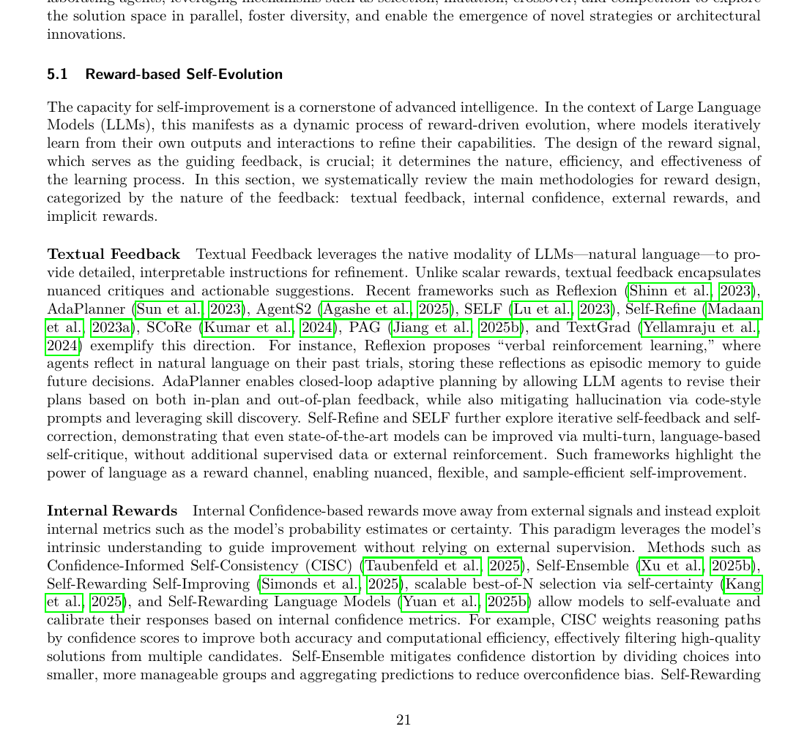

# PD-Transactions on Machine Learning Research (TMLR)-2026-A Survey of Self-Evolving Agents What, When, How, and Where to Evolve on the Path to Artificial Super Intelligence
*论文下载地址：https://arxiv.org/abs/2507.21046*

*代码是否开源：是 https://github.com/CharlesQ9/Self-Evolving-Agents*

*分享人：自动生成*

## 一句话总结内容
> 本文系统性综述自进化智能体（self-evolving agents），从 what、when、how、where 四个维度梳理其概念、机制、评测与应用，并讨论其走向人工超级智能（ASI）的潜在路径。

## 一句话总结创新贡献
> 论文提出统一的理论与实践框架，将自进化智能体分解为可进化对象、进化时机、进化机制和演化场域四个维度，并结合形式化定义、评测指标与代表性系统，给出面向未来的系统化研究路线图。

## 举一个例子说明这篇文章的创新点
> 例如，作者将环境形式化为 POMDP，引入智能体系统 Π 和自进化策略 f(Π,τ,r) 的统一数学框架，以最大化累计效用 max∑U(Πj,Tj) 描述自进化目标，并在此框架下统一刻画从反思更新记忆、自动调优提示与工作流，到微调模型参数、扩展工具集乃至重构多智能体架构等多种演化方式。

## 框架图

**框架工作流描述**：
> 论文首先给出自进化智能体的形式化与操作性定义，将环境建模为 POMDP，将智能体系统 Π 表示为由模型、上下文、工具与架构组成的整体，并用自进化策略 f 描述从当前系统到新系统的转变；随后在 What to evolve 中分析模型、记忆与上下文、工具及智能体架构四类可进化对象，在 When to evolve 中区分测试内（intra-test-time）与测试间（inter-test-time）演化，并将其映射到 ICL、SFT、RL 等学习范式；在 How to evolve 中梳理基于奖励（文本反馈、内外部标量奖励、隐式奖励）、模仿与示范、自博弈与群体进化等方法，并讨论在线/离线、on-policy/off-policy 与演化粒度等交叉维度；最后在 Where to evolve 中总结通用场景及编码、GUI、金融、医疗、教育等专门领域的应用与评测，进而归纳安全性、可扩展性和多智能体共进化等关键挑战与未来方向。

## 本文挑战及已有工作不足
> 1. 设计能系统衡量适应性、稳健性、知识保持与长期收益的评测指标与动态基准环境，并与智能体共同协同演化
> 2. 在大规模连续任务和长时间在线运行下，实现自进化智能体的高可扩展性，同时控制推理延迟、存储与算力成本
> 3. 在多智能体共进化场景中刻画和控制协作与博弈带来的非平稳性、涌现行为和复杂动力学，以避免系统级不可预期风险
> 4. 如何在开放、长期交互环境中实现可验证的安全自进化，防止能力失控、行为偏移以及价值观与合规约束在演化中逐步退化

## 印象最深刻的点
> 1. 构建包含环境 E、智能体系统 Π、自进化策略 f 与效用 U 的统一数学刻画，使不同类型的自进化机制可在同一形式体系下进行比较与分析
> 2. 将自进化智能体首次提升为一等研究范式，而非通用智能体综述中的附属模块，并明确其在通向 ASI 路线中的核心地位
> 3. 从操作性定义出发给出经验驱动、持久策略改变与主动探索三条准入标准，清晰划分自进化智能体与传统流水线、提示工程和静态训练范式的边界
> 4. 提出 what–when–how–where 四维统一分类框架，并在图 2、图 3 中将大量代表性工作系统映射到叶节点，形成结构清晰的研究地图

## 对我们的启发
> 1. 可以直接借用论文提出的 what–when–how–where 框架来设计新型自进化智能体，将模型、记忆、工具和架构的更新机制显式模块化，便于分析、组合与复用
> 2. 对被动学习与主动自进化（自发探索、自反思、自评估）的区分提醒我们，在训练与部署阶段都应引入主动数据收集和自诊断机制，而非仅依赖人工构造数据
> 3. 将自进化策略抽象为 f(Π,τ,r) 的形式，为把反思、经验重放、RL 微调和工具管理等统一视为“策略更新算子”提供了思路，有助于发展更通用的元学习算法
> 4. “评测环境与智能体共进化”的观点启发构建可动态调整任务难度和分布的基准平台，以更真实地衡量系统的长期自适应与自改进能力

## Idea是否好想
> 论文的核心思想是将以大模型为核心的智能体从“静态模型+固定 pipeline”的范式中抽离出来，把具备自我改进能力的整体系统视为研究对象。作者通过将环境 POMDP 化、用 Π 表示由模型、记忆、工具与架构构成的智能体系统，并以演化策略 f 连接不同状态下的 Π，从而把反思记忆更新、提示自动调优、自监督 SFT、强化学习微调、工具生成与筛选、多智能体结构重组等看似异质的做法，统一为“在经验和反馈驱动下对内部状态进行持久修改”的不同实例。在此基础上，论文提出 what–when–how–where 四维分类，并从问题设定与解决范式两个层面对比 curriculum learning、终身学习、模型编辑与遗忘，论证自进化智能体更接近一种系统级解决范式而非单一训练策略。这种抽象既澄清了社区中概念边界模糊的现状，也提供了清晰的研究坐标系，但目前仍主要停留在概念整合与框架搭建层面，具体算法设计和定量实证还有待后续工作进一步充实。

## 是否有开创性
> 新颖性主要体现在三个方面：第一，论文将自进化智能体从以往智能体综述中的附属话题中独立出来，明确提出其是通向人工超级智能的一条关键路线，并围绕这一目标构建较完整的理论框架；第二，从 what、when、how、where 四个互补维度重新组织既有零散工作，厘清模型、记忆、工具和架构的演化，与测试内外演化时机、奖励与模仿等学习范式以及通用与专门领域应用之间的关系；第三，在概念层面给出具操作性的定义，强调经验驱动、持久策略改变和主动探索三条准入标准，将简单提示工程、静态蒸馏或完全由人工调度的流水线排除在“强自进化”范畴之外，为方法评价和基准设计提供可执行的判据。

## 是否属于热点
> 自进化智能体框架，LLM 智能体的持续自适应学习，多智能体协同进化与结构演化，从静态大模型走向具备长期自我改进能力的下一代智能体，以及通向人工超级智能（ASI）的演化路径研究。

## 其他需要补充的点（可选）
> 1. 在操作性定义中提出从“原始演化(proto-evolution)”到“强自进化(strong self-evolution)”的光谱，并指出现实系统多处于“人类设计框架+局部自动演化”的阶段，因此综述采用包容视角将不同程度的自进化机制纳入统一讨论
> 2. 通过将环境建模为 POMDP E=(G,S,A,T,R,Ω,O,γ)，把用户目标、环境状态、动作空间、转移函数、观察与折扣因子统一纳入形式体系，为后续引入强化学习与规划方法奠定基础
> 3. 将智能体系统形式化为 Π=(Γ,{ψi},{Ci},{Wi})，把架构拓扑 Γ、底层模型 ψi、上下文 Ci 与工具集 Wi 明确分离，便于分析各子系统的可进化性及其交互作用

## 与其他论文的关联（可选）
> 1. 与 lifelong/continual learning 的关系：两者都关注任务序列下的知识积累与遗忘问题，但终身学习通常依赖外部给定的任务流与被动数据，自进化智能体则强调主动探索、内部反思和基于自身表现规划学习轨迹
> 2. 与 model editing 与 unlearning 的关系：模型编辑与遗忘提供的是对参数的局部精细修改范式，自进化智能体将其视为众多更新通道之一，同时还允许记忆重构、工具集扩展和架构改写等更广泛的系统级变化
> 3. 与 curriculum learning 的关系：curriculum learning 多在静态数据集上通过难度调度组织训练样本、主要更新模型参数，而自进化智能体面向动态任务序列与交互环境，除参数外还能持续修改记忆、工具和结构等非参数组件

## 还有哪些不足的地方（未来工作）
> 1. 提升自进化智能体在大规模任务与长时间交互中的可扩展性，包括高效的在线更新策略、记忆管理机制与工具库维护方法
> 2. 构建更安全的自进化机制，对自发探索和结构重组过程施加可验证约束，避免能力提升伴随价值偏移或安全属性衰减
> 3. 系统研究多智能体协同与对抗场景下的共进化动力学，发展用于稳定协作、控制涌现行为和缓解非平稳性的算法及理论工具
> 4. 设计能够与智能体共同演化的评测环境和基准，例如可自动调整任务难度与分布的交互平台，以真实反映长期学习和适应能力
