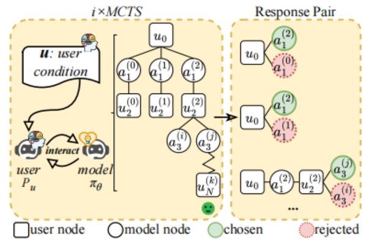

# PD-arXiv-2025-Enhancing User Engagement in Socially-Driven Dialogue through Interactive LLM Alignments
> 说明：本文档内容默认使用中文生成（论文标题与必要专有名词除外）。

*论文下载地址：https://arxiv.org/abs/2506.21497v1*

*代码是否开源：未提及*

*分享人：马明晖*

## 一句话总结内容
> 以终局用户反应为直接奖励，结合用户模拟器与i×MCTS生成偏好对，并用DPO对齐交互式LLM，在情感支持与公益劝募对话中显著提升用户参与度。

## 一句话总结创新贡献
> 将“对话后用户反应”作为参与度指标，借助用户模拟器+i×MCTS在同一上下文下产出高低质量交互对并以DPO对齐，从而在无需知识检索或显式行为规划的前提下有效提升参与度。

## 举一个例子说明这篇文章的创新点
> 在公益劝募任务中，将最终捐款金额归一化为donation/2作为奖励；i×MCTS在同一上下文下比较候选回复，如“我想捐$2，你愿意一起吗？”相较“你客气了！”更易引发积极后续行动，因而被标记为更高参与度的“Chosen”样本。

## 框架图

**框架工作流描述**：
> 1) 训练两个用户模拟器（情感支持的求助者、公益劝募的被说服者），拟合条件化的即时反应与终局状态；2) 在给定用户条件下对目标交互式LLM执行i×MCTS：UCB选择、扩展多候选、用相似度/情绪分剪枝、滚动至终局并以负面情绪表达充分度或最终捐款额计奖回传；3) 从同一上下文抽取“Chosen/Rejected”模型回复对形成偏好集Dp；4) 训练奖励模型，并从原语料采样模型回复对，用其打分得Dt；5) 以D=Dp∪Dt进行DPO对齐，提升高参与度回复的生成概率；6) 通过自动交互评测与人工主观评测验证效果。

## 本文挑战及已有工作不足
> 1. 方法依赖用户模拟器，易与真实用户分布偏移
> 2. 参与度是跨轮的全局属性，难以用单轮信号准确度量
> 3. 交互搜索空间巨大，MCTS易出现分支爆炸与计算开销高
> 4. 情感支持与劝募涉及伦理与安全，需防止操纵性或有害引导

## 印象最深刻的点
> 1. 以终局用户结果作为直接奖励，绕过知识或策略等不稳定代理指标
> 2. 采用DPO进行离策略偏好对齐，流程简洁稳定，避免在线RL
> 3. 混合偏好集（Dp+Dt）兼顾对齐收益与通用能力保持
> 4. 提出i×MCTS引入用户模拟器，在交互层面直接产出高低质量偏好对

## 对我们的启发
> 1. 在社交型对话中直接优化终局反应优于仅优化知识或行为代理目标
> 2. 用DPO等稳定的偏好学习替代高方差强化学习可降调参与训练成本
> 3. 用户模拟器可作为低成本近似环境，用于离线生成偏好与训练奖励模型
> 4. LLM与MCTS结合可在交互空间进行规划式搜索以获取可靠偏好样本

## Idea是否好想
> 工作以“用户终局反应”为核心奖励，契合参与度的累积属性；用i×MCTS在交互层面探索高价值轨迹，再以DPO完成高效对齐，整体逻辑自洽且易落地。主要风险在于：1) 用户模拟器与真实用户分布可能存在偏移，导致对齐偏向“易被说服”的风格；2) 终局信号依赖规则/正则，易漏检隐性情绪或表达不全；3) 相似度与情绪分等剪枝启发存在近似偏差，可能错杀优质分支；4) 偏好标注人机一致性仅中等（κ≈0.59–0.67），数据仍含噪。作者通过引入Dt与奖励模型缓解能力遗忘，并以人机评测与用户研究验证总体有效性，显示方法具备实用价值与可扩展性。

## 是否有开创性
> 不同于以往依赖知识检索或显式行为规划的参与度优化，本工作将MCTS直接作用于交互式LLM，以终局用户反应构建偏好对，并配以任务特定剪枝与DPO实现稳定高效对齐，形成“搜索即偏好数据生产”的范式，在社交对话参与度优化上具备新意与实证优势。

## 是否属于热点
> 基于偏好学习的对齐（DPO/RLHF范式）与LLM×MCTS融合，用终局用户反馈优化社交型对话参与度。

## 其他需要补充的点（可选）
> 1. 场景：情感支持与公益劝募，末轮可直接观测参与度信号
> 2. 自动评测显示情感支持的Engaged Rate由64.06%升至80.47%，劝募平均捐款由$0.58增至$1.29，回合数基本不变；人工评测与小规模用户研究亦显示Aligned更受欢迎
> 3. 数据与模型：PsyDTCorpus/PsyQA与Persuasion For Good；Supporter基于Qwen-2.5-7B-Instruct，Persuader/模拟器基于Llama-3.2-3B-Instruct，均采用LoRA微调

## 与其他论文的关联（可选）
> 1. 对话规划中的MCTS（Li et al., 2024; Yu et al., 2023）侧重行为序列，本工作直接优化模型策略以提升终局参与度
> 2. Direct Preference Optimization（DPO, Rafailov et al., 2024）作为核心对齐算法
> 3. LLM×MCTS在数学/科学推理中的应用（如Wang et al., 2024b; Zhang et al., 2024; Feng et al., 2023），本工作将其扩展至社交对话

## 还有哪些不足的地方（未来工作）
> 1. 从“一刀切”提升转向个性化参与度建模，学习用户画像与偏好动态
> 2. 将基于规则的终局判别升级为更鲁棒的神经或多模态判别器
> 3. 开展多目标对齐，在安全、诚实、同理心与参与度之间可控权衡
> 4. 引入真实用户在环反馈与在线A/B测试，降低对模拟器分布的依赖
