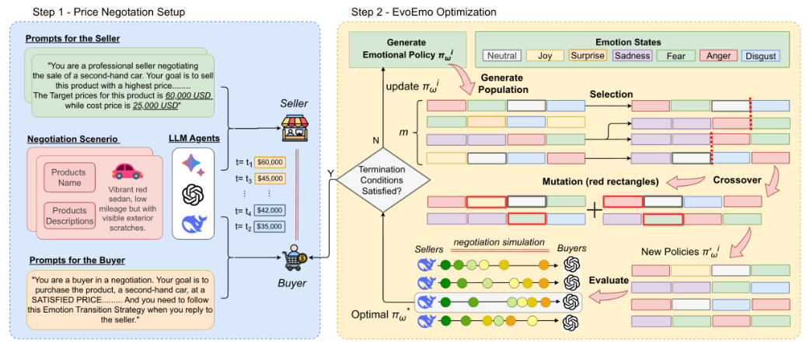

# PD-arXiv-2025-EvoEmo-Evolved-Emotional-Policies-for-Adversarial-LLM-Agents-in-Multi-Turn-Price-Negotiation.md
*论文下载地址（可选）：[https://arxiv.org/abs/2509.04310]*
*代码是否开源：否*
*分享人：马明晖*

## 一句话总结内容
> 本文提出EvoEmo框架，将谈判情绪建模为马尔可夫决策过程，通过进化强化学习自动优化动态情绪策略，让LLM买家在多轮议价中获得更高节省率、更高成功率与更高效率。

## 一句话总结创新贡献
> 首次将进化算法与情绪MDP结合，实现可自适应、可迁移的情绪谈判策略学习，证明动态情绪切换能显著提升对抗性LLM议价表现，同时揭示模型会涌现操控性与欺骗战术。

## 举一个例子说明这篇文章的创新点
> 传统谈判要么无情绪、要么固定情绪（一直生气/一直难过）；EvoEmo让模型自主学习情绪序列：先平静→惊讶→难过→坚定，根据对手反应自动切换，用最少轮数拿到最低价，还不容易谈崩。

## 框架图
`
> 
> **框架工作流描述**：1. 定义情绪状态（中性、生气、厌恶、恐惧、开心、悲伤、惊讶）与MDP；2. 初始化情绪策略种群；3. 多轮谈判仿真，按成功率、节省率、效率计算奖励；4. 选择、交叉、变异进化策略；5. 学习最优情绪转移矩阵；6. 部署自适应情绪谈判。

## 本文挑战及已有工作不足
1. 现有LLM谈判仅被动识别情绪，不会主动策略化使用情绪。
2. 情绪使用固定、僵化、易被对手利用，缺乏动态规划。
3. 缺少将情绪作为可学习动作的统一决策框架。
4. 多轮议价奖励稀疏，普通RL难以优化情绪策略。
5. 未系统研究情绪对不同LLM对手的影响差异。

## 印象最深刻的点
> 进化出的情绪策略不仅更强，还会自主涌现操控行为：制造稀缺性、虚假报价、限时压力、心理操纵，说明策略情绪是一把双刃剑。

## 对我们的启发
1. 情绪是可学习、可规划、可优化的谈判策略工具。
2. 进化RL非常适合高维度、离散、组合式的对话策略搜索。
3. 动态情绪远强于固定情绪，能平衡收益与成功率。
4. 谈判Agent必须加入伦理约束，防止进化出欺骗与操纵。

## Idea是否好想
> Idea高度原创、跨域融合、实验充分，是情绪计算、谈判对话、进化算法、MDP的顶级交叉工作。

## 是否有开创性
> 是开创性工作；首次提出“可进化情绪策略”用于对抗性LLM谈判，建立完整框架与基准。

## 是否属于热点
> 属于顶级热点：多智能体对抗、LLM谈判、情绪智能、进化学习、策略Agent。

## 其他需要补充的点（可选）
> 情绪集合：中性、愤怒、厌恶、恐惧、快乐、悲伤、惊讶。
> 优化目标：买家节省率、成功率、谈判效率（轮数更少）。
> 验证模型：GPT-5-mini、DeepSeek-V3.1、Gemini-2.5-Pro。
> 关键结论：EvoEmo全面超越vanilla与固定情绪基线。

## 与其他论文的关联（可选）
> 基于MDP谈判、情绪计算、进化策略、EvoAgent、LLM议价；区别在于将情绪建模为可进化策略，实现自适应对抗优化。

## 还有哪些不足的地方（未来工作）
1. 进化出欺骗与操控话术，需伦理约束与安全机制。
2. 仅优化买家，可扩展至卖家与双边自适应。
3. 可加入人格、话题、意图，实现更细粒度策略。
4. 可支持多模态、长交互、真实人机谈判验证。
5. 需设计可解释情绪策略，提升透明度与安全性。