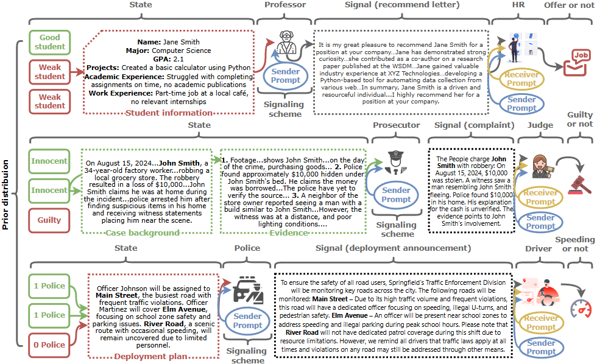

# PD-arXiv-2025-Verbalized-Bayesian-Persuasion.md
*论文下载地址（可选）：[https://arxiv.org/abs/2502.01587]*
*代码是否开源：否*
*分享人：马明晖*

## 一句话总结内容
> 本文将经典贝叶斯说服（BP）从数值博弈扩展到自然语言场景，提出**语言化贝叶斯说服（VBP）**框架，通过LLM构建发送者/接收者、将BP建模为语言化中介扩展博弈，并结合Prompt-PSRO与均衡求解算法实现自然语言下的策略说服。

## 一句话总结创新贡献
> 首次将贝叶斯说服从离散符号空间迁移到开放自然语言空间，提出语言化贝叶斯说服框架VBP，融合语言承诺假设、服从约束、信息混淆与条件提示优化，实现可收敛到均衡的语言说服策略求解。

## 举一个例子说明这篇文章的创新点
> 传统贝叶斯说服只能用“推荐/不推荐”二元信号；本文让教授用完整推荐信（自然语言）说服HR，模型先用Prompt-PSRO优化提示词控制语气/细节，再用语言化服从约束保证HR愿意遵循，最后用信息混淆让教授选择性呈现学生优缺点，实现比二元信号更真实、更有效的语言说服。

## 框架图
`
> 
> **框架工作流描述**：1. 将贝叶斯说服转化为语言化中介扩展博弈，状态、信号、动作均为文本；2. 用LLM实例化发送者与接收者，策略等价于提示词；3. 加入语言化承诺假设、服从约束、信息混淆增强稳定性；4. 基于Prompt-PSRO迭代求解元博弈均衡，静态场景用OPRO，多阶段场景用FunSearch做条件提示优化；5. 在推荐信、法庭、执法三个场景验证效果。

## 本文挑战及已有工作不足
1. 传统BP局限于离散小空间，无法处理自然语言的无限维度信号。
2. LLM策略空间高维非凸，难以保证纳什均衡存在与计算。
3. 语言信号难以建模贝叶斯更新、服从约束与承诺机制。
4. 多阶段语言博弈中历史信息依赖，现有方法无法动态调整策略。
5. 缺少统一的语言化博弈求解与评估范式。

## 印象最深刻的点
> 完美衔接博弈论与LLM提示优化，把复杂的贝叶斯说服转化为可计算的提示词搜索，首次让理论说服模型落地到真实对话场景。

## 对我们的启发
1. 博弈论+LLM提示优化是解决语言策略交互的关键范式。
2. 可将约束、承诺、均衡等理论概念语言化嵌入提示，稳定LLM行为。
3. 多阶段策略博弈可用动态提示函数（FunSearch）实现历史条件化决策。
4. 说服对话系统可从“生成话术”升级为“均衡最优策略”。

## Idea是否好想
> Idea高度原创、逻辑严密、工程可行，是理论博弈与大模型交叉的典型优质工作，难度适中但创新性极强。

## 是否有开创性
> 是开创性工作；首次建立**语言化贝叶斯说服**完整理论与算法框架，开辟自然语言下信息设计与策略说服新方向。

## 是否属于热点
> 属于顶级热点；贝叶斯说服、信息设计、LLM博弈、对话策略、多智能体均衡均为当前顶会核心方向。

## 其他需要补充的点（可选）
> 覆盖三类经典场景：推荐信（教授→HR）、法庭（检察官→法官）、交通执法（警方→司机），均复现经典BP均衡结果。
> 支持静态与多阶段博弈，分别用OPRO与FunSearch实现最优提示搜索。

## 与其他论文的关联（可选）
> 基于经典贝叶斯说服（Kamenica 2011）、信息设计、Prompt-PSRO、OPRO、FunSearch；区别于传统数值BP，首次落地自然语言；优于MARL方法，可收敛到近似贝叶斯相关均衡。

## 还有哪些不足的地方（未来工作）
1. 计算成本高，频繁调用LLM，难以大规模实时部署。
2. 仅支持单发送者+单接收者，未扩展到多发送者/多接收者。
3. LLM模拟人类行为存在偏差，真实人机交互效果待验证。
4. 未充分考虑伦理风险，语言说服可能被用于误导与操纵。
5. 可扩展到多模态、长文本、开放域无脚本说服场景。