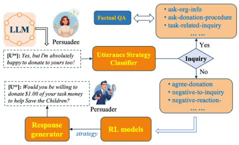

# PD-arXiv-2026-Personality-Aware-Reinforcement-Learning-for-Persuasive-Dialogue-with-LLM-Driven-Simulation.md
*论文下载地址（可选）：[https://arxiv.org/abs/2601.06877]*
*代码是否开源：否*
*分享人：马明晖*

## 一句话总结内容
> 本文提出一种融合动态人格感知、LLM仿真对话与强化学习的劝说对话框架，通过D3QN优化策略，结合同意意愿、捐赠金额与反悔惩罚，实现更稳定、高效、个性化的公益劝说。

## 一句话总结创新贡献
> 首次在劝说对话中实现**逐轮动态人格表征**（81维混合嵌入），结合LLM议程驱动仿真与D3QN强化学习，提出包含反悔惩罚的复合奖励，显著提升劝说成功率与用户承诺稳定性。

## 举一个例子说明这篇文章的创新点
> 传统劝说机器人用固定话术；本方法每轮都从对话中实时推理用户人格（外向性、同理心等），对谨慎型用户用证据与逻辑慢慢说服，对感性用户用情感共鸣，同时避免用户“先答应后反悔”，让捐赠更稳定真实。

## 框架图

> **框架工作流描述**：1. 策略导向交互框架：分类用户意图→RL选择劝说策略→MMR检索生成回复；2. 人格感知用户表征：从对话逐轮预测81维人格嵌入；3. D3QN强化学习：状态=对话历史+人格，奖励=同意+捐赠-反悔；4. LLM仿真生成多样化对话扩充训练数据。

## 本文挑战及已有工作不足
1. 多数劝说系统使用静态用户画像，无法捕捉对话中动态心理变化。
2. 真实劝说数据稀缺，传统模拟器无法生成细粒度人格化行为。
3. 现有RL奖励只关注是否说服，忽略用户“答应后反悔”问题。
4. 生成式回复缺乏策略可控性与上下文多样性。
5. 缺少人格与策略的动态匹配机制。

## 印象最深刻的点
> 用逐轮动态人格嵌入替代静态画像，加入反悔惩罚奖励，让用户承诺更稳定；同时用LLM仿真解决数据稀缺问题，工程与理论双突破。

## 对我们的启发
1. 动态心理状态建模是高质量劝说对话的核心。
2. 强化学习+检索生成兼顾策略可控与表达自然度。
3. 复合奖励（成功+金额+稳定性）能带来更真实的长期劝说效果。
4. LLM仿真可低成本扩充高覆盖、多人格的对话数据。

## Idea是否好想
> Idea结构清晰、模块完整、动机强烈、落地性强，是人格化对话+劝说+RL+LLM仿真的高度集成创新。

## 是否有开创性
> 是开创性工作；首次将动态逐轮人格、D3QN、LLM仿真、反悔惩罚复合奖励统一用于劝说对话。

## 是否属于热点
> 属于顶级热点：劝说对话、个性化对话、动态用户建模、RLHF、LLM仿真、公益AI。

## 其他需要补充的点（可选）
> 场景：公益捐赠劝说（PersuasionForGood）。
> 人格表示：25连续+7分类→81维混合嵌入。
> 策略空间：27种劝说策略（信誉、逻辑、情感、赞美等）。
> 关键提升：动态人格→更高累积奖励；反悔惩罚→更少反悔；LLM仿真→更强泛化。

## 与其他论文的关联（可选）
> 基于P4G数据集、D3QN、MMR检索、LLM用户仿真；区别于静态人格，使用动态逐轮推断；新增反悔惩罚解决承诺不稳定问题。

## 还有哪些不足的地方（未来工作）
1. 回复生成依赖P4G检索，可扩展开放生成。
2. LLM仿真存在偏差，需引入真实用户迭代。
3. 可支持多模态、多轮长对话、跨文化人格。
4. 可加入因果推理与反事实优化。
5. 可扩展到健康干预、教育引导、公共宣传等场景。