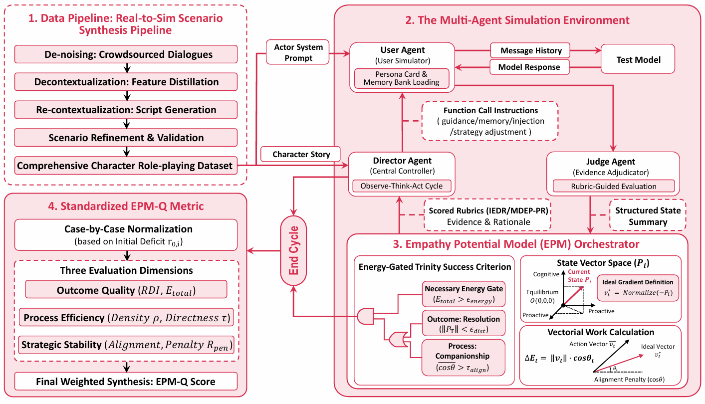

# PD-arxiv-2026-EMPA: Evaluating Persona-Aligned Empathy as a Process

*论文下载地址（可选）：[https://arxiv.org/abs/2603.00552](https://arxiv.org/abs/2603.00552)*

*代码是否开源：https://github.com/KAYA-HAI/EMPA-Benchmark-EPMSandbox*

*分享人：马明晖*

## 一句话总结内容
> 论文提出EMPA框架，通过模拟真实对话场景，评估大语言模型在多轮对话中与用户角色保持一致、持续提供支持的能力，而非孤立回复。

## 一句话总结创新贡献
> 提出一个过程导向的框架，用于评估基于人格的共情，将共情视为持续干预而非孤立回复，并使用心理空间中的轨迹评分。

## 举一个例子说明这篇文章的创新点
> 引入心理动态向量形式（EPM）来建模用户的心理状态，并定义了认知、情感和主动共情三个维度，以评估模型在多轮对话中的表现。

## 框架图
> 

**框架工作流描述**：
> EMPA包含三个主要部分：1)从真实对话中提取心理特征并生成可控的模拟场景；2)使用多智能体模拟环境进行开放式的多轮对话；3)通过共情潜力模型（EPM）分析对话轨迹，从方向性、累积效应和稳定性三个维度进行评分。

## 本文挑战及已有工作不足
> 1. 用户可能表现出非合作或抵抗行为，如回避、否认等，需要模型在非合作假设下进行建模
> 2. 心理支持对话中，目标可能随时间演变，效果通常延迟或噪声，没有可靠的回合级别成功信号
> 3. 用户状态是潜在的，反馈稀疏且难以在情境中验证，看似支持的回合可能仍然导致偏离人格特定需求的轨迹
> 4. 现有评估实践与长时程社会应用不匹配，通常将评估简化为局部的、回合级别的输出，无法捕捉长期行为效果

## 印象最深刻的点
> 1. 提出一个统一框架，将模拟、潜在状态建模和过程级指标相结合，以解决主流代理评估的局限性
> 2. 使用非脚本化的多智能体交互循环，避免脚本化的回合级交换，暴露长时程策略、适应性和失败模式
> 3. 使用轨迹级过程指标，超越标量或回合级分数，联合捕捉方向对齐、累积效应和行为稳定性
> 4. 将共情视为一个过程，通过情境、互动和反馈展开，而非固定能力，与心理账户中情绪智力的概念一致

## 对我们的启发
> 1. 心理学中关于共情的概念，将其视为一个过程，通过情境、互动和反馈展开，而非固定能力
> 2. 多智能体系统在模拟社会行为中的应用，如Generative Agents和SOTOPIA，但更关注心理状态的演变
> 3. 从静态指标到交互式评估的进展，如Agent-as-a-Judge和状态感知评估，但更关注长期轨迹和持续的人格对齐

## Idea是否好想
> 论文的核心创新在于将共情评估从传统的单回合、标量评分转变为一个过程导向的、轨迹级的框架。它识别并解决了传统评估中存在的几个关键问题：1) 潜在的用户状态和延迟的反馈；2) 非合作用户行为；3) 强度与有效性的混淆；4) 可量化的指标可能导致表演性行为。通过引入心理动态向量形式（EPM），该框架能够捕捉模型在多轮对话中与用户需求保持一致、持续提供支持的能力，从而更真实地反映共情的效果。

## 是否有开创性
> 提出一个过程导向的框架，用于评估基于人格的共情，将共情视为持续干预而非孤立回复，并使用心理空间中的轨迹评分。框架包含三个主要部分：1)从真实对话中提取心理特征并生成可控的模拟场景；2)使用多智能体模拟环境进行开放式的多轮对话；3)通过共情潜力模型（EPM）分析对话轨迹，从方向性、累积效应和稳定性三个维度进行评分。

## 是否属于热点
> 将共情评估从传统的单回合、标量评分转变为一个过程导向的、轨迹级的框架，解决传统评估中存在的潜在用户状态、延迟反馈、非合作行为、强度与有效性混淆以及可量化指标导致表演性行为等问题。

## 其他需要补充的点（可选）
> 1. 使用非脚本化的多智能体交互循环，避免脚本化的回合级交换，暴露长时程策略、适应性和失败模式
> 2. 使用轨迹级过程指标，超越标量或回合级分数，联合捕捉方向对齐、累积效应和行为稳定性
> 3. 使用心理动态向量形式（EPM）来建模心理状态，并定义了认知、情感和主动共情三个维度，以评估模型在多轮对话中的表现

## 与其他论文的关联（可选）
> 1. 与静态任务如情绪分类、情感分析和社交常识推理等早期共情评估不同，EMPA更关注交互动态
> 2. 与交互式方法如Agent-as-a-Judge和状态感知评估不同，EMPA更关注长期轨迹和持续的人格对齐，而不仅仅是回合级别的行为变化
> 3. 与认知任务中基于固定真值和独立单位的评估实践不同，共情是一个过程驱动的能力，其有效性仅通过行为随时间展开而显现

## 还有哪些不足的地方（未来工作）
> 1. 框架中的心理动态向量形式（EPM）是一个关键组件，其参数和维度可能需要根据不同任务进行调整
> 2. 评估指标和评分标准可能需要根据不同的应用场景和用户群体进行调整
> 3. 多智能体模拟环境中的用户模拟器可以进一步改进，以更真实地模拟用户行为，包括非合作和抵抗行为
