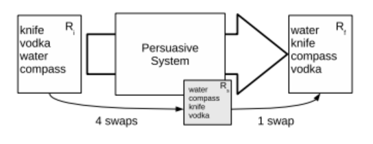

# PD-未提及-2008-Measure Of Belief Change as an Evaluation of Persuasion
> 说明：本文档内容默认使用中文生成（论文标题与必要专有名词除外）。

*论文下载地址：[https://www.researchgate.net/publication/228964262_Measure_Of_Belief_Change_as_an_Evaluation_of_Persuasion](https://www.researchgate.net/publication/228964262_Measure_Of_Belief_Change_as_an_Evaluation_of_Persuasion)*

*代码是否开源：未提及*

*分享人：马明晖*

## 一句话总结内容
> 提出以排序变化为代理、基于Kendall τ置换距离的通用劝服评测指标，实现跨领域可比的劝服力衡量。

## 一句话总结创新贡献
> 将劝服形式化为信念排序的改变，给出可归一化度量与两种实验设定（一般/最大化分歧），并在对话劝服中与主观感知显著相关。

## 举一个例子说明这篇文章的创新点
> 在餐馆推荐式对话实验中，系统将目标排序设为用户初始排序的完全逆序以最大化“劝服努力”，用归一化Kendall τ距离变化度量Persuasiveness，并观察到其与用户对他者劝服性的主观评分显著相关（Spearman ρ=0.70，p<0.01）。

## 框架图

**框架工作流描述**：
> 1) 参与者给出初始排序Ri；2) 设定目标排序Rs（一般设定可自定；可比性推荐取Ri的逆序以最大化劝服努力）；3) 进行劝服交互；4) 参与者给出最终排序Rf；5) 计算Kτ(Ri,Rs)与Kτ(Rf,Rs)之差并归一化，得Persuasiveness；6) 依据目标选择一般度量（可检测反作用）或最大化分歧度量（便于跨系统比较）；7) 结合问卷（主观劝服、强迫/胁迫感等）开展效度检验与混杂控制。

## 本文挑战及已有工作不足
> 1. 负向劝服（反作用）的识别与解释
> 2. 物品数n不一致导致距离尺度不同，度量不可比
> 3. 跨任务/领域缺乏统一可比指标，长期行为追踪代价高且受外部干扰
> 4. 劝服与胁迫的区分与测量

## 印象最深刻的点
> 1. 将信念变化外化为排序变化的通用评测框架，理论上联结TRA/BDI与排序距离
> 2. 可捕捉反作用并揭示主观感知与实际改变的不一致
> 3. 设计“最大化分歧”方案以统一劝服努力，增强跨系统可比性
> 4. 规范化Kendall τ度量，明确[-1,1]与[0,1]两种解释区间

## 对我们的启发
> 1. 为策略搜索/强化学习提供连续的距离型目标信号
> 2. 在难以直接观测行为改变时，以排序变化作代理提升评测可操作性与统计功效
> 3. 结合主客观双轨指标更全面地刻画劝服过程
> 4. 以“最大化努力”规范任务难度，支撑跨系统与跨领域的基准构建

## Idea是否好想
> 论文从TRA、BDI与AGM出发，将信念变化映射为排序距离：以Kendall τ刻画用户排序与系统目标的接近度，并给出归一化与两种实验设定。一般设定可检测并量化反作用，利于诊断论证策略；最大化分歧设定统一劝服努力，便于公平比较。方法跨域适用、成本低、统计功效高，但排序与真实信念、社会规范之间存在偏差映射，且需独立测量胁迫以排除非劝服因素。整体上，该框架可复用、可标准化，为劝服评测奠定基础。

## 是否有开创性
> 将劝服效果形式化为“排序距离的变化”，并以初始排序的逆序作为目标来标准化劝服努力，既可比较系统又能识别反作用，同时给出清晰的归一化区间与解释。

## 是否属于热点
> 劝服系统的标准化评测与跨域可比度量（基于排序的信念变化）。

## 其他需要补充的点（可选）
> 1. 实验加入“非强迫性”问项以区分劝服与胁迫，未与度量显著相关
> 2. 讨论了“从信念导出排序”与“对信念本身排序”的区别
> 3. 度量可扩展至长期随访：干预后与数月后复测排序以观察信念保持

## 与其他论文的关联（可选）
> 1. 与TRA相关，为以信念变化评估劝服提供理论基础
> 2. 采用Kendall τ置换距离作为排序差异的可解释度量
> 3. 与BDI模型与AGM信念修正规范相关，从信念修正角度理解排序变化

## 还有哪些不足的地方（未来工作）
> 1. 验证该度量与长期行为改变的相关性与因果联系
> 2. 系统化测量并控制胁迫因素，确保度量反映纯粹劝服
> 3. 开发跨领域标准数据集与评测基准并提供开源工具链
> 4. 探索其他排序距离或学习到的语义距离以增强稳健性与敏感度
