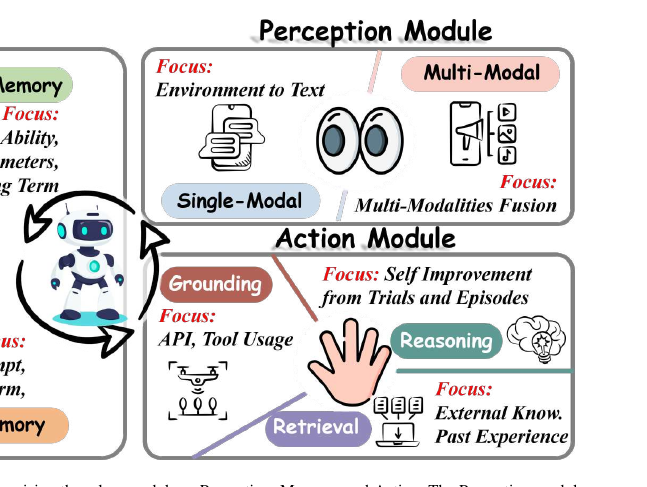

# Planing-IEEE Transactions on Pattern Analysis and Machine Intelligence (TPAMI)-2025-Lifelong Learning of Large Language Model based Agents- A Roadmap
*论文下载地址：https://doi.org/10.1109/TPAMI.2025.3650546*

*代码是否开源：是 https://github.com/qianlima-lab/awesome-lifelong-llm-agent*

*分享人：自动生成*

## 一句话总结内容
> 本文系统梳理如何为基于大语言模型的智能体引入终身学习能力，以感知、记忆与行动三大模块构建统一架构，并给出相应研究路线图与应用前景。

## 一句话总结创新贡献
> 论文首次专门围绕“LLM智能体+终身学习”交叉方向提出感知–记忆–行动三模块闭环框架，并以7个关键研究问题为主线系统综述相关方法、评测基准与现实应用。

## 举一个例子说明这篇文章的创新点
> 例如，作者将传统智能体框架中笼统的“Brain”模块细化为以长期记忆为核心的Memory模块，并与Perception和Action共同构成感知–记忆–行动的动态反馈闭环，从而为终身学习智能体提供更清晰、可扩展的功能分解范式。

## 框架图

**框架工作流描述**：
> 整体流程上，作者首先形式化定义LLM智能体的终身学习任务与目标，并按时间轴梳理传统终身学习、深度终身学习、LLM终身学习到LLM智能体终身学习的四个发展阶段；随后围绕“感知、记忆、行动”三大核心模块提出总体架构：感知模块在静态与动态环境中持续获取单模态和多模态信息，记忆模块负责随时间演化的知识存储、组织与检索以缓解灾难性遗忘，行动模块则在当前目标与记忆的条件下执行推理、工具调用和环境交互；在此框架下，论文以一系列研究问题（RQs）为主线组织对构建流程、持续适应策略、评估指标与应用场景的综述，并据此总结关键挑战与未来研究方向。

## 本文挑战及已有工作不足
> 1. 评测体系不完善：尚无专门针对终身学习LLM智能体的统一指标和基准数据集，导致不同方法在长期能力、泛化与适应性上的比较不够客观可复现
> 2. 缺乏面向真实动态、多模态环境的持续学习机制：当前LLM多被视为静态黑盒，既有终身学习研究主要聚焦数据分布变化，难以支撑在复杂交互环境中协同设计感知、记忆与行动
> 3. 稳定性–可塑性困境突出：在持续吸收新任务和新环境知识时，既要防止灾难性遗忘，又要避免长期训练导致的可塑性丧失，两者难以同时满足
> 4. 可扩展性与资源约束严峻：在跨游戏、网页、操作系统等多环境长期运行时，如何在模型规模、计算与存储成本可控的前提下实现知识共享与隐私保护，仍缺乏系统解决方案

## 印象最深刻的点
> 1. 围绕构建终身学习LLM智能体提出7个研究问题，系统覆盖架构设计、感知、记忆与行动机制、评测指标和应用场景，为读者构建全面的研究地图
> 2. 将单智能体方法与多智能体协作、分布式和联邦学习等范式纳入统一讨论，并配套“awesome-lifelong-llm-agent”GitHub资源库，形成从理论综述到实践资源的一体化生态
> 3. 清晰梳理终身学习从经典概念、深度终身学习到LLM终身学习和LLM智能体终身学习的四个阶段，并结合工业应用背景呈现技术演进脉络
> 4. 提出以Perception–Memory–Action为核心的总体架构，用Memory替代传统笼统的“Brain”模块，突出终身知识管理在智能体设计中的中心地位

## 对我们的启发
> 1. 将多智能体协作、分布式与联邦学习视作扩展的外部记忆与知识共享机制，可在保证隐私前提下提升终身学习系统的鲁棒性与可扩展性
> 2. 可将传统增量学习中的正则化、经验重放与知识蒸馏等策略迁移到LLM智能体的交互式场景，用于稳定参数、保持长期记忆并缓解灾难性遗忘
> 3. 在设计具备终身学习能力的LLM智能体时，可优先按感知、记忆与行动三大模块进行功能解耦与接口规范，再在各模块内部选用合适的持续学习机制
> 4. 通过增强感知模块对网页、GUI、游戏等多环境的统一文本化和多模态表示能力，有望实现“单一智能体、多环境复用”的设计目标

## Idea是否好想
> 论文的核心思想是将“LLM + Agent + 终身学习”统一到一个感知–记忆–行动的闭环架构中：感知模块持续从多环境、多模态中抽取结构化信息，记忆模块负责长期知识的组织与检索并对抗灾难性遗忘，行动模块在环境中执行决策和工具调用，将新经验反哺上游模块。该框架将传统增量学习、强化学习、多模态学习和多智能体协作等原本分散的研究线索串联起来，勾勒出面向AGI的连续学习蓝图，其优势在于一方面继承了终身学习在稳定性–可塑性平衡、经验重放和参数正则等方面的成熟思想，另一方面又结合LLM智能体特有的工具使用、自然语言接口和跨环境交互能力进行了重新组织。局限在于其作为综述工作主要停留在概念与方法层面的归纳，对具体算法实现和大规模系统工程问题缺乏深入探讨；同时，统一的评测基准和度量体系尚在建设中，实际部署仍需在具体任务与资源约束下进行大量工程探索。

## 是否有开创性
> 相较于仅聚焦“终身学习”或“LLM智能体”的既有综述，本论文的独特性体现在：第一，明确聚焦二者交叉的“终身学习LLM智能体”，系统刻画从基础概念、构建流程到应用的完整问题空间；第二，提出以Perception–Memory–Action为核心的统一架构，以Memory模块取代笼统的“Brain”，强调长期知识管理在终身学习中的中心地位；第三，从单模态文本感知到多模态不完备学习给出分层视角，区分静态与动态环境，并梳理网页、图表、游戏、GUI等典型场景下的感知方案；第四，将单智能体的终身学习与多智能体协作、分布式优化和联邦学习相联系，指出通过知识共享与任务分解缓解灾难性遗忘的潜在路径；第五，以7个研究问题为主线，将架构设计、训练策略、评测与应用统一进一条清晰的研究路线图，为后续工作提供系统参考框架。

## 是否属于热点
> 终身学习与大语言模型智能体的结合、面向AGI的持续适应能力、多模态交互环境中的增量学习，以及围绕灾难性遗忘与稳定性–可塑性权衡的方法设计，构成当前智能体研究的重要热点。

## 其他需要补充的点（可选）
> 1. 在单模态网页感知方面，文章框架性比较了基于HTML解析、可访问性树以及截屏+OCR+视觉定位的多种管线，并指出后者在接近人类视觉感知和适用范围上更具优势
> 2. 论文将游戏、网页浏览、在线购物、家务执行和操作系统操作等真实应用场景视为检验终身学习LLM智能体能力与工程可行性的关键试验场
> 3. 作者强调，相较于主要关注“连续预训练”或“连续指令微调”的LLM终身学习工作，LLM智能体必须在真实或模拟环境中通过行动持续收集新数据并更新能力

## 与其他论文的关联（可选）
> 1. 与现有LLM智能体综述相比，本文专门突出“持续学习”的时间维度和知识演化过程，并引入多智能体系统、分布式优化和联邦学习作为解决可扩展性与隐私问题的重要外部支撑
> 2. 与传统终身学习综述相比，本文继承了对灾难性遗忘、稳定性–可塑性困境以及正则化、重放和知识蒸馏等方法的系统梳理，并进一步将这些方法映射到LLM智能体的交互和工具使用场景中
> 3. 与聚焦LLM本身的终身学习综述（如连续预训练或连续指令微调）相比，本文强调当LLM被嵌入具身或软件环境作为智能体时，其学习目标从纯文本建模扩展为“感知–记忆–行动”的闭环决策

## 还有哪些不足的地方（未来工作）
> 1. 将终身学习机制与对齐、安全、隐私保护以及强化学习策略更紧密地结合，例如通过更合理的经验重放、异步更新和安全探索机制，避免引入有害行为或泄露敏感信息
> 2. 设计更高效、可扩展且可解释的记忆模块和稳定性–可塑性平衡机制，用于在多任务、多模态乃至模态不完备场景下进行长期知识存储与检索，同时控制模型复杂度以及计算和存储成本
> 3. 探索终身学习在多智能体协作、分布式与联邦场景下的扩展，在通信成本可控的前提下实现长期知识共享，并兼顾隐私保护与系统鲁棒性
> 4. 构建面向终身学习LLM智能体的统一评测基准与指标体系，并在机器人、个人助手和企业工作流等真实应用环境中搭建可长期运行的原型系统，联合考察任务性能、知识保留、新任务适应性和长期稳定性
