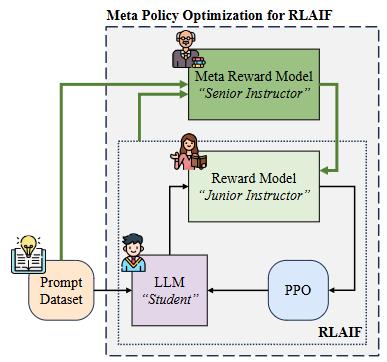

# Alignment-ICLR-2026-Toward-Evaluative-Thinking-Meta-Policy-Optimization-with-Evolving-Reward-Models.md
*论文下载地址（可选）：[https://arxiv.org/abs/2504.01698]*
*代码是否开源：是 [https://anonymous.4open.science/r/mpo-CD3B]*
*分享人：马明晖*

## 一句话总结内容
> 本文提出元策略优化（MPO）框架，通过元奖励模型动态迭代优化奖励模型的评估提示，解决LLM对齐中奖励破解、提示工程繁重、固定奖励信号鲁棒性差三大问题。

## 一句话总结创新贡献
> 首次将元认知与评估性思考引入RLAIF，构建动态进化的奖励机制，自动迭代细粒度评分规则，有效抑制奖励破解，无需人工专家提示即可超越手工精调效果。

## 举一个例子说明这篇文章的创新点
> 传统RLAIF用固定评分提示，模型学会只写标题就能拿高分（奖励破解）；MPO让元奖励模型监控这种漏洞，自动把评分规则细化为字数、相关性、结构、论据等细项，让模型无法钻空子，只能真正提升文章质量。

## 框架图
`
> 
> **框架工作流描述**：1. 策略模型（学生）生成回答；2. 奖励模型（初级导师）按当前提示打分；3. 每训练k步，元奖励模型（高级导师）执行Meta-Analysis检测评分漏洞；4. 执行Meta-Refinement生成更细的评分规则；5. 执行Meta-Merging合并为统一提示；6. 更新奖励模型并继续PPO训练，循环迭代。

## 本文挑战及已有工作不足
1. 固定奖励提示易导致奖励破解，模型钻规则漏洞而非提升质量。
2. 人工设计奖励提示成本高、鲁棒性差、难以泛化到多任务。
3. 传统RLAIF无法随策略进化动态调整评估标准。
4. 评估粒度粗糙，无法区分细微质量差异。
5. 多任务（写作、数学、伦理、摘要）需要专用提示，扩展性差。

## 印象最深刻的点
> 用“导师监督导师”的元认知结构，完全自动化实现奖励机制进化，从根源抑制奖励破解，效果超过专家手工反复调试的最优提示。

## 对我们的启发
1. 对齐的核心不是固定奖励，而是奖励机制本身能自适应进化。
2. 元提示优化可替代大量人工提示工程，降低落地门槛。
3. 抑制奖励破解的关键是动态细粒度化评估规则。
4. MPO可无缝接入PPO、GRPO等主流RL算法，通用性极强。

## Idea是否好想
> Idea简洁、动机强烈、结构清晰、工程友好，是对齐方向极具落地价值的范式创新，极易复现与扩展。

## 是否有开创性
> 是开创性工作；首次提出“动态进化奖励模型”的对齐框架，开创元认知奖励优化新方向。

## 是否属于热点
> 属于顶级热点：LLM对齐、RLHF/RLAIF、奖励破解防御、提示自动化、多任务对齐均为核心热点。

## 其他需要补充的点（可选）
> 支持四大任务：议论文写作、摘要、伦理推理、数学推理。
> 计算开销仅增加约11%，几乎无额外内存开销。
> 评分规则随训练自动变细、结构更层级化。

## 与其他论文的关联（可选）
> 基于PPO、RLAIF、LLM-as-Judge；区别于固定奖励，引入动态进化机制；优于AutoPrompt、专家提示、Self-Rewarding等方法。

## 还有哪些不足的地方（未来工作）
1. 固定间隔触发MPO，可改为自适应触发。
2. 仅验证了单智能体场景，未扩展到多智能体。
3. 未探索多模态任务的动态奖励进化。
4. 可结合更高效的采样策略加速规则进化。
5. 可扩展到对话、安全对齐、代码生成等更多场景。